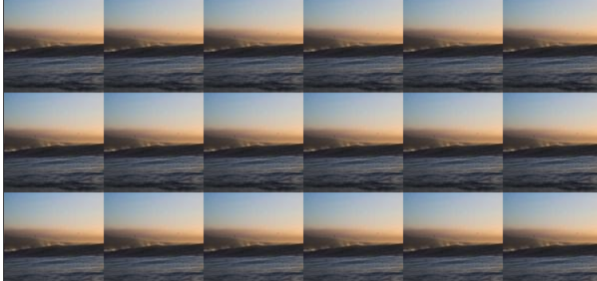
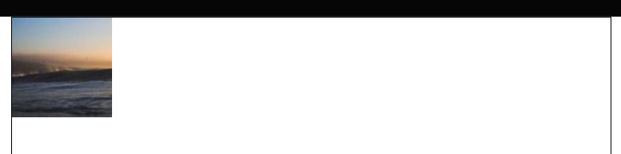
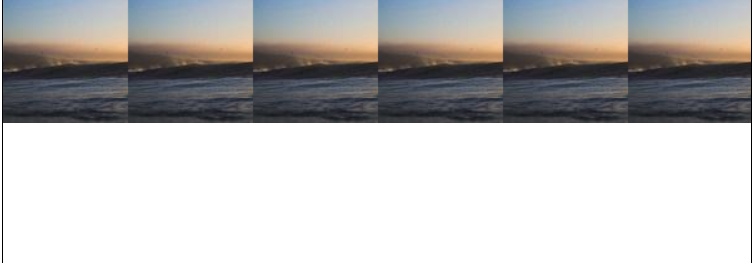
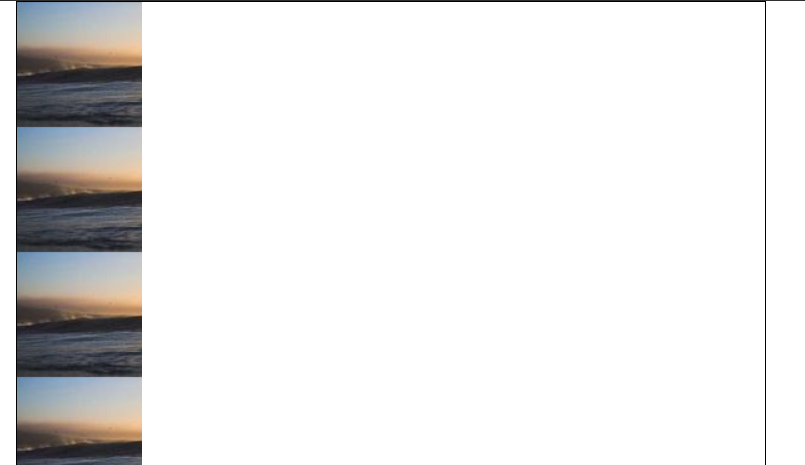
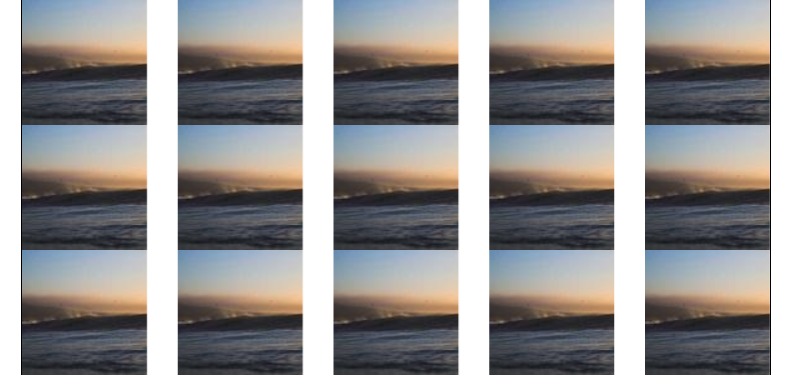
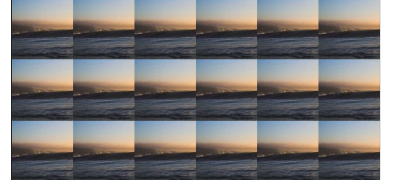
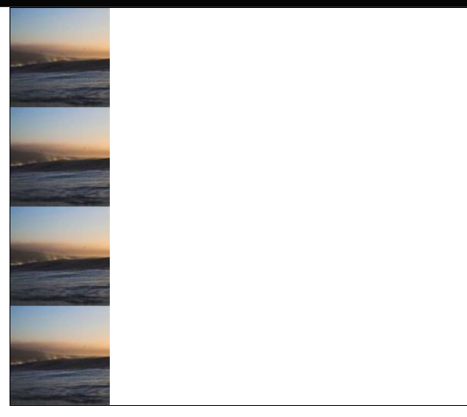
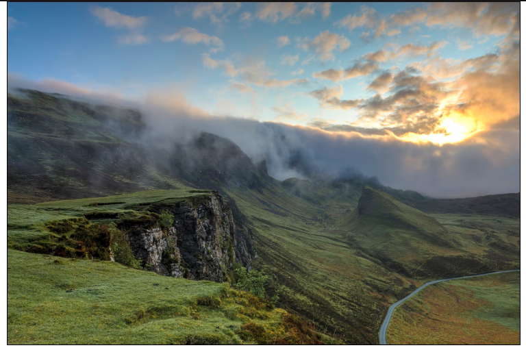
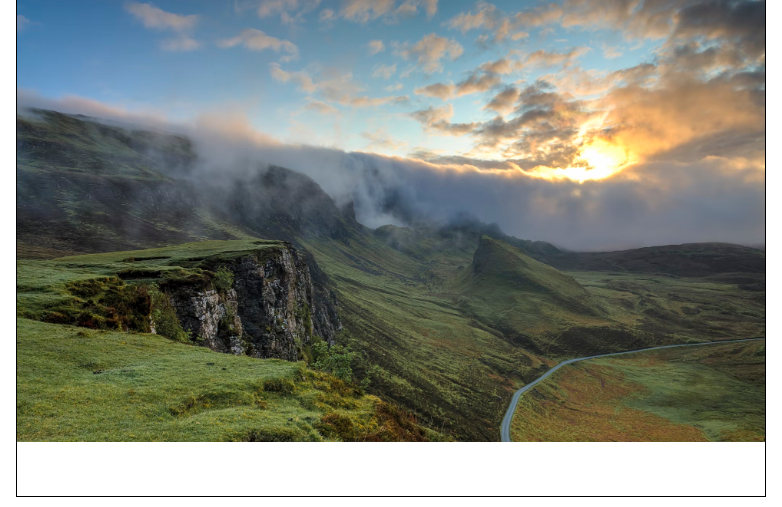
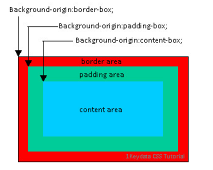

## background-image

background-image 可以設定一張或多張的圖片，寫法如下:

``` css
.box {
  background-image: url('tim.png');
}
```

背景圖片的設定，在不控制大小的情況下，預設就是原始圖片大小，且圖片僅會顯示在區塊的範圍內，也就是說當圖片太大張的時候，圖片將會發生裁切的情形。另外，當同時設定了background-color與background-image的時候，background-image將會蓋住background-color。

background-image支援的值有以下幾種

- url( )
- linear-gradient( )
- radial-gradient( )
- repeating-linear-gradient( )
- repeating-radial-gradient()
- Inital
- Inherit

## url() 設定

url所要撰寫的是圖片檔案所在的位置，可使用

- 相對路徑: ("../pic/01.jpg");
  從該段 css background-image 所在位置前往圖片所在位置 

- 絕對路徑: ("https://medium.com/");
  完整的網址

## 多重背景功能


可以寫入多張背景圖的url，並在每個url之間使用了逗號做區隔，要注意

1. 背景圖片的堆疊是按照順序的，先寫的則顯示在前，後寫的顯示在後，依序堆疊
2. 背景圖片設定不要重複(background-repeat: no-repeat;)
3. 背景圖片的位置設定要錯開(position)

``` css
.bg {
  height: 400px;
  margin-top: 20px;
  border: 1px solid #000;
  background-image: url(https://picsum.photos/200/100?random=1),
                    url(https://picsum.photos/200/100?random=2),
                     url(https://picsum.photos/200/100?random=3);
  background-repeat: no-repeat;
  background-position: left top, right bottom, center center;
}
```

[範例](https://codepen.io/jskrtivy-the-animator/pen/eYaVwGQ)

## 漸層背景設定

``` 
background-image: linear-gradient(起始色彩, 結束色彩);
```

指定方向漸層


- to top (下方漸層到上方)
- to right (左方漸層到右方)
- to bottom (上方漸層到下方)
- to left (右方漸層到左方)
- to top left (右下漸層到左上)
- to top right (左下漸層到右上)
- to bottom right (左上漸層到右下)
- to bottom left (右上漸層到左下)


或使用角度設定 (60deg,起始顏色，結束顏色)

常用角度如: 

- 0deg: 由下往上
- 45deg: 左下往右上
- 90deg: 由左向右
- 135deg: 左上往右下
- 180deg: 由上往下
- 270deg: 由右往左
- 360deg: 由下午往上


用漸層背景做兩個顏色區塊拼接

``` 
background-image: linear-gradient(115deg, #f00 50%, #ff0 50%);
                              角度, 起始色彩 開始漸層位置, 結束色彩 結束漸層位置 
```

[範例](https://codepen.io/jskrtivy-the-animator/pen/PovQrQm)


## 背景重複設定

background-repeat 用來設定背景圖是否重複，預設是 repeat(重複撲滿整個容器，會出現裁切現象)

1. background-repeat: repeat (預設)
2. background-repeat: no-repeat (不重複)
3. background-repeat: repeat-x (水平方向位移)
4. background-repeat: repeat-y(垂直方向位移)






5. background-repeat: space 
  在不裁切，不變形，不縮放的情況下重複背景圖片，有多餘空間會分布在圖片之間。



6. background-repeat: round
  使用縮放或變形的方式，讓圖片在不裁切下重複填滿容器。

 

### x, y 軸設定

background-repeat，也可以寫成兩個值，分別代表 x軸，y軸。

``` css
background-repeat: no-repeat round;
```

可以達到 x 軸不重複，y軸則不裁切方式重複。



[codepen](https://codepen.io/jskrtivy-the-animator/pen/bGyvREg)

## 背景圖片位置

可以用 background-position 來設定背景圖位置，可設定值或關鍵字。

- 值: px、%、em
- 關鍵字: (x軸, y軸)
        left top (左上)
        center center (正中)
        right bottom (右下)
        50px center (距離左側50px 垂直居中)
        center 50px (水平居中，距離上方50px)
        right 100px bottom 30px (距離右方 100px 距離下方 30px)

## 背景圖片大小

background-size 可以用來設定背景圖片大小，可設定的值有:

``` css
background-size: auto;
background-size: 200px;
background-size: 200pt;
background-size: 2em; 
background-size: 50%; //百分比
background-size: cover;
background-size: contain;
background-size: initial;
background-size: inherit;
```

### 百分比的問題

當設定 background-size: 100% 100% 時，表示背景圖要跟容器一樣大，但當容器尺寸改變時，例如高度不變，寬度卻變窄，圖片會因為尺寸和容器的寬高比不同而變形。

### cover 和 contain

- cover: 讓圖片在「不變形」、「寬高等比例」、「必要時裁切」的方式填滿整個空間。
- cotain: 讓圖片在「不變形」、「寬高等比例」、「不裁切」的方式填滿整個空間。




## 背景圖範圍

預設背景圖範圍是在邊框線以內(border)，background-origin 可以設定背景原點，也就是圖片依容器中的卡個座標為起點。可設定的值有:

1. content-box:
   指 css 屬性 width、height 定出的範圍內，若沒指定 width、height 則會在padding內。
2. padding-box
   指 css 屬性 border 內(不含border範圍)
3. border-box
   指 css 屬性 border 內(含border範圍)



## 背景圖固定方式

background-attachment 用來設定背景圖是要依照「視窗可見範圍」的捲軸來滾動，或是依照容器區塊來滾動。

可以設定的值包括:

1. scroll: 捲動
2. fixed: 固定
3. local: 區域

### scroll 捲動背景

scroll 會依照視窗的卷軸來捲動，當視窗卷軸捲動時，背景圖會被捲走，也是瀏覽器預設使用的值。要注意的是，當捲動的不是瀏覽器視窗，而是內部容器視窗時，內部容器的背景圖不會被捲走。


### fixed 固定背景

background-attachment: fixed，會將視窗可見範圍當作定位空間，設定後圖片位置會跑到視窗左上角。


### Local 

背景圖片會「跟著所在空間的捲軸」捲走，所以可以看到內部的淺黃色區塊捲動捲軸時，該區塊的背景圖就會跟著被捲走。


### 簡易版視差滾動


利用 background-attachment: fixed，將背景圖固定，可以做到簡易版視差滾動效果。

[範例](https://codepen.io/jskrtivy-the-animator/pen/bGyvRKo)

## background 縮寫

background 也可以寫成縮寫語法

``` css
background: gray url("amos.png") scroll no-repeat 50% 50% / 50% 50%;
```

上面分別對應的值如下

``` css
background: color image attachment repeat poition / size
```

最後面那段斜線用來區隔 position 和 size。

### background 寫法注意

當  background-position / background-size 這一組值，在僅有 background-position 時 可以省略 / ，但要寫background-size 時，要與 background-position 一起寫。

``` css
// 有效寫法
background: url("amos.png") no-repeat center
background: url("amos.png") no-repeat center / 50% 50%;
background: url("amos.png") no-repeat center / cover;


// 無效寫法
background: url("amos.png") no-repeat / 50% 50%;
background: url("amos.png") no-repeat / cover;
background: url("amos.png") no-repeat center cover;
```


