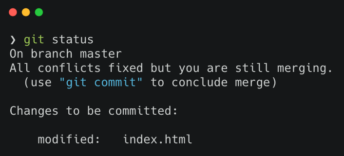

## 合併與衝突

上章節講過我們可以用 git pull 或 git fetch 來下載遠端更新的內容。
如果遠端數據庫和本地端數據庫的同一個地方都發生了修改的情況下（例：檔案中同一行的地方）。
這時，因為 Git 不能自動判斷要導入那一個修改內容於是就會發生錯誤。

```html
<div class="container">
  <<<<<<< HEAD
  <div>我是 Cat</div>
  =======
  <div>我是 Dog</div>
  >>>>>>> dog
</div>
```

此時發生衝突的地方必須手動修改，如上例，VScode 會提醒你產生衝突的地方，此時再決定要留 cat 還是 dog。假設你要留下 cat ，則改為

```html
<div class="container">
  <div>我是 Cat</div>
</div>
```

當儲存後，你就可以輸入 git add . 將它重新加入索引後，你可以使用 git status 觀察狀態。



此時的回饋就會說，您目前沒有任何衝突了，可以使用 git commit 來提交。於是我們就輸入該指令後。就會彈跳編輯器顯示預設訊息。

```vim
Merge branch 'dev'

# Conflicts:
#    all.css
#
# It looks like you may be committing a merge.
# If this is not correct, please remove the file
#    .git/MERGE_HEAD
# and try again.


# Please enter the commit message for your changes. Lines starting
# with '#' will be ignored, and an empty message aborts the commit.
#
# On branch master
# All conflicts fixed but you are still merging.
#
# Changes to be committed:
#    modified:   index.html
#
```

Git 預設訊息裡，你也可以自己編輯相關內容，若是覺得沒問題就儲存關閉，本次合併就完成了！
