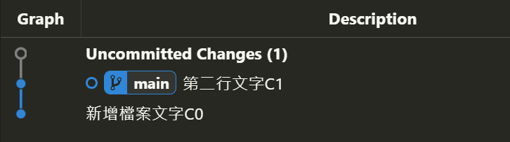
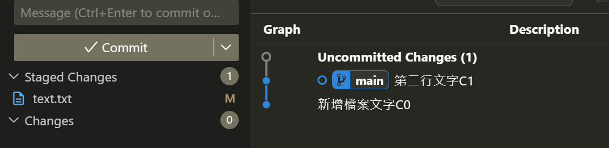

## 取消修改

在 git 裡主要用兩種方法來取消修改，一種是 git reset，另外一種是 git revert。

## git reset

git reset 利用把分支的參考點退回到上一個 commit 來取消修改。你可以認為這是在"重寫歷史"。git reset 往回移動 branch，原來的 branch 所指向的 commit 好像從來沒有存在過一樣。


git reset 可以分為 --hard、 --soft 、 --mixed 三種模式

### reset --mixed

```
git reset --mixed HEAD~1   # 數字表示移動到 HEAD後面第幾個
git reset HAED^ 回復到上一個commit
git reset HAED^^ 回復到上上一個commit
```

--mixed 是預設的參數，如果沒有特別加參數，git reset 指令將會使用 --mixed 模式。這個模式會把暫存區的檔案丟掉，但不會動到工作目錄的檔案，也就是說 Commit 拆出來的檔案會留在工作目錄，但不會留在暫存區。



### reset --soft

這個模式下的 reset，工作目錄跟暫存區的檔案都不會被丟掉，所以看起來就只有 HEAD 的移動而已。也因此，Commit 拆出來的檔案會直接放在暫存區。



### reset --hard

hard 模式下，不管是工作目錄以及暫存區的檔案都會丟掉。

### 取消 reset

如果你 reset 完後悔，輸入 git reset + 還原點的 hash 值，是可以回復的。因為 reset 的概念就是帶著目前分支前往特定 commit。還原點的 hash 值可以用 git reflog 查詢。


### 操作注意

如果你是跟其他開發者遠端協作，盡量不要將已經推到遠端數據庫的版本，進行 git reset 後再推上去。

試想如果你的同事推了個版本到遠端數據庫，但你抓下來後用 reset 還原掉他的資料，又 push 更新上去，這樣他的資料就都不見了。

所以使用 git reset 的時機在於，你將遠端數據庫 clone 下來後，在本地自己新增的 commit 可以還原。而遠端數據庫既有的 commit ，就不要再試圖還原。

## git revert

為了將你想取消的紀錄分享給你的同事，可以用 git revert，概念是再做一個新的 Commit，來取消你不要的 Commit，新的 commit 點上會有 ' 代表是 revert 的點。

```
git revert + 要刪除的commit點
```


