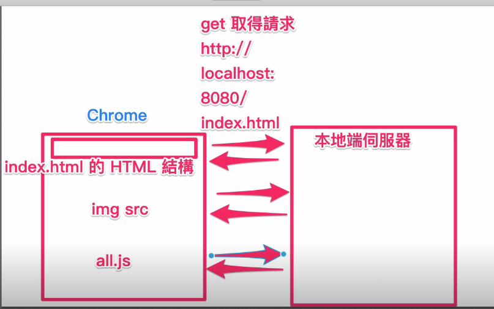

## 網路請求流程

當使用者透過瀏覽器發送一個網址，就會向伺服器發出一個網路請求。
伺服器一開始會回傳完整的 html 檔案，當瀏覽器解析到如 img 、css 、js 檔等資源時，就會再向伺服器發出請求取得資源。如上圖總共發出三次網路請求。

## Ajax 原理

AJAX 即「Asynchronous JavaScript and XML」（非同步的 JavaScript 與 XML 技術）

傳統的 Web 應用允許使用者端填寫表單（form），當送出表單時就向網頁伺服器傳送一個請求。伺服器接收並處理傳來的表單，然後送回一個新的網頁，但這個做法浪費了許多頻寬，因為在前後兩個頁面中的大部分 HTML 碼往往是相同的。

Ajax 透過瀏覽器發送一個網頁請求給伺服器，伺服器再回傳對應資料，如此不用重新整理網頁，就能更新資料，並避免了在網路上傳送那些沒有改變的資訊。網頁請求代碼可分為以下幾種

## 網頁請求狀態碼

- 資訊回應 (Informational responses, 100–199),
- 成功回應 (Successful responses, 200–299),
- 重定向 (Redirects, 300–399),
- 用戶端錯誤 (Client errors, 400–499),
- 伺服器端錯誤 (Server errors, 500–599).

## AJAX 的特性

- 非同步：AJAX 請求是非同步的，這意味著不會阻塞網頁的其他操作。用戶可以繼續與頁面互動，等待數據返回。
- 增強用戶體驗：通過僅更新網頁的部分內容，減少了頁面重繪的時間，使得頁面看起來更加流暢和快速。
- 跨平台：只要支援 JavaScript 和 XMLHttpRequest/Fetch API 的瀏覽器都可以使用 AJAX，適用於各種瀏覽器和平台。
