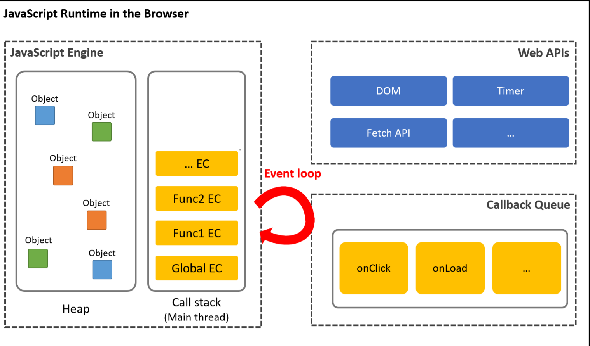
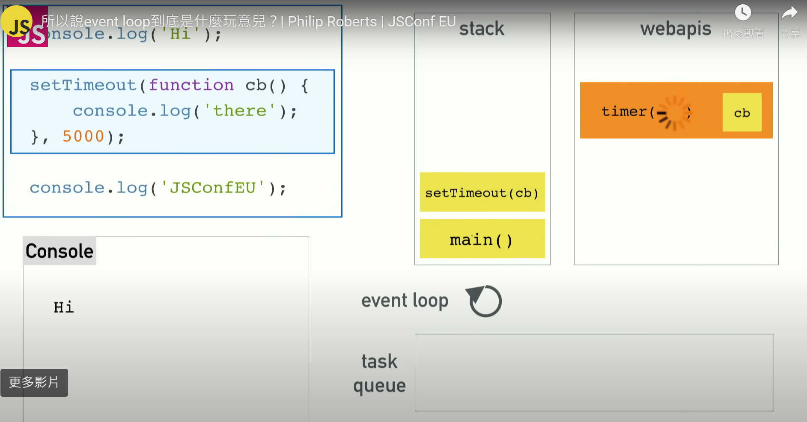
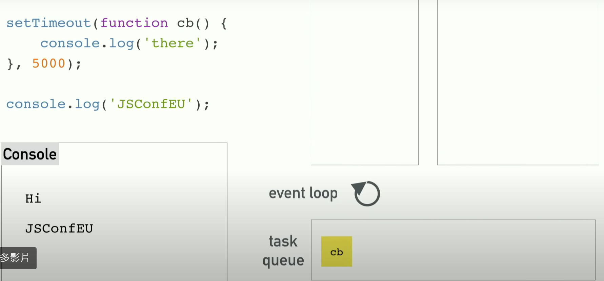
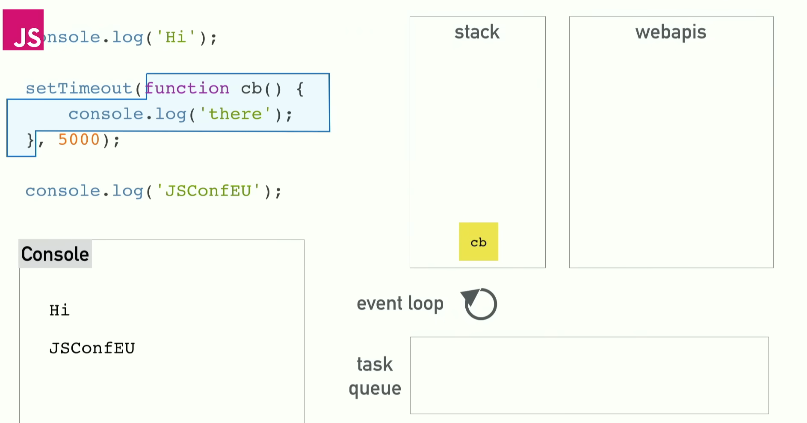

## 單執行緒

JS是一個單執行緒的語言，是作業系統的運行概念。
指的是程式面對多個任務時，只能一次處理一個，依序處理下去，不能同時處理多個任務。


如上圖，小明只能先吃完早餐，再打給漂亮阿姨，最後在洗碗，無法三個一起進行。多執行緒指的則是，三個任務可以同時執行。

## 同步(Synchronous)

指的是程式必須依照順序依序處理任務，不會直接跳到下個任務。
像這樣先完成 A 才能做 B、C、D …」的運作方式我們就會把它稱作「同步」。

## 非同步(Asynchronous)

凡是需要取用外部資源或是某段程式碼會延遲執行都算是非同步事件，例如：點擊 click 事件、setTimeout、串接外部 API 等等…
這種非依序執行的，都是非同步行為。

JS在執行程式碼時，是依照同步的概念，也就是依序執行。
如果遇到非同步的任務，如 setTimeout() 等會延遲執行的程式。
會先將非同步任務放到事件儲列，等所有程式跑完後，再執行事件儲列裡的任務。


如上圖， 依序執行 吃早餐 > 打給漂亮阿姨 > 洗餐盤 > 漂亮阿姨回電
其中 漂亮阿姨回電 是非同步事件 setTimeout ，所以會先放在事件儲列中，
等所有程式跑完，最後在執行。

``` js
for(let i=0; i<3; i++) {
  setTimeout(function() {
    console.log(i);
  }, 0)
}
```

上面 for 迴圈的程式屬於同步程式，setTimeout 屬於非同步。所以 for 迴圈先執行三次後，才會執行事件儲列裡的 setTimeout，此時
i 已經是 3了。


## 阻塞（blocking）

當執行程式碼片段需要等待很長一段時間，或好像「卡住」的這種現象，被稱作 阻塞（blocking），假設請求資料的 AJAX Request 變成同步（Synchronous）處理的話，那麼每 request 一次，因為必需等這個函式執行完畢從堆疊（stack）中跳離開後才能往下繼續走，進而導致阻塞的情形產生，以下面的 pseudo code 為例：

``` js
// pseudo code
var foo = $.getSync('//foo.com');
var bar = $.getSync('//bar.com');
var qux = $.getSync('//qux.com');

console.log(foo);
console.log(bar);
console.log(qux);
```

## Event loop



對瀏覽器執行 js 的引擎而言(如 chrome 的 v8引擎)，JS是一個單執行緒的語言，一次只能執行一個任務。但瀏覽器除了js的執行引擎外，也提供了 Web API 給我們使用，讓我們能同時執行不同任務。

以下面這段程式碼為例:

``` js
console.log('我去上學');
setTimeout(() => {
  console.log('打電話給老師');
}, 5000);
console.log('下課了');
```

執行結果會是 '我去上學' => '下課了' => '打電話給老師';

流程如下: 

1. 執行 console.log('我去上學');

2. 當執行到 setTimeout 時，因為 setTimeout 屬於 web api，會被移到 web api 去執行。

3. 執行 console.log('下課了');

4. 當 setTimeout 的計時器到了後，將 callback function 移到 event queue 事件儲列做等待。

5. event loop 會一直觀察 callstack(執行環境) 是否為空，若為空則將 event queue 內等待的 callback function 移回 callstack 作執行。







<!-- JavaScript 是單執行緒語言，這意味著它一次只能執行一個任務。然而，為了實現非同步行為，它依賴於事件循環。事件循環是一種機制，允許 JavaScript 在等待某些操作完成時（如 I/O 操作、計時器、網絡請求等）不阻塞主執行緒，從而可以繼續執行其他代碼。

事件循環的工作流程:

1. 執行棧（Call Stack）：JavaScript 執行同步代碼的地方。當函數被調用時，它會被添加到執行棧頂部，當函數執行完成後，會從棧中移除。

2. Web API：當 JavaScript 執行非同步代碼時（如 setTimeout、fetch 等），這些調用會被發送到瀏覽器的 Web API，Web API 在後台處理這些請求。

3. 事件儲列（Task Queue/Callback Queue）：當 Web API 完成非同步操作後，對應的回調函數會被放入事件隊列中，等待執行。

4. 事件循環（Event Loop）：事件循環不斷地檢查執行棧是否為空。如果執行棧為空，事件循環會將事件隊列中的第一個回調函數移入執行棧，然後執行它。

 -->


