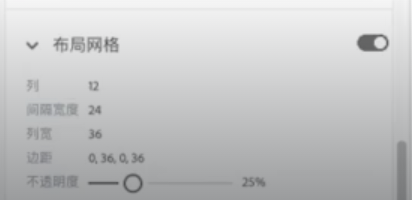

## CSS權重

CSS權重（specificity）是一個用來確定當多個CSS規則適用於同一個HTML元素時，哪一個規則的樣式將會被應用的概念。權重是由選擇器的特定性來確定的，而特定性則是由選擇器中使用的不同類型和數量的標記、類別和ID來計算的。

以下是一些權重的例子和解釋：

- 元素選擇器：這是最低權重的選擇器，它只是一個HTML元素的名稱，例如p或div。它的權重是 1分。
- 類別選擇器：這是指定了一個元素的類別的選擇器，例如.class。它的權重是10分。
- ID選擇器：  這是指定了一個元素的唯一ID的選擇器，例如#id。它的權重是 100 分。
- 內聯樣式： 這是直接在HTML元素中使用style屬性指定的樣式。它的特定性是1000 分。

``` css
/* 元素選擇器 */
p {
  color: blue;
}

/* 類別選擇器 */
.intro {
  font-size: 16px;
}

/* ID選擇器 */
#main-title {
  font-weight: bold;
}

/* 內聯樣式 */
<p style="color: red;">This is a paragraph.</p>
```

當多個規則適用於同一個HTML元素時，CSS解析器將根據這些規則的權重來決定最終樣式。一般來說，權重越高的規則將被優先應用。如果兩個規則的權重相同，則後面出現的規則將優先應用，就是先看權重，再看先後順序。

## 設定 viewport

- head 標籤裡加入設定

```html
<meta name="viewport" content="width=device-width, initial-scale=1.0">
```

## media quary 語法

 media quary 語法會根據設備的屏幕大小、類型、解析度或其他媒體特性來應用不同的樣式。這使得網站能夠在不同的裝置上提供最佳的使用體驗，包括桌面電腦、平板電腦、手機和印刷媒體等。

``` css
@media 媒體類型 and (媒體特性) {
  /* 樣式規則 */
}
```

在這個語法中，@media是CSS中用於定義媒體查詢的關鍵字，媒體類型是指定媒體類型的可選參數，例如screen（屏幕）或print（打印），媒體特性則是用於指定條件的表達式，例如 max-width: 600px（最大寬度600像素）。


``` css
/* 先寫 PC 版型 在寫手機板型型 */
.title {
  color: red;
}

/* ipad 直式下變更樣式 */
@media (max-width: 768px) {
  .title {
    color: blue;
  }
}

/* iphone11 直式下變更樣式 */
@media (max-width: 375px) {
  .title {
    color: yellow;
  }
}
```

## 如何決定斷點下多少？

- 平板設定 992px 以下：768px~992px 是給小螢幕的平板使用，其中 768px 是目前已知較主流的最小平板尺寸
- 手機
    - 767px 以下：有些內容在 767px 以下就轉為手機版的話，會導致版面看起來留白較多，因此會建議使用在元素較多的內容上，例如此次設計稿的 header 和 footer
    - 576px 以下：目前較常見會設定成手機版尺寸的斷點
- 電腦：993px 以上就會是電腦或大螢幕的平板使用

## 響應式 container 設計

當需要一個固定寬度置中的容器時，可以加上 max-width 來設計。讓容器在手機板時自適應寬度，桌機板時則維持最大寬度。左右加入padding，避免內容貼齊邊線。

``` css
.container {
  max-width: 960px; // 最大寬度960px;
  margin: 0 auto;
  padding-left: 12px;
  padding-right: 12px; 
}
```

- padding 計算方式由設計稿的格線系統計算，若設計稿每欄間的 gutter 是 24px，container 的 padding 則為 gutter / 2 = 12px。

- 因為有改變盒模型計算方式，壓縮到內容的空間，要在寬度補回去左右推出的 padding 數值

## container 斷點設計

不同尺寸下的 container 也會有響應式斷點設計



以上面平板尺寸設計稿的格線系統而言，conatiner寬度計算方式為

12(欄) * 36(欄寬) + 24(間距) * 11(間格數) = 696px

696px + 24(container 左右推的padding 要加回來) = 720px


## 響應式圖片設計

在圖片加上 max-width，確保圖片寬度大於容器時，寬度會自適應成100%，不會超過父層造成跑版，圖片寬度小於容器時，則維持原本寬度。

``` css
img {
	max-width: 100%;
	height: auto;
	vertical-align: middle;
}
```


## 兩欄式 RWD 實作

使用 flex 實作 兩欄式 RWD，外層用flex使內層水平排列，內層兩欄設定寬度百分比，兩欄寬度加上gap 總共不能超過100%

``` html
<div class="container">
  <div class="flex-row">
    <div class="menu">123</div>
    <div class="list">456</div>
  </div>
</div>
```

``` css
.container {
  max-width: 960px;
  margin: 0 auto;
}
.flex-row {
  display: flex;
}
.menu {
  width: 45%;
  margin-right: 2%;
  height: 100px;
} 
.list {
  width: 53%;
  height: 100px;
}
```

## 響應式格線系統

```css
.container {
  max-width: 1320px;
  padding: 0 12px;
  margin: 0 auto;
}

.row {
  display: flex;
  flex-wrap: wrap;
  /* 抵銷最左邊和最右邊的 col 多出來的 padding */
  margin-left: -12px;
  margin-right: -12px;
}

/* 一個元素佔 3 欄，格線系統總共是 12 欄， 12 / 3 可分成 4 等份 */
.col-3{
	/* 100% / 4 */
  width: 25%;
  padding-left: 12px;
  padding-right: 12px;
}

@media (max-width: 992px){
  .col-md-6 {
    width: 50%;
  }
}

@media (max-width: 576px){
  .col-sm-12{
    width: 100%;
  }
}
```


