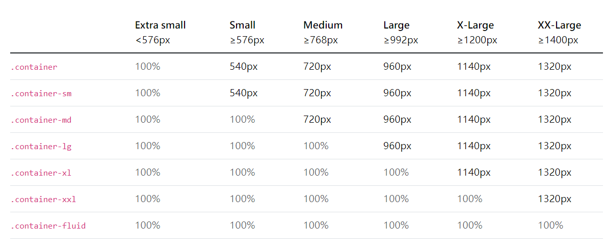

## Breakpoints 講解

Bootstrap 在斷點的設計上始以手機優先的方式來設計。

|Name        |Class   |裝置尺寸|裝置|
|-----       |--------|------|----|
|Extra small |None    |<576px|    |
|small       |sm      |≥576px|手機橫向|
|Medium      |md      |≥768px|ipad直向|
|Large       |lg      |≥992px|桌機、ipad橫向、ipad pro直向|
|Extra large |xl      |≥1200px|ipad pro橫向|
|Extra extra large |xxl  |≥1400px|         | 

當螢幕尺寸大於等於 576px 時 ，斷點 sm 就會啟用，大於等於 768px 時， 斷點 md 就會啟用。


## container

Bootstrap 的 container 是一個固定寬度且水平置中的容器。



預設 container 在 ≥768px 寬度為 720px，≥992px時 寬度為 720px 960px以此類推，目的是在左右各留有空間，以免太過壅擠。

若要滿版的 container 可以設定 

``` html
<div class="container-fluid">
  ...
</div>
```


