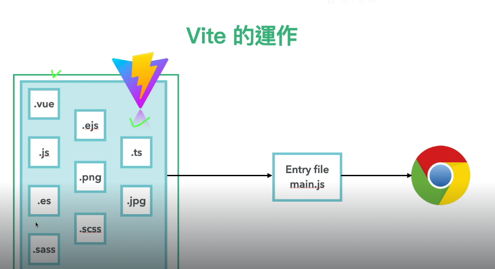
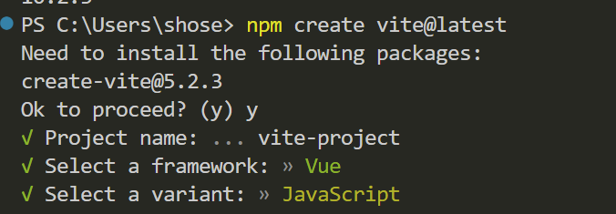
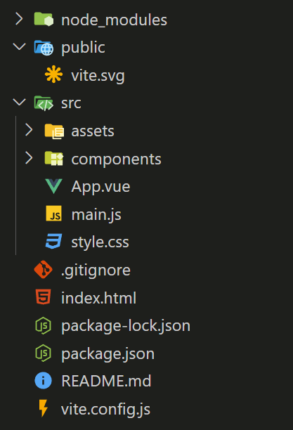
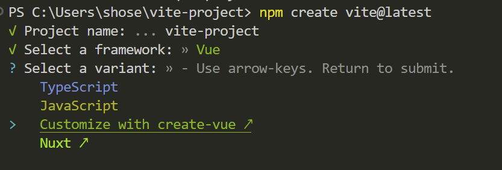
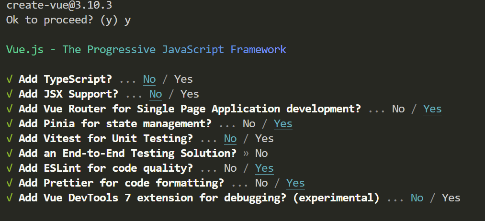

## 什麼是 vite



Vite 是一個由 Evan You（Vue.js 的創建者）開發的前端構建工具，可以將scss、vue、ejs 等檔案編譯成網頁能夠讀取的 html、js、css。Vite 使用原生的 ES 模塊功能，並且只在需要的時候進行編譯和轉換。這與傳統的打包工具（如 Webpack）不同，後者通常需要預先打包整個應用。

## 安裝

[vite官網](https://vitejs.dev/guide/)

```
npm create vite@latest
```

輸入指令後會跳出幾個選項，包括資料夾名稱、使用的框架、語言等



選好後按指令安裝運行專案即可

```
cd vite-project  // 移動到資料夾
npm install     // 下載套件
npm run dev     // 運行專案
```

## 專案結構說明



- node_module 資料夾:

透過 npm install 下載道專案的套件會放在這，不會進入版本控制。

- public 資料夾: 

存放靜態資源文件、public 資料夾中的所有文件會被直接複製到最終構建的輸出目錄（通常是 dist），並且它們的文件名和結構保持不變，不會經過 Vite 的打包或處理。適合用來存放那些不需要經過打包處理的靜態文件，如圖片、favicon。

- src 資料夾:

主要開發區域，這裡的檔案都會透過與 main.js 這支進入點產生關聯來被編譯。

## 用 create-vue 建立專案

若要加入 vue-router、penia 等 vue 專案常用套件，可以在開始時選擇 create-vue



接下來按照需求選擇要安裝的套件後，npm run dev 運行專案即可。

