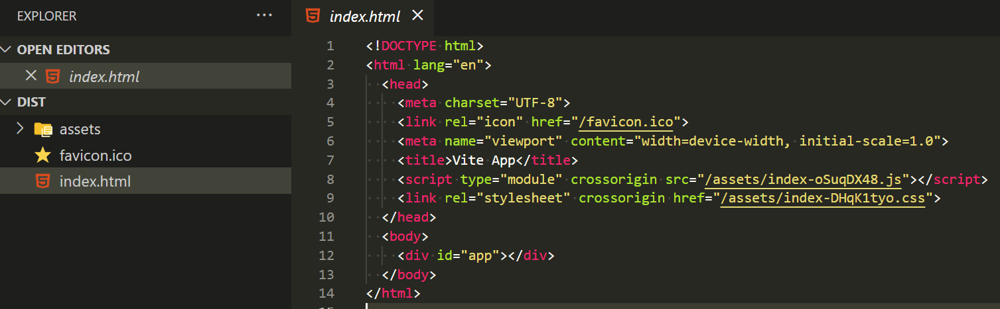

## 編譯專案

當成專案完成後，可以用 `npm run build` 來編譯專案，編譯完成會放在 dist 資料夾


## 專案路徑調整

如果直接將 dist 資料夾裡的 html 用 live-server 的方式開啟



會出現找不到網頁的情形


因為目前 router 的設計不是瀏覽器可以運行的 router，我們可以回到專案router 的 index.html


將 方法替換為 `createWebHashHistory`，這會將路由模式 切換成 hash 模式，也就是由前端控制的路由

[路由模式說明](https://book.vue.tw/CH4/4-2-route-settings.html)

設定後重新 `npm run build` 來編譯專案，此時再去將 dist 資料夾裡的 html 用 live-server 的方式開啟也不會產生錯誤了。

## 環境變數設定


因為專案開發時的 api 路徑會和正式產品的 api 路徑不同，所以不會將 api 路徑寫死在專案裡，而是透過環境變數切換。

- 通用的環境變數:
  
  在專案根目錄建立 .env 檔案，使用 VITE_ 建立環境變數

  ```
  VITE_PATH=https://randomuser.me/api/
  ```

  在vue元件中用 import.meta 引入

  ``` js
  const url = import.meta.env.VITE_PATH;
  ```

- 開發用的環境變數:
 
  在專案根目錄建立 .env.development 檔案，這隻檔案的變數只有在開發時能讀取

  ```
  VITE_TEXT=這是開發中環境
  ```

- 產品用的環境變數
  
  在專案根目錄建立 .env.production 檔案，這隻檔案的變數只有 npm run build 後的產品中能讀取

  ```
  VITE_TEXT=這是產品中環境
  ```

如上都有 VITE_TEXT 這個變數，開發時會讀取到 '這是開發中環境'，編譯後則會讀到 '這是產品中環境'。


