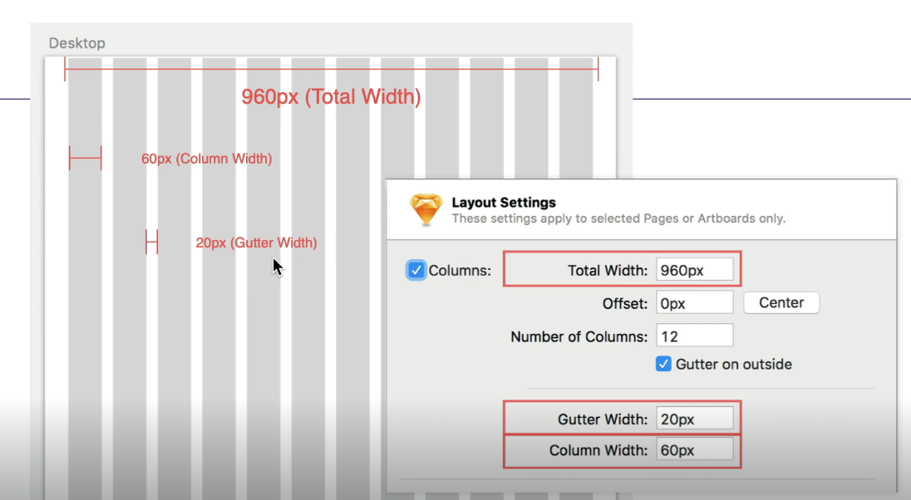
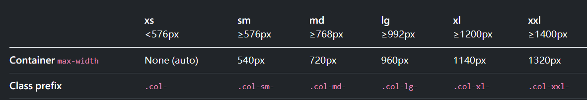

## 格線基礎解說



Bootstrap 格線系統採用12欄的設計，因為12是最多數的公倍數。

- total width: container 總寬度
- column width: 每欄寬度
- gutter width: 欄與欄間距。

Bootstrap 格線系統是應用 flexbox 來排版，讓內部的 col 能夠水平排列。
使用上最外層一定會有一個 container，再來是 row，再來是 col。

``` html
<div class="container text-center">
  <div class="row">
    <div class="col">
      Column
    </div>
    <div class="col">
      Column
    </div>
    <div class="col">
      Column
    </div>
  </div>
</div>
```
上面是一個水平置中的三欄欄寬範例，功能說明如下:

- container: 水平置中容器，並在左右留有padding。
- row: 設定 flex 讓 col 能水平排列，並設有左右負值的 margin 讓 左右的 col 能貼齊 container。
- col: 每欄左右設有 padding來製造欄與欄的間距，預設是12欄來做設計。



## 自動格線系統

在 row 裡面直接使用 .col 來設計，每欄會自動分配欄寬。

``` html
// 三欄式版面設計
<div class="container text-center">
  <div class="row">
    <div class="col">
      1 of 3
    </div>
    <div class="col">
      2 of 3
    </div>
    <div class="col">
      3 of 3
    </div>
  </div>
```

自動格線也可以搭配固定寬度的 col，如下 col-6 固定50%寬度，其餘欄位自動分配寬度。

``` html
<div class="container text-center">
  <div class="row">
    <div class="col">
      1 of 3
    </div>
    <div class="col-6">
      2 of 3 (wider)
    </div>
    <div class="col">
      3 of 3
    </div>
  </div>
</div>
```

### 本身內容寬度的 col

如果想讓 col 的寬度是依照本身元素內容的寬度的話，可以設定 `col-{breakpoint}-auto`

``` html
<div class="container text-center">
  <div class="row">
    <div class="col">
      1 of 3
    </div>
    <div class="col-md-auto">
      Variable width content
    </div>
    <div class="col col-lg-2">
      3 of 3
    </div>
  </div>
</div>
```


## 響應式設計

col 的設計也支援響應式斷點

``` html
<div class="container text-center">
  <!-- Stack the columns on mobile by making one full-width and the other half-width -->
  <div class="row">
    <div class="col-md-8">.col-md-8</div>
    <div class="col-6 col-md-4">.col-6 .col-md-4</div>
  </div>

  <!-- 手機版為兩欄 50%寬度， 平板為三欄 33% 寬度 -->
  <div class="row">
    <div class="col-6 col-md-4">.col-6 .col-md-4</div>
    <div class="col-6 col-md-4">.col-6 .col-md-4</div>
    <div class="col-6 col-md-4">.col-6 .col-md-4</div>
  </div>

  <!-- 永遠都是 50% 寬度 -->
  <div class="row">
    <div class="col-6">.col-6</div>
    <div class="col-6">.col-6</div>
  </div>
</di>
```


## row-columns

除了在 col 上設定欄寬以外，另一種做法是在 row 上用 `row-cols-*`設定欄數。

手機版為1欄滿版，手機橫向為 2 欄、平板以上為四欄
``` html 
<div class="container text-center">
  <div class="row row-cols-1 row-cols-sm-2 row-cols-md-4">
    <div class="col">Column</div>
    <div class="col">Column</div>
    <div class="col">Column</div>
    <div class="col">Column</div>
  </div>
</div>
```

## 巢狀格線

在 col 內也可以用 row 新開一個內部的格線系統。

``` html
<div class="container text-center">
  <div class="row">
    <div class="col-sm-3">
      Level 1: .col-sm-3
    </div>
    <div class="col-sm-9">
      <div class="row">
        <div class="col-8 col-sm-6">
          Level 2: .col-8 .col-sm-6
        </div>
        <div class="col-4 col-sm-6">
          Level 2: .col-4 .col-sm-6
        </div>
      </div>
    </div>
  </div>
</div>
```

## scss 客製化格線

透過修改 bootstrap 的 scss 可以客製化格線系統。

``` scss
$grid-columns: 12 !default; // 預設欄數為12欄
$grid-gutter-width: 1.5rem !default; // 預設欄間距
$grid-row-columns: 6 !default; // 使用 .row-cols-* 時最多欄數限制
```


