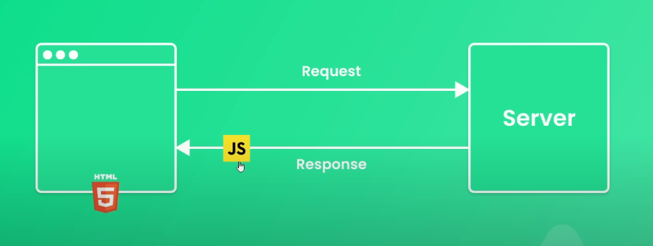

## SSR (server side render) 伺服器端渲染


SSR (Server-Side Rendering，伺服器端渲染) 表示伺服器收到前端的請求之後，伺服器會向 model(資料庫)要對應的資料，把資料帶給 view。view 再回傳一份完整的 HTML 檔案（這個動作就叫做 render），而瀏覽器拿到之後，只要顯示出來就好。

## CSR (client side render) 客戶端渲染



client side render 指的就是當前端拿到資料以後，才用 JavaScript 動態的把那些內容填到網頁上面。

CSR 的 HTML 只需要一個簡單的根節點：

```js
<div id="root"></div>
```

至於節點內的資料，會由 JavaScript 打 api 去跟資料庫要資料後，渲染到畫面上。

當在 csr 渲染的網站，我用右鍵 -> 檢視原始碼，會發現幾乎是空的：


因為我們是在執行期間「動態」去跟後端伺服器拿資料，再動態產生你看到的那些元素，而那些元素原本不存在 index.html 裡面。

### 前後端分離

使用 csr 渲染的情況下，後端只要專注於處理資料庫的資料和制定 API 文件，提供前端需要的資料就好。
前端工程師利用 ajax 從後端拿資料，並且在自己這邊用 JavaScript 動態產生內容。

## 後端路由

網站的伺服器會依照網址的結構，跟資料庫撈資料後，回傳對應的內容給瀏覽器渲染，這樣的機制稱為「網站路由」，管理網站路由的程式稱為 router。

## 前端路由

在使用 csr 渲染時，因為只有 index.html 檔案，就必須由前端進行路由管理。因為前端只有一個檔案，所以網址可能像是這樣：https://example.com/index.html。以vue-router的兩種路由模式來解說:

### Hash 模式

在 hash 模式中，URL 的路徑會包含一個 # 符號。例如：

```js
http://example.com/#/about
```

在這個 URL 中，#/about 是 Vue Router 管理的部分，hash 原本在網頁中是代表「錨點」的意思，舉例說明:

```
http://example.com/#app
```

當瀏覽器開啟以上網址時，會自動捲動到 `<div id="app"></div>` 錨點元素的位置。

hash 模式利用 URL 的 hash（#）部分來模擬一個完整的 URL，當 hash 改變時，頁面不會重新加載，同時也會增加一筆紀錄到瀏覽歷史裡，我們可以透過「上一頁」、「下一頁」來切換不同錨點位置。這使得單頁應用（SPA）能夠在不重新加載頁面的情況下進行導航。

優點:

1. 簡單易用：不需要服務器配置，直接在 URL 中使用 # 符號即可，URL 變更不會發送請求到服務器。
2. 廣泛的瀏覽器支持：所有瀏覽器，包括舊版本的瀏覽器，都支持 hash 模式。
3. 方便開發和測試：由於不需要服務器配置，開發和測試環境下更簡單便捷。

缺點:

1. 不美觀的 URL：URL 包含 # 符號，例 http://example.com/#/about，不夠清晰和專業。
2. SEO 不友好：搜索引擎一般不會索引 # 之後的部分，對 SEO 不利。

### History Api 模式

Vue Router 的 history 模式是 Vue.js 應用程式的另一種路由模式，與 hash 模式不同，history 模式利用了 HTML5 的 History API 來實現無刷新導航，提供更美觀且更符合傳統網站的 URL 格式。

在 history 模式中，URL 不會包含 # 符號。例如：˙

```
http://example.com/about
```

History API 通過 pushState 和 replaceState 提供了一種無需刷新頁面即可改變 URL 和管理歷史記錄的方法。

優點:

1. 美觀的 URL：URL 不包含 # 符號，更清晰和專業，例如 http://example.com/about，對 SEO 更友好。
2. SEO 優化：搜索引擎可以抓取和索引這些 URL，有助於提高網站的搜索引擎排名。

缺點:

1. 後端需相對應的配置: 沒有後端的配置，使用者直接輸入網址，就會被導到 404 error 頁面。因此在後端的配置必須加上「如果 URL 匹配不到靜態資源，就全都導到 index 頁面」的程式。

2. 不支援舊瀏覽器：對於不支援 HTML5 History API 的舊瀏覽器無法使用。

3. 初始加載時間較長：由於需要服務器處理 URL，初次加載時間可能比 hash 模式長。
