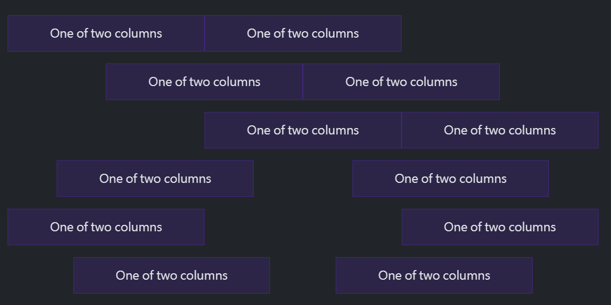
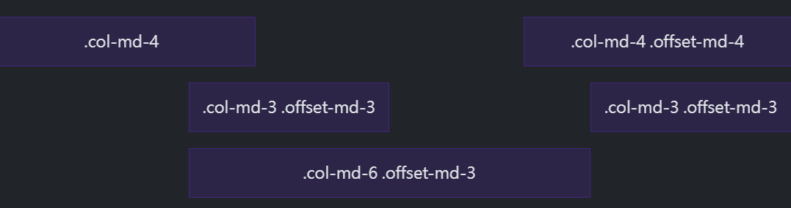

## 垂直對齊方法

在 .row 上用  `align-items-*` 垂直對齊元素

### 往上對齊

``` html
<div class="container text-center">
  <div class="row align-items-start">
    <div class="col">
      One of three columns
    </div>
    <div class="col">
      One of three columns
    </div>
    <div class="col">
      One of three columns
    </div>
  </div>
</div>
```

### 垂直對齊

``` html
<div class="container text-center">
  <div class="row align-items-center">
    <div class="col">
      One of three columns
    </div>
    <div class="col">
      One of three columns
    </div>
    <div class="col">
      One of three columns
    </div>
  </div>
</div>
```

### 往下對齊

``` html
<div class="container text-center">
  <div class="row align-items-end">
    <div class="col">
      One of three columns
    </div>
    <div class="col">
      One of three columns
    </div>
    <div class="col">
      One of three columns
    </div>
  </div>
</div>
```

### 對齊單一子元素

``` html
<div class="container text-center">
  <div class="row">
    <div class="col align-self-start">
      One of three columns
    </div>
    <div class="col align-self-center">
      One of three columns
    </div>
    <div class="col align-self-end">
      One of three columns
    </div>
  </div>
</div>
```

## 水平對齊

在 .row 上用  `justify-content-*` 水平對齊元素



``` html
<div class="container text-center">
  <div class="row justify-content-start">
    <div class="col-4">
      One of two columns
    </div>
    <div class="col-4">
      One of two columns
    </div>
  </div>
  <div class="row justify-content-center">
    <div class="col-4">
      One of two columns
    </div>
    <div class="col-4">
      One of two columns
    </div>
  </div>
  <div class="row justify-content-end">
    <div class="col-4">
      One of two columns
    </div>
    <div class="col-4">
      One of two columns
    </div>
  </div>
  <div class="row justify-content-around">
    <div class="col-4">
      One of two columns
    </div>
    <div class="col-4">
      One of two columns
    </div>
  </div>
  <div class="row justify-content-between">
    <div class="col-4">
      One of two columns
    </div>
    <div class="col-4">
      One of two columns
    </div>
  </div>
  <div class="row justify-content-evenly">
    <div class="col-4">
      One of two columns
    </div>
    <div class="col-4">
      One of two columns
    </div>
  </div>
</div>
```

## column 斷行

當你想讓 col 斷行到下一行，又不想加入新的一列 .row 時，可以在 col 跟 col 間用 w-100的div

``` html
<div class="container text-center">
  <div class="row">
    <div class="col-6 col-sm-3">.col-6 .col-sm-3</div>
    <div class="col-6 col-sm-3">.col-6 .col-sm-3</div>

    <!-- Force next columns to break to new line -->
    <div class="w-100"></div>

    <div class="col-6 col-sm-3">.col-6 .col-sm-3</div>
    <div class="col-6 col-sm-3">.col-6 .col-sm-3</div>
  </div>
</div>
```

## order

在 col 使用 .order-* 來控制 col 顯示順序，預設提供 order 1 - 5 可以設定。
order 值越小的會往前排。

``` html
<div class="container text-center">
  <div class="row">
    <div class="col">
      First in DOM, no order applied
    </div>
    <div class="col order-5">
      Second in DOM, with a larger order
    </div>
    <div class="col order-1">
      Third in DOM, with an order of 1
    </div>
  </div>
</div>
```

- .order-first: 會套用 order: -1，讓元素排到最前面。
- .order-last : 會套用 order: 6，讓元素排到最後面。

## Offsetting 推移 col

在 col 上用 offset-*，讓 col 增加 margin-left 向左推移。
舉例: .offset-md-4 會向左推移四個單位



``` html
<div class="container text-center">
  <div class="row">
    <div class="col-md-4">.col-md-4</div>
    <div class="col-md-4 offset-md-4">.col-md-4 .offset-md-4</div>
  </div>
  <div class="row">
    <div class="col-md-3 offset-md-3">.col-md-3 .offset-md-3</div>
    <div class="col-md-3 offset-md-3">.col-md-3 .offset-md-3</div>
  </div>
  <div class="row">
    <div class="col-md-6 offset-md-3">.col-md-6 .offset-md-3</div>
  </div>
</div>
```

## row 以外使用 col

.col-* 也可以在 row 以外使用來設定元素的寬度，當在row 以外使用時，col 內不會有預設的padding。


``` html
<div class="col-3 p-3 mb-2">
  .col-3: width of 25%
</div>

<div class="col-sm-9 p-3">
  .col-sm-9: width of 75% above sm breakpoint
</div>
```

## gutter

gutter 是指每欄 col 間的間距，預設值是 1.5rem (24px)

### 水平 gutter

在 row 上使用 `.gx-*` 來調整欄間距。當加大了欄間距，可能需要在 contianer 增加 padding，以免出現水平溢出(x軸)

``` html
<div class="container px-4 text-center">
  <div class="row gx-5">
    <div class="col">
     <div class="p-3">Custom column padding</div>
    </div>
    <div class="col">
      <div class="p-3">Custom column padding</div>
    </div>
  </div>
</div>
```

或是在 container 上增加 overflow-hidden 也可以

``` html
<div class="container overflow-hidden text-center">
  <div class="row gx-5">
    <div class="col">
     <div class="p-3">Custom column padding</div>
    </div>
    <div class="col">
      <div class="p-3">Custom column padding</div>
    </div>
  </div>
</div>
```

### 垂直 gutter

在 row 上使用 `.gy-*` 來調整垂直欄間距。

``` html
<div class="container overflow-hidden text-center">
  <div class="row gy-5">
    <div class="col-6">
      <div class="p-3">Custom column padding</div>
    </div>
    <div class="col-6">
      <div class="p-3">Custom column padding</div>
    </div>
    <div class="col-6">
      <div class="p-3">Custom column padding</div>
    </div>
    <div class="col-6">
      <div class="p-3">Custom column padding</div>
    </div>
  </div>
</div>
```

### 垂直與水平 gutter

在 row 上使用 `.g-*` 來同時調整垂直與水平欄間距。

``` html
<div class="container text-center">
  <div class="row g-2">
    <div class="col-6">
      <div class="p-3">Custom column padding</div>
    </div>
    <div class="col-6">
      <div class="p-3">Custom column padding</div>
    </div>
    <div class="col-6">
      <div class="p-3">Custom column padding</div>
    </div>
    <div class="col-6">
      <div class="p-3">Custom column padding</div>
    </div>
  </div>
</div>
```

## No gutters 

在 row 上使用 `.g-0` 來同時將欄間距歸零。

``` html
<div class="row g-0 text-center">
  <div class="col-sm-6 col-md-8">.col-sm-6 .col-md-8</div>
  <div class="col-6 col-md-4">.col-6 .col-md-4</div>
</div>
```


