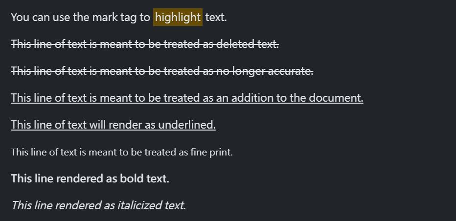
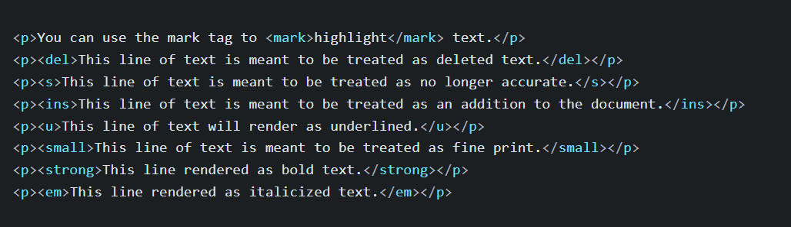

## 標題 class

當我們想設定文字大小為標題的大小，卻無法使用標題標籤時使用。

``` html
<p class="h1">h1. Bootstrap heading</p>
<p class="h2">h2. Bootstrap heading</p>
<p class="h3">h3. Bootstrap heading</p>
<p class="h4">h4. Bootstrap heading</p>
<p class="h5">h5. Bootstrap heading</p>
<p class="h6">h6. Bootstrap heading</p>
```

## Display 文字

當想要字體更大，粗細更細的文字時，使用 `display-*`

``` html
<h1 class="display-1">Display 1</h1>
<h1 class="display-2">Display 2</h1>
<h1 class="display-3">Display 3</h1>
<h1 class="display-4">Display 4</h1>
<h1 class="display-5">Display 5</h1>
<h1 class="display-6">Display 6</h1>
```

``` scss
$display-font-sizes: (
  1: 5rem,
  2: 4.5rem,
  3: 4rem,
  4: 3.5rem,
  5: 3rem,
  6: 2.5rem
);
```

## 行內文字元素




- `<mark>`: 替元素加上黃底凸顯， 相對的class為 `.mark`
- `<small>`: 表示網頁細則內容，如 copyright。 相對的class為 `.small`
- `<s>`: 表示不再準確的資訊，會在文字加上 刪除線。

## 取消列表樣式

當要取消列表預設樣式，在 ul 或 ol 加上 `.list-unstyled`

``` html
<ul class="list-unstyled">
  <li>This is a list.</li>
  <li>This may still come in handy in some situations.</li>
</ul>
```