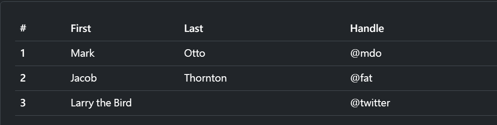

## 表格概述

要使用表格樣式，可以在 table 標籤加上 .tabel 樣式。

- thead: thead表頭內請用 th 標籤，並加上 scope="col" 代表這一欄。
- tbody: tbody內請用 th 標籤，並加上 scope="col" 代表這一列。



``` html
<table class="table">
  <thead>
    <tr>
      <th scope="col">#</th>
      <th scope="col">First</th>
      <th scope="col">Last</th>
      <th scope="col">Handle</th>
    </tr>
  </thead>
  <tbody>
    <tr>
      <th scope="row">1</th>
      <td>Mark</td>
      <td>Otto</td>
      <td>@mdo</td>
    </tr>
    <tr>
      <th scope="row">2</th>
      <td>Jacob</td>
      <td>Thornton</td>
      <td>@fat</td>
    </tr>
    <tr>
      <th scope="row">3</th>
      <td colspan="2">Larry the Bird</td>
      <td>@twitter</td>
    </tr>
  </tbody>
</table>
```

## 套用主題色彩

可以在整個表格、單列、單格加上主題色彩的表格 如 table-primary

``` html
<!-- On tables -->
<table class="table-primary">...</table>
<table class="table-secondary">...</table>

<!-- On rows -->
<tr class="table-primary">...</tr>
<tr class="table-secondary">...</tr>

<!-- On cells (`td` or `th`) -->
<tr>
  <td class="table-primary">...</td>
  <td class="table-secondary">...</td>
</tr>
```

## 內容垂直對齊

可以在 table 讓使用 

- align-middle: 讓表格內容垂直中
- align-top: 讓表格內容往上對齊
- align-bottom: 讓表格內容往下對齊

``` html
<div class="table-responsive">
  <table class="table align-middle">
    <thead>
      <tr>
        ...
      </tr>
    </thead>
    <tbody>
      <tr>
        ...
      </tr>
      <tr class="align-bottom">
        ...
      </tr>
      <tr>
        <td>...</td>
        <td>...</td>
        <td class="align-top">This cell is aligned to the top.</td>
        <td>...</td>
      </tr>
    </tbody>
  </table>
</div>
```

## 響應式表格

在 tabel 外加上 `.table-responsive`， 可以讓表格在小吋螢幕上出現橫向捲動(overflow-x: scroll)，避免出現x軸破版。

``` html
<div class="table-responsive">
  <table class="table">
    ...
  </table>
</div>
```


