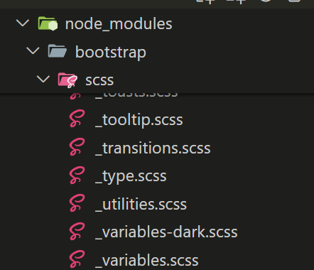

## 複製變數



首先到 node_modules裡找到 utilities.scss 檔案複製一份。

在專案內的 scss 內將複製的檔案貼上。

## 更改變數設定

在變數內即可新增，或調整原有 utilities 內容。

``` scss
$utilities: () !default;
$utilities: map-merge(
  $utilities,
  (
    
    "align": (
      property: vertical-align,
      class: align,
      values: baseline top middle bottom text-bottom text-top
    ),
  )
)
```
## 引入變數

在 all.scss 內引入，記得引入順序是在 bootstrap 原本的 utilities 檔後面

``` scss
@import 'bootstrap/scss/maps';
@import 'bootstrap/scss/mixins';
@import 'bootstrap/scss/root';

@import 'bootstrap/scss/utilities';

// 下面放入自訂utilities
@import './bootstrap-custom/utilities';
//

@import 'bootstrap/scss/utilities/api';
```

