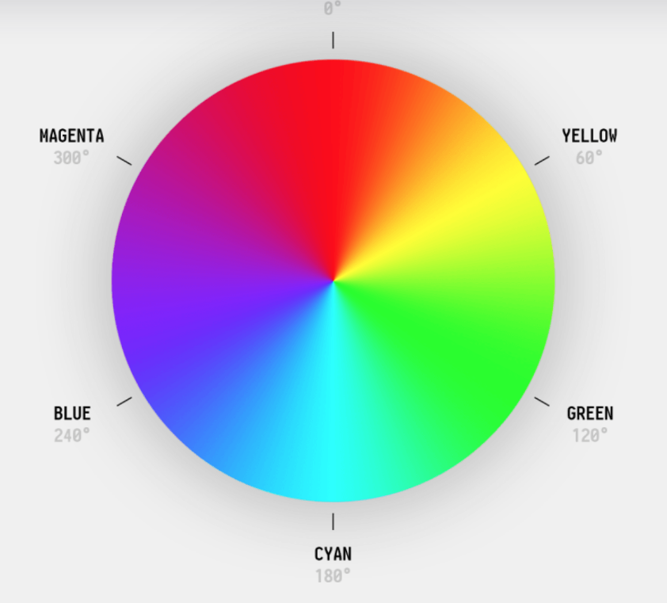

## 文字色彩設定

文字色彩設定方式如下:

``` css
.color-primary {
  color: red;
}
```

可以設定的值有

``` css
color: red; // 關鍵字
color: #ff0000; /* 使用十六进制颜色码 */
color: rgb(255, 0, 0); /* 使用RGB颜色值 */
color: rgba(255, 0, 0, 0.5); /* 使用RGBA颜色值，最后一个参数是透明度（0-1之间） */
color: hsl(0, 100%, 50%); /* 使用HSL颜色值 */
color: hsla(0, 100%, 50%, 0.5); /* 使用HSLA颜色值，最后一个参数是透明度（0-1之间） */
```

## RGB 與 RGBA 色彩

CSS 中的 RGB 和 RGBA 用來定義顏色。它們都使用紅色（Red）、綠色（Green）和藍色（Blue）三種顏色的組合來表示一種顏色。區別在於 RGBA 還包括一個透明度（Alpha）參數。

### RGB（Red, Green, Blue）

RGB 顏色值表示一種顏色的紅色、綠色和藍色組成部分。每一部分的值範圍在 0 到 255 之間。

``` CSS
color: rgb(red, green, blue);

color: rgb(255, 0, 0); /* 紅色 */
color: rgb(0, 255, 0); /* 綠色 */
color: rgb(0, 0, 255); /* 藍色 */

// 也可使用 % 百分比

color: rgb(100%, 0, 0); /* 紅色 */
```

### RGBA（Red, Green, Blue, Alpha）

RGBA 是在 RGB 基礎上添加了 Alpha 透明度參數。Alpha 的值範圍是 0 到 1，其中 0 表示完全透明，1 表示完全不透明。

``` CSS
color: rgba(255, 0, 0, 0.5); /* 半透明紅色 */
color: rgba(0, 255, 0, 0.3); /* 30% 透明度的綠色 */
color: rgba(0, 0, 255, 0.1); /* 10% 透明度的藍色 */
```

## HSL 和 HSLA 色彩

CSS 中的 HSL 和 HSLA 用來定義顏色。HSL 代表色相（Hue）、飽和度（Saturation）和亮度（Lightness）。
而 HSLA 在此基礎上還包含了透明度（Alpha），Alpha 的值範圍是 0 到 1，其中 0 表示完全透明，1 表示完全不透明。。

- Hue（色相）：顏色的種類，值的範圍是 0 到 360 度。0 度是紅色，120 度是綠色，240 度是藍色。

- Saturation（飽和度）：顏色的鮮豔程度，值的範圍是 0% 到 100%。0% 是灰色，100% 是全彩色。

- Lightness（亮度）：顏色的明暗程度，值的範圍是 0% 到 100%。0% 是黑色，100% 是白色。



``` CSS
color: hsl(0, 100%, 50%); /* 紅色 */
color: hsl(120, 100%, 50%); /* 綠色 */
color: hsl(240, 100%, 50%); /* 藍色 */
color: hsl(60, 100%, 50%); /* 黃色 */
color: hsl(180, 100%, 50%); /* 青色 */
color: hsl(300, 100%, 50%); /* 洋紅 */
color: hsl(0, 0%, 75%); /* 淺灰色 */
color: hsl(0, 0%, 0%); /* 黑色 */
color: hsl(0, 0%, 100%); /* 白色 */

color: hsla(0, 100%, 50%, 0.5); /* 半透明紅色 */
color: hsla(120, 100%, 50%, 0.3); /* 30% 透明度的綠色 */
color: hsla(240, 100%, 50%, 0.1); /* 10% 透明度的藍色 */
color: hsla(0, 0%, 0%, 0); /* 完全透明 */
color: hsla(0, 0%, 100%, 1); /* 不透明的白色 */
```

## 關鍵字

顏色設定也可以用[關鍵字](https://zh.wikipedia.org/zh-tw/%E7%BD%91%E9%A1%B5%E9%A2%9C%E8%89%B2#%E9%A2%9C%E8%89%B2%E5%90%8D%E7%A7%B0)，另外常見的還有
transparent (透明)，跟 currentColor。

currentColor 指的是目前的文字色彩，假如父層有設定文字色彩，使用這個關鍵字就能讓設定的css屬性套用父層文字色彩。

``` css
 .example {
  color: #3498db; /* 藍色 */
  border: 2px solid currentColor; /* 邊框顏色與文字顏色一致 */
  background-color: currentColor; /* 背景顏色與文字顏色一致 */
  padding: 20px;
  margin: 10px;
}
```
