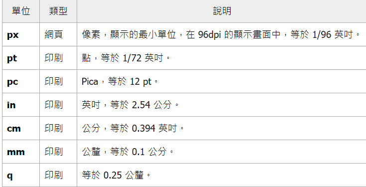

## 文字大小 (Font Sizes)

Font Sizes 設定方法如下:

``` css
.h1 {
  font-size: 16px;
}
```

Font Sizes 可以設定的值

- 關鍵字:

``` css
font-size: xx-small;
font-size: x-small;
font-size: small;
font-size: medium;
font-size: large;
font-size: x-large;
font-size: xx-large;
font-size: xxx-large;
```

- 絕對單位:

「絕對尺寸單位」是使用 font-size 是最常見的數值單位，絕對尺寸單位表示「不會因為其他元素樣式而變動」的單位，font-size 支援下列絕對尺寸單位：



- 相對單位: 

相對單位使字體大小能夠根據外部條件（如父元素的字體大小或根元素的字體大小）進行調整

1. em: 基於父元素的字體大小。例如，如果父元素的字體大小是 16px，那麼 1em 就等於 16px。

2. rem: 基於根元素（即 `<html>`）的字體大小。例如，如果根元素的字體大小是 16px，那麼 1rem 就等於 16px。

3. % (百分比): 百分比基於父元素的字體大小。例如，如果父元素的字體大小是 16px，那麼 100% 就等於 16px。

4. vw: 相對於視口寬度的百分比。例如，1vw 等於視口寬度的 1%。

5. vh: 相對於視口高度的百分比。例如，1vh 等於視口高度的 1%。

6. vmin 和 vmax: vmin 是視口寬度和高度中較小的那個的百分比，而 vmax 則是較大的那個。例如，如果視口寬度是 1000px，高度是 800px，那麼 1vmin 是 8px，1vmax 是 10px。


