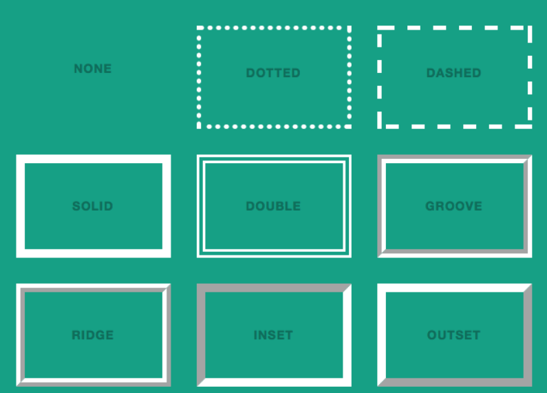

## border 與 outline

``` css
border: 1px solid red;
outline: 1px solid red;
```

border 和 outline 都是由「線條寬度、線條樣式、線條色彩」所組成，差異為

- border: 設定物件的邊框線，會佔據空間，可設定圓角
- outline: 設定物件的外框線、不佔據空間、不能設定圓角

## 使用時機

因為 border 可以設定圓角，專案較常用。outline 則是在表單輸入框被 focus 時出現的外框線。

## border 相關屬性

border 與 outline 也可分別為四邊設定不同的值。

``` css
border-top: 1px solid red;
border-right: 1px solid red;
border-bottom: 1px solid red;
border-left: 1px solid red;
```

## 單一屬性四個值設定

因為 border 有四個邊，也可對單一值設定四個編的值，四個值依序是 上右下左 來設定。

``` css
border-width: 1px 2px 1px 2px;
border-style: solid solid solid solid;
border-color: blue blue blue blue;
```

四個值的寫法也可以改成一到四個值的寫法

``` css
// 四個值分別指定 
border-width: 上 右 下 左

// 三個值 
border-width: 上 左右 下

// 兩個值
border-width: 上下 左右

// 一個值
border-width: [上右下左]
```

## border style

 border-style 可以設定的值有

``` 
 none | hidden | dotted | dashed | solid | double | groove | ridge | inset | outset
```




