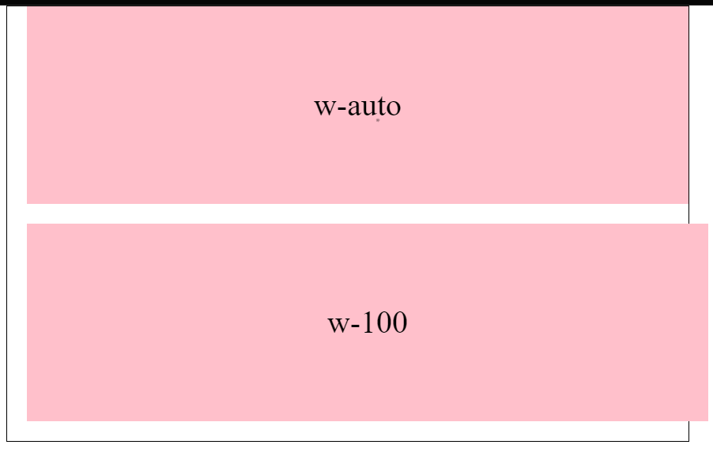
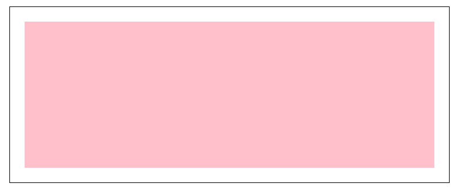
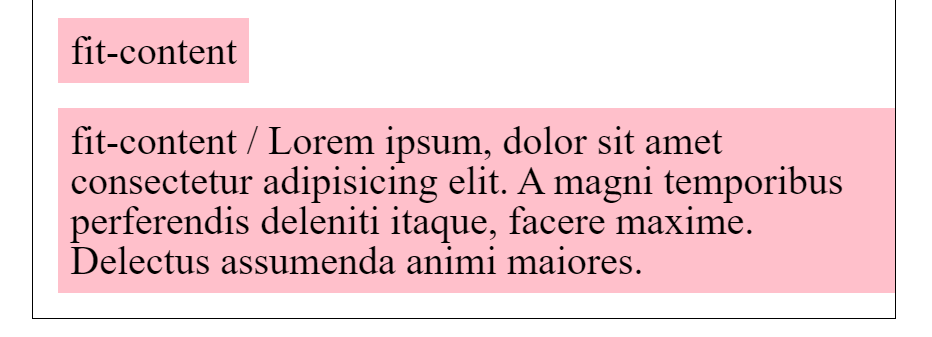
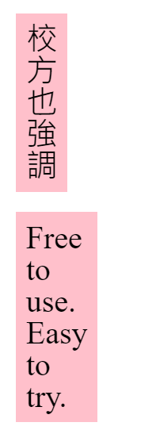
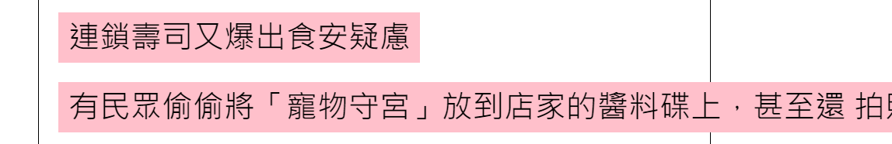

## 基礎介紹

Width 和 Height 主要用來設定物件的寬和高，可以設定的值包刮

| 單位類型 | 單位 | 描述                  | 範例              |
| -------- | ---- | --------------------- | ----------------- |
| 絕對長度 | `px` | 像素                  | `width: 100px;`   |
| 絕對長度 | `cm` | 厘米                  | `width: 10cm;`    |
| 絕對長度 | `mm` | 毫米                  | `width: 100mm;`   |
| 絕對長度 | `in` | 英寸                  | `width: 2in;`     |
| 絕對長度 | `pt` | 點（1pt = 1/72 英寸） | `width: 72pt;`    |
| 絕對長度 | `pc` | 派卡（1pc = 12pt）    | `width: 6pc;`     |
| 相對長度 | `%`  | 相對於包含塊的百分比  | `width: 50%;`     |
| 相對長度 | `em` | 相對於元素的字體尺寸  | `width: 10em;`    |
| 相對長度 | `rem`| 相對於根元素的字體尺寸| `width: 10rem;`   |
| 相對長度 | `vw` | 視口寬度的百分比      | `width: 50vw;`    |
| 相對長度 | `vh` | 視口高度的百分比      | `width: 50vh;`    |
| 相對長度 | `vmin`| 視口寬度和高度中較小值的百分比 | `width: 50vmin;`|
| 相對長度 | `vmax`| 視口寬度和高度中較大值的百分比 | `width: 50vmax;`|
| 相對長度 | `ch` | 0 的寬度              | `width: 20ch;`    |
| 相對長度 | `ex` | x 的高度              | `width: 5ex;`     |
| 相對長度 | `lh` | 行高                  | `width: 2lh;`     |


## 為何設定寬高無效

設定寬高時，要注意物件不能是 inline 元素，linline 以外的 「block、inline-block、flex-item、table」都能設定寬高。

## 寬高可運用空間

預設設定寬高是內容可運用空間，也就是 content-box 的寬高，如果另設定寬高的話，物件尺寸會往外增加。

``` css
.box {
  width: 200px;
  padding: 20px;
  border: 20px solid #aaa;
}
```

上面物件總佔據寬度為， width 200 + padding(左右) 20 + border(左右) 20 = 280px

### 寬度 auto 是什麼

當設定寬度值為 auto 時，和設關鍵字 「avaliable」一樣，會扣除 margin、padding、border的寬度，讓內容不超出父容器。所以需要滿版畫面時，有時候設定 auto 比設定 100% 更好用。



上圖兩個區塊一個是 width: auto，一個是 width:100%，兩個區塊都設定 margin-left: 20px。可以看到 width:auto的區塊自動扣除 margin 的寬度，width:100% 則沒扣除導致超出父層寬度。

### 寬高 100% 的範圍

當設定物件為寬 100% 時，該物件寬度會等於父層內容的可運用空間，也就是 padding 以內的空間



如上圖 子層設定寬度 100%，會佔滿父層的 padding 以內的空間。

當父層為 width: 600px; padding: 20px; 時，子層 100% 就是 600 - 20 -20 = 560px

### 寬 100vw 的範圍

當一個物件設定 width: 100vw 時，指的是左邊緣到右邊緣，不包含卷軸寬度。也就是說當你視窗出現卷軸時，寬度會因為卷軸的關係，導致過寬出現橫向卷軸。

但設定 width: 100%，就不會有這個問題，因為寬度是父層的可用空間，非視窗寬度。

## 關鍵字運用

寬度可設定的關鍵字有

- avaliable
- fit-content
- min-content
- max-content

### available

和設關鍵字 「auto」一樣，會扣除 margin、padding、border的寬度，讓內容不超出父容器。

### fit-content

當內容文字過少時，寬度會自動符合內容資料的寬度，當寬度多到要折行時，則呈現和 「availble 」一樣效果



### min-content

min-content 會以最小字作為物件的寬度，中文而言，就是一個字的寬度，會以一個字來換行。英文字是以多個字母為一個單字，所以會以最長的那個單字來換行。



### max-content

min-content 會以「最大內容寬度」呈現，當內容只有幾個字，寬度就是內容的數量。但若內容多到要換行，它就不會讓你換行，內容有多長，寬度就多長。



## min-width、max-width

當設定 min-width 、min-height，表示限制最小寬度、高度分別是多少。
設定 max-width、 max-height 則是最大寬度、高度的限制。

``` css

// .box 最小寬度為 200px ，最大寬度為 600px
.box {
  min-width: 200px;
  max-width: 600px;
}
```

### 同時設定 min-width、width

當同時設定 min-width、width時，會以 min-width 蓋過 width

``` css
// 寬度為 300px
.box {
  width: 200px
  min-width: 300px
}
```

### 同時設定 min-width、max-width

當同時設定 min-width、max-width，max-width 又比 min-width 小時，min-width 蓋過 max-width。

``` css
// 寬度為 300px
.box {
  min-width: 300px;
  max-width: 100px;
}
```


