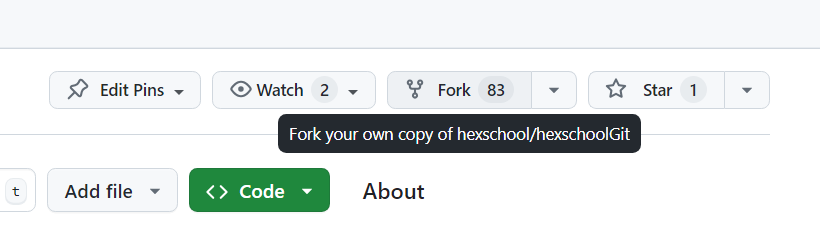
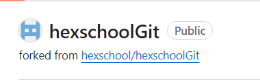
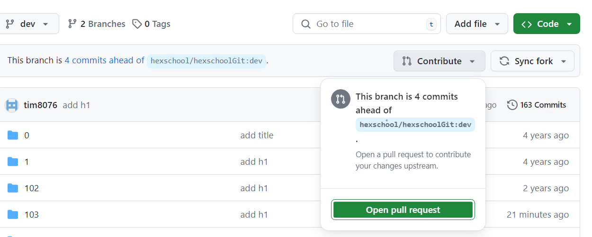
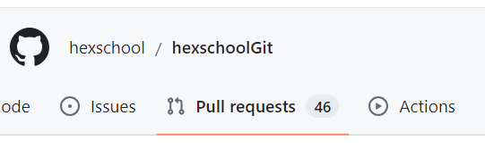

## 何謂發 PR

在 github 上其他人的專案，若我們想新增自己的程式碼上去，可以發 pr 給專案原作者。

### 第一步 Fork 對方的專案

在 GitHub 上，點擊目標倉庫右上角的 "Fork" 按鈕，將目標倉庫複製到自己的 GitHub 賬戶中。



fork 到自己 github 的專案，會顯示從哪裡 fork 來的。



### 第二步 clone 專案到本地端

將 fork 來的專案，git clone 到本地端

``` git
git clone https://github.com/tim8076/hexschoolGit.git
```

接著就是開始進行修改，例如新增一個 index.html 檔案，接著就是一般的 Git Commit 動作。

### 第三步：Push 回你自己的專案

用 git push，將 新增的 commit push 到自己的 github。

### 發 PR 給原專案作者

回到自己的專案頁面，可以找到一個「New pull request」的按鈕：



按下「Create pull request」後，可開始填寫 PR 的相關資訊，讓作者知道你這個 PR 大概做了什麼事。

填寫完畢後，按下「Create pull request」按鈕後，即算完成送出 PR。

### 第五步：原作收下 PR

原作者，便可以在專案的頁面看到 Pull requests 的數量增加了




