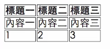
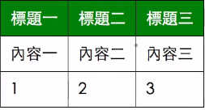
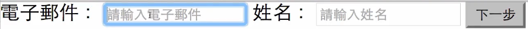
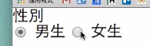
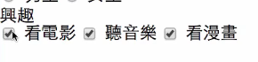
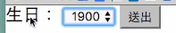
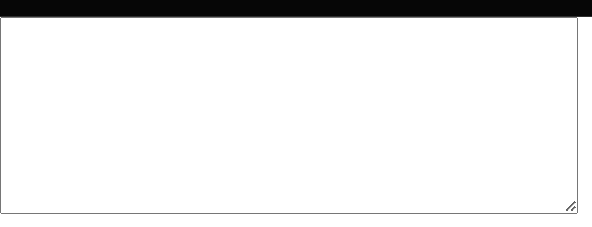
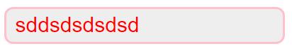

## 表格基礎介紹

HTML 表格（tables）用於在網頁中呈現表格。表格是由<table>元素開始和結束，並包含許多子元素來定義表格的各個部分。下面是一些基本元素及其用途：

1.` <table>`：定義表格的開始和結束。 2. `<tr>`（Table Row）：定義表格中的一行。 3.`<th>`（Table Header）：定義表格中的表頭單元格，通常是表格的標題。 4. `<td>`（Table Data）：定義表格中的數據單元格。

```html
<table class="table">
  <tr>
    <th>姓名</th>
    <th>年齡</th>
    <th>職業</th>
  </tr>
  <tr>
    <td>王小名</td>
    <td>15</td>
    <td>學生</td>
  </tr>
</table>
```

### 設定表格樣式

因為在表格設定 border 時，預設會有格與格的間距，如下圖



在 css reset 上會將表格與表格空隙清除

```css
// css reset
table {
  border-collapse: collapse;
  border-spacing: 0;
}
```

清除空隙後可以設定 border 樣式

```css
.table th,
.table td {
  border: 1px solid #000;
}

// th 欄位用padding推出空間
.table th {
  padding: 10px;
  background-color: green;
  color: white;
}

// td 欄位用padding推出空間
.table td {
  padding: 10px;
}
```



## 表單元素介紹

HTML 表單是用來收集使用者輸入資料的工具，廣泛應用於各種網站和網頁應用程式中。表單由一組 HTML 元素組成，每個元素都具有特定的功能，如文本輸入框、單選按鈕、複選框和下拉選單等。

```html
<form action="index.html" method="get">
  <input type="text" name="mail" />
  <input type="text" name="person" />
  <input type="submit" id="name" value="確認送出" />
</form>
```

表單內容會放在 `form` 元素內，在 input 欄位內輸入的資料，在按下 submit 按鈕後，會依照 name 的值，將資料傳送出去，網址會像這樣:

```
index.html?mail=abc@mail.com&person=小明
```

上面 mail 和 person 欄位分別帶入輸入的值。

### label、placeholder



```html
<input type="text" name="person" placehoder="請輸入文字欄位" />
```

在 input 上加入 placehoder，可以添加提示文字，讓使用者知道要輸入什麼資料，建議 input 都要搭配 label，用 for 和 id 互相對應。

```html
<label for="mail">電子郵件：</label>
<input id="mail" type="text" placeholder="請輸入電子郵件" name="mail" />
```

在 label 元素加上與 input 元素對應的 id，當使用者點擊 label 時， input 輸入框就會自動被選取，增加使用者體驗。

## input 類型

1. type="date": 會跳出日曆選擇器，但在每個瀏覽器會不太相同，建議使用 datepicker 的套件代替。
2. type="text": 純文字欄位
3. type="email": 輸入 email 欄位
4. type="range": 會出現範圍拉條
5. type="number": 只能輸入數字，不能輸入字母
6. type="tel": 手機版會跳出電話鍵盤

其他 type 可以參考 [MDN](https://developer.mozilla.org/zh-CN/docs/Web/HTML/Element/input)

## input 屬性

1. readonly: 僅能讀取，不能寫入
2. disabled: 禁用
3. required: 必填欄位，可做簡易驗證。

## radio、checkbox

```html
<form action="index.html">
  <h2>性別</h2>
  <input type="radio" name="sex" value="male" id="male" />
  <label for="male">男生</label>
  <input type="radio" name="sex" value="female" />
  <label for="female">男生</label>
</form>
```

在表單中，radio 是作為單選題使用，使用相同的 name 來將選項群組。



```html
<form action="index.html">
  <h2>興趣</h2>
  <input type="checkbox" name="hobby" value="movie" id="movie" />
  <label for="movie">看電影</label>
  <input type="checkbox" name="hobby" value="music" id="music" />
  <label for="music">聽音樂</label>
  <input type="checkbox" name="hobby" value="paint" id="paint" />
  <label for="paint">畫畫</label>
</form>
```

在表單中，checkbox 是作為多選題使用，使用相同的 name 來將選項群組。



## select、textarea

```html
<form action="index.html">
  <label for="birth">生日：</label>
  <select name="birth" id="birth">
    <option value="1900">1900</option>
    <option value="1901">1901</option>
  </select>
  <input type="submit" id="name" value="確認送出" />
</form>
```



select 會搭配 option 元素使用，option 是下拉選單的選項，value 則是表單送出會帶入的值。

```html
<textarea name="content" id="" cols="60" rows="10"></textarea>
```

textarea 用來輸入多行文字的表單元素，cols 代表一行可以輸入幾個文字，rows 代表能輸入多少列。



## CSS 自訂表單樣式

我們可以使用 CSS 自訂表單樣式

```html
<input type="text" class="text-input" />
```

```CSS
.text-input {
  border: 3px solid pink;
  border-radius: 10px;
  color: red;
  background-color: #eee;
  padding: 5px 10px;
  font-size: 1.5rem;
  apperance: none;
}

// 表單和按鈕最好做一樣大，因為常會放在一起。
.btn {
  padding: 5px 10px;
}
```

上面設定後就可以產生下面樣式的 input



設定樣式時，也要記得加上:focus, active

```CSS
.text-input:focus {
  background-color: #eee;
  outline: none;
}

// 按鈕可以加上 hover，被滑入時樣式
.btn:hover {
  background-color: red;
}

// 按鈕可以加上 active，被點擊時樣式
.btn:active,
.btn.active {
  background-color: red;
}
```
