## 網站發想初衷

設計網站的初衷:

- 例: 社會上常有人因為程式問題卡關，想設計一個 IT 論壇，幫助大家解決問題

## 什麼是使用者故事

使用者故事（User Story）是敏捷開發中常用的一種工具，用來描述特定使用者在特定情境下希望達成的目標。對於網站設計，使用者故事可以幫助團隊了解使用者需求，從而設計出更符合使用者期望的網站。

以這個[咖啡廳評價網](https://cafenomad.tw/)為例

### 使用者

- 我可以 輸入我所在的地區，找到附近的店家
- 我可以 設定篩選條件，例如口味、氛圍等，以便我可以找到符合我喜好的咖啡廳
- 我可以 瀏覽店家列表，以便我可以看到符合我的篩選條件的咖啡廳
- 我可以 查看店家詳細資訊，包括地址、營業時間、價格等
- 我可以 註冊帳號並登入系統
- 我可以 查看其他使用者對咖啡廳的評價，以便我可以參考其他人的經驗
- 我可以 留下自己對咖啡廳的評價和評論，以便其他使用者可以參考我的經驗
- 我可以 保存我喜歡的咖啡廳，以便下次可以快速找到。
- 我可以 分享店家的詳細資訊和評價到社交媒體上，以便我可以分享我的經驗和意見

### 管理者

- 我可以 新增新的咖啡廳，包括店家名稱、地址、營業時間、價格範圍等，以便前台使用者可以搜尋到
- 我可以 編輯現有咖啡廳資訊，以便更新店家的相關資訊，如地址、營業時間等
- 我可以 刪除不再營業或不符合標準的咖啡廳資訊，以保持資料庫的整潔和準確性
- 我可以 管理所有使用者的帳戶資訊，如重置密碼、解鎖帳戶等，以提供技術支援和維護帳戶安全
- 我可以 查看評價，瀏覽所有使用者對咖啡廳的評價，確保內容合規並反映真實用戶體驗
- 我可以 刪除評價，確保系統中的評價符合相關政策

使用者故事每則最好只聚焦一個功能，初期來說最好條列 3-7 個使用者故事就好，因為每個使用者故事都會對應到好幾個網站頁面。

## site map 網站地圖

當使用者故事寫好後，可以用網站地圖的方式整理

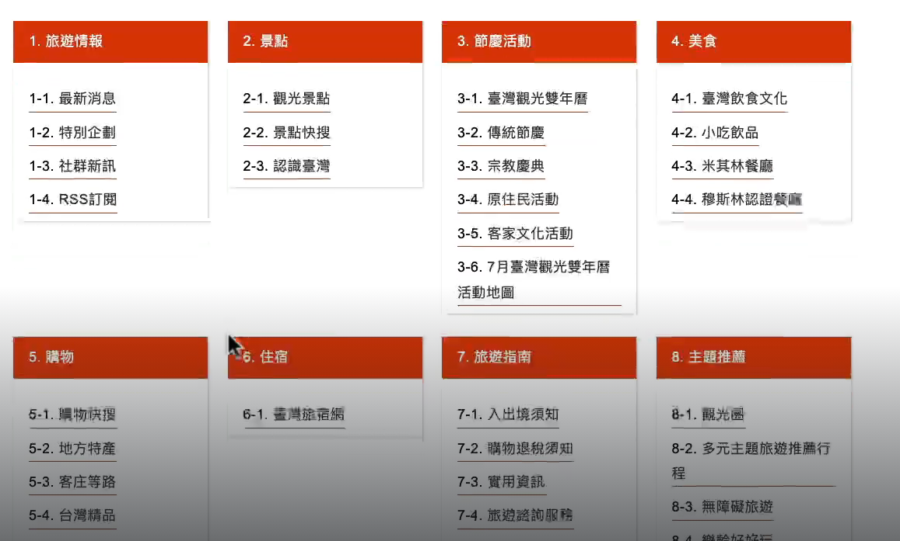

繪製工具可以用 [whimsical.com](https://whimsical.com/my-files-UmNkUvuq86GLk3d7wEeM6M)

## Miro 工具介紹

首先來到 [Miro 官網](https://miro.com/app/dashboard/)註冊會員

註冊好後，點選 New board 建立新工作區

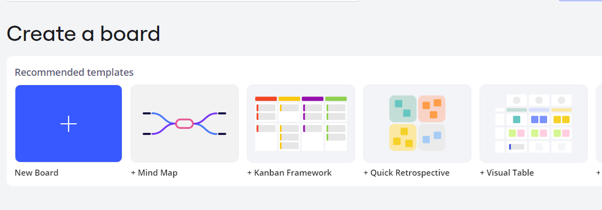

### 建立 frame

進到工作區後可以點擊左側工具欄的 Frame 來建立一個頁面，因為是製作網站線搞圖，所以可以選擇 browser 樣板。

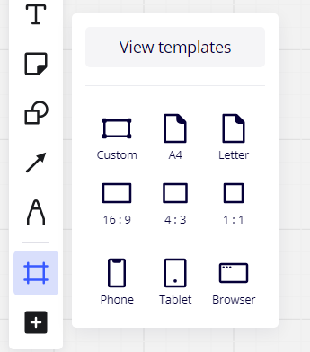

### 複製 frame

在 frame 上按 ctrl+c ctrl+v 可以複製新增頁面

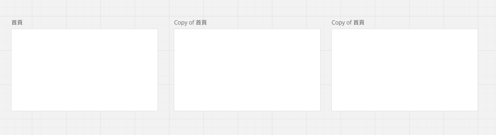

### 切換 frame

按左下角 open frame 可以切換不同 frame

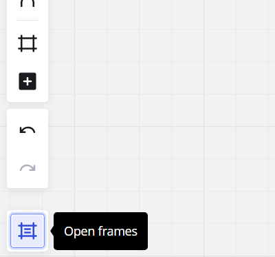

### 打字

選擇左側文字工具可以新增文字

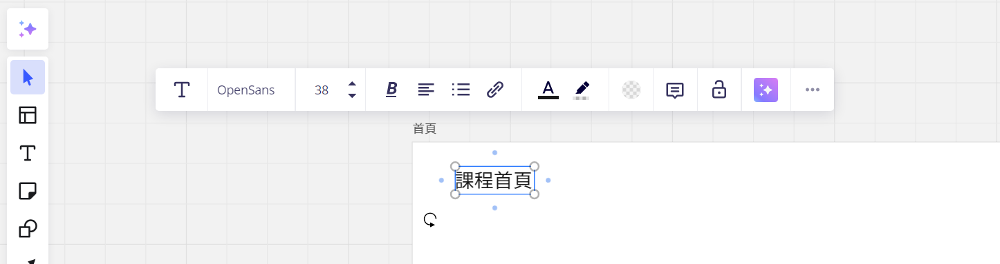

### sticky note

使用 sticky note 標示給設計師的提示

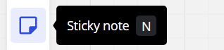

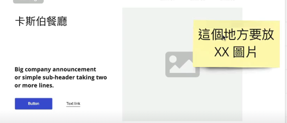

### 形狀工具

左側形狀工具可以加入不同形狀

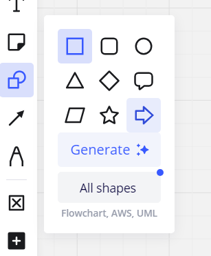

可以使用形狀工具繪製流程圖

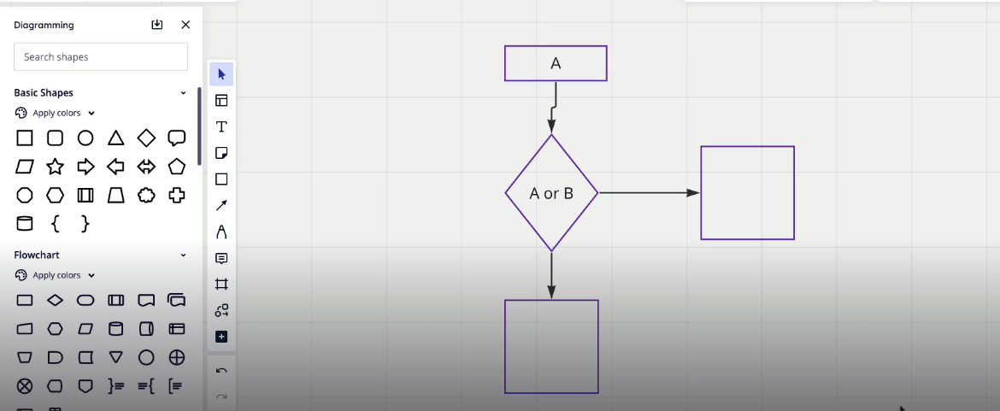

### comment 功能

comment 可以做為團隊間溝通使用

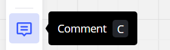

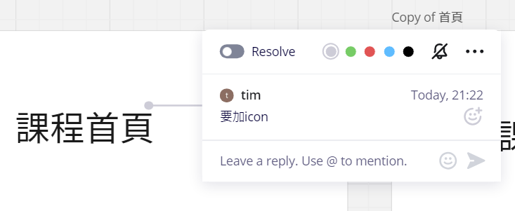

### wireframe 工具列

左側工具欄 搜尋 wireframe 可以找到 wireframe 工具列，可以用來繪製網站線稿圖

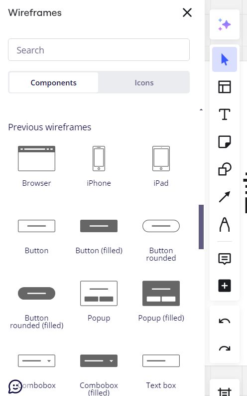

### 邀請團隊成員

在左側選單選擇 users

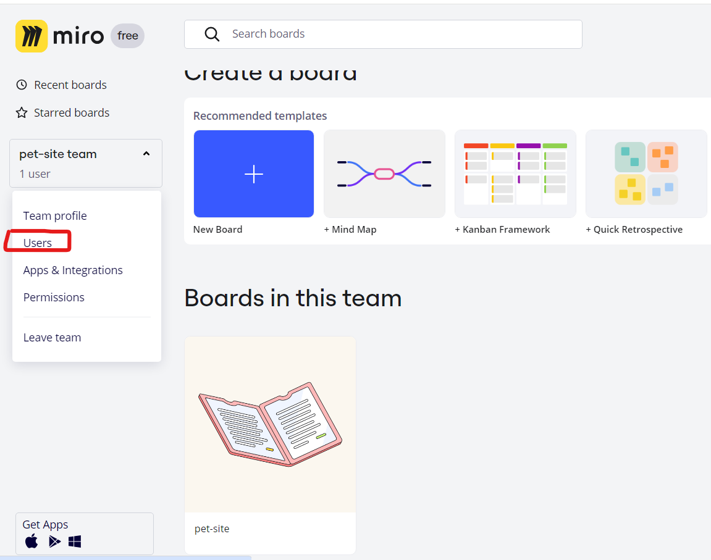

到團隊成員頁面後，點擊 invite new user 邀請新成員

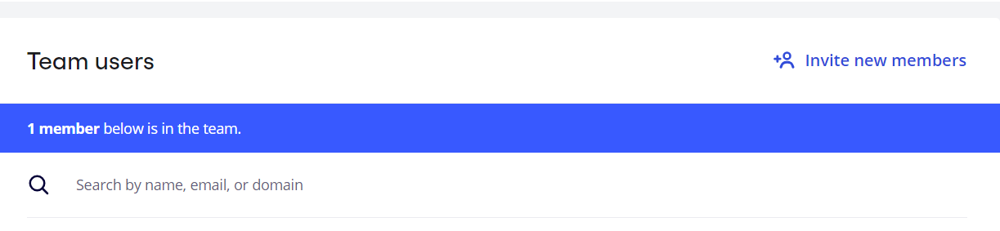

## 網站名稱

1. PetCare-專業寵物保姆
2. 毛寶貝-專業寵物保姆
3. 毛孩福利社-專業寵物保姆

## 常見問題

- 預定寵物保母費用?
  安親寄宿：媒合費用＄ 300/12H 起，會依據毛小孩體型調整。
  到府保姆：＄ 300/次起，單次半小時。超過半小時需加購。
  遛狗服務：＄ 200/次起，單次半小時。超過半小時需加購。
  到府洗澡：＄ 450/次起，費用會依據毛小孩種類與體型有所調整。

  所有服務費用皆含「寵物保險」及「服務品質保障」，服務不滿意全額退款。

- 寵物保母服務包括哪些內容？
  我們的寵物保母服務包括餵食、散步、洗澡、遊戲和陪伴等。根據您的需求，我們也可以提供特定的服務，如藥物管理和訓練。

- 如何預訂寵物保母服務？
  您可以通過我們的網站在線預訂，選擇合適的日期和時間，並提供您的寵物資料。我們會根據您的需求挑選合適的保母,供您選擇並預訂。

- 如果我的寵物有特殊需求怎麼辦？
  在預訂時，請詳細告知我們您的寵物有何特殊需求，我們會根據需求選擇最合適的保母，確保您的寵物得到專業的照顧。

- 那些地區有提供寵物保母服務?
  全台各地皆有寵物保姆服務。

- 我可以隨時聯絡寵物保母嗎？
  是的，您可以通過我們的網站或 App 與保母進行溝通，了解您的寵物狀況。我們也會提供定期更新和照片，讓您隨時了解寵物的情況。
