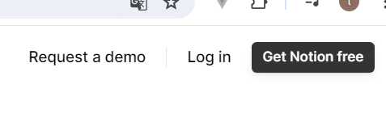
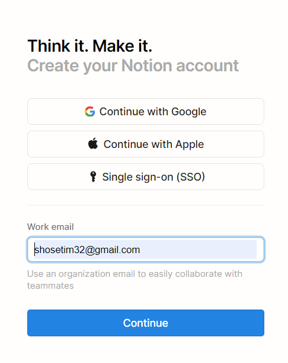
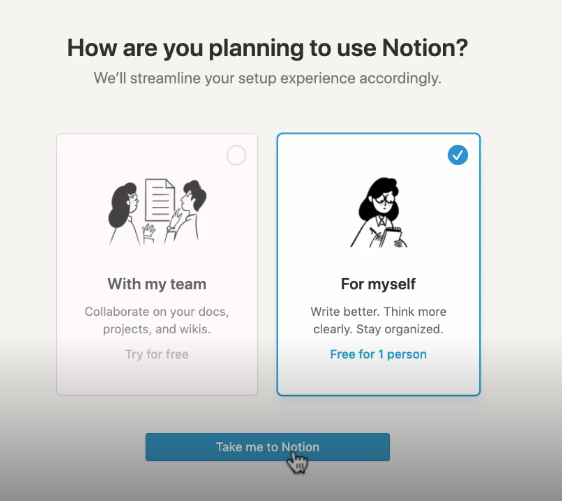
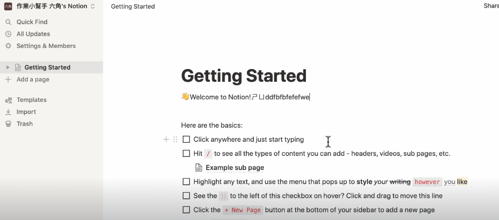
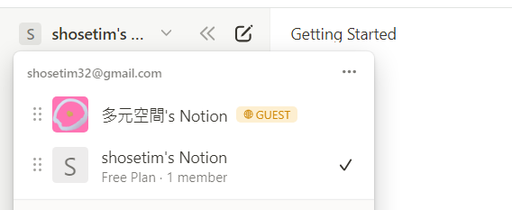
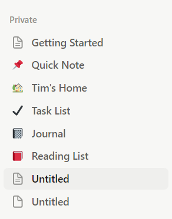
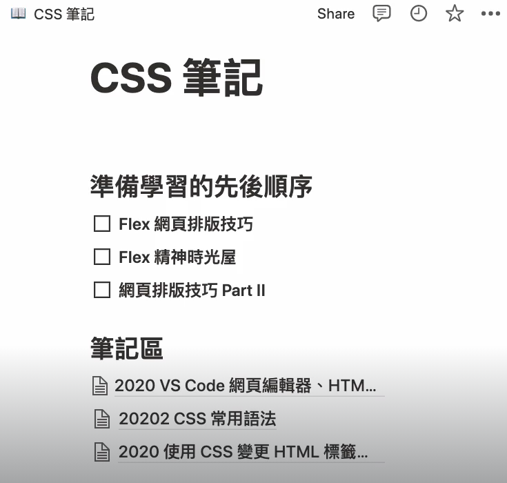
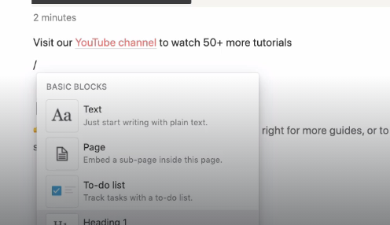

##  註冊 Notion 服務教學

1. 到 [notion 官網](https://www.notion.so/)點擊 get notion free

2. 選擇註冊方式

3. 選擇是個人還是團隊用

4. 這樣成功註冊囉

## 工作區、頁面、區塊

### 工作區

點擊左上角可以切換不同帳號的工作區，比如公司可能會把你加入公司群組，就會有公司的工作區。

### 頁面

在工作區左側可以建立不同頁面

單個頁面內也可以在有頁面

### 區塊

在頁面內可以透過輸入 / 建立不同區塊 block 

