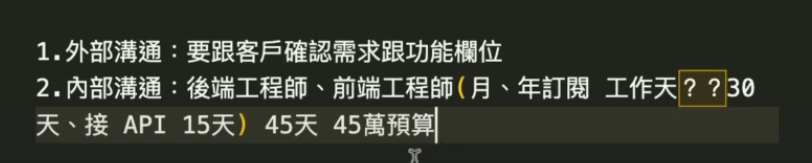
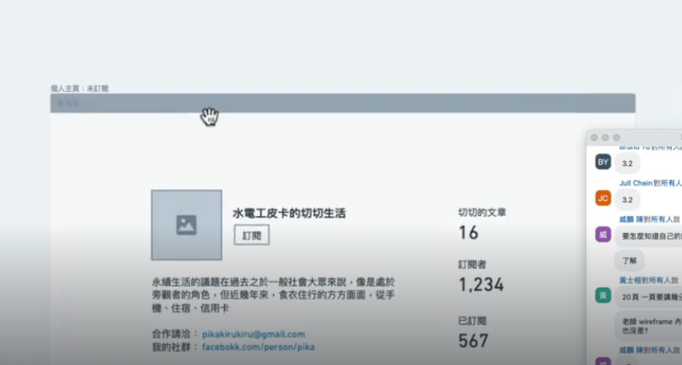

## 線稿圖

Wireframe 是一種視覺指南，用於表示網站或應用程式的骨架結構。它在設計過程的早期階段使用，用於勾勒頁面的基本結構和佈局，而不關注設計細節，如顏色、字體或圖片。以下是 wireframe 的一些關鍵方面：

1. 結構和佈局：Wireframe 專注於頁面上元素的排列，如標題、頁腳、導航菜單、內容區域和按鈕。

2. 功能性：它展示了不同元素之間的關係和互動，例如按鈕點擊後會發生什麼。

3. 用戶體驗：Wireframe 幫助設計師和開發者確定用戶如何導航和使用網站或應用程式。

4. 簡單和明確：由於 wireframe 只關注結構和功能，所以通常是簡單的黑白圖，不包含視覺設計元素。

5. 溝通工具：Wireframe 是設計師、開發者和客戶之間的重要溝通工具，用於討論和確認頁面的基本佈局和功能。

## 線稿圖功能

線稿圖作為和客戶外部溝通和工程師內部溝通使用

線稿圖繪製時，每一頁都要標上編號，如 1-1 是個人主頁，才能確認線稿圖和網站地圖是一致的。

## 線搞圖常見問題

首頁 banner 最好搭配搜尋列，讓使用者能直接進行購買

