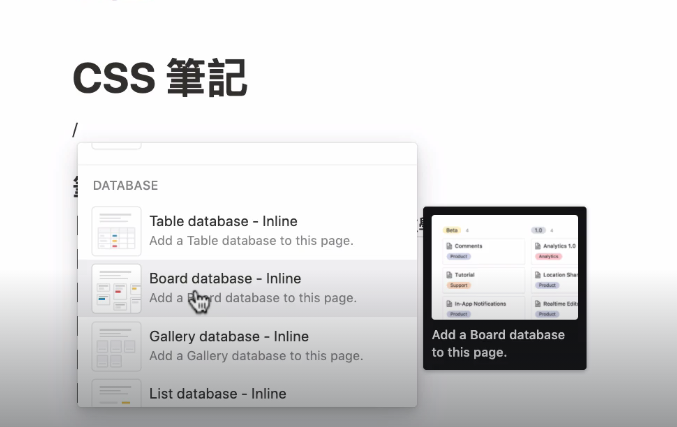
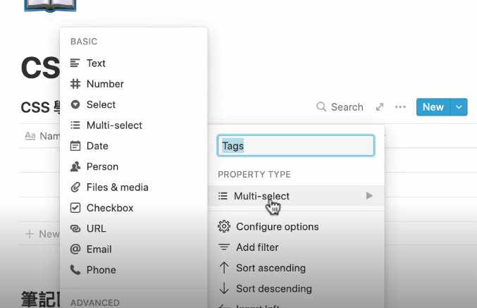
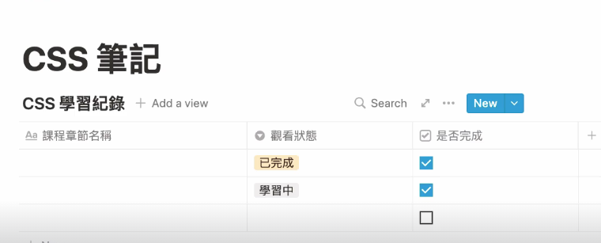
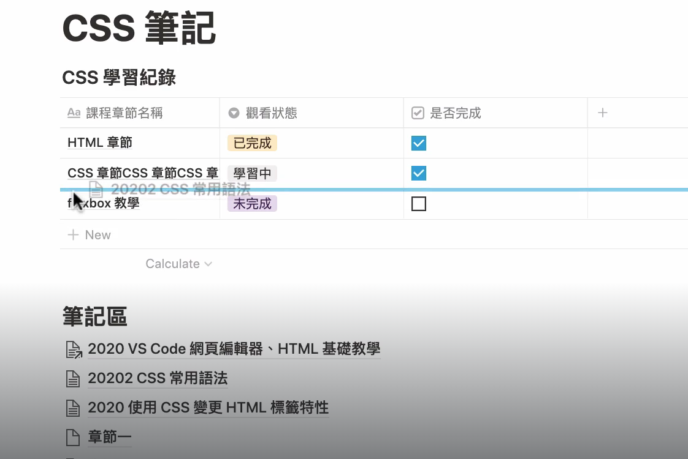
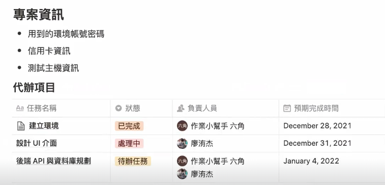
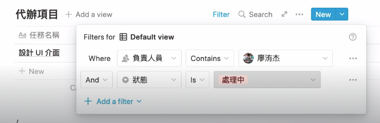
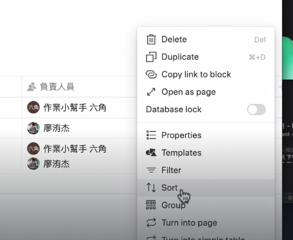

## database 資料庫

在 notion page 裡輸入 /table，可以增加一個資料庫

資料庫每一欄都可以選擇屬性類型

比如下方資料庫就有 select下拉選單、checkbox 兩種屬性欄位

## 拉 page 進資料庫

若有其他 page 想放進資料庫，可以直接拖曳 page 到資料庫欄位

## 建立 2~5 人小專案

table 也可以用來管理 2-5 人小專案，輸入任務名稱、負責人員、狀態等。

## 資料庫篩選

若想篩選資料庫內資料，例如我只想看小明任務執行如何，可以點擊table 上方 filter 按鈕，篩選負責人員為小明。

## 資料庫排序

若想對 table 資料做排序，可以使用 sort 功能

