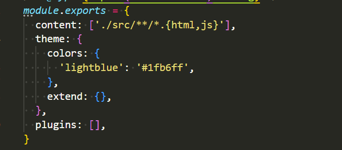
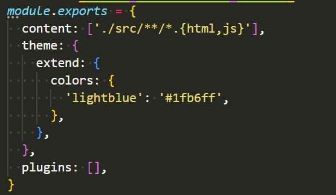
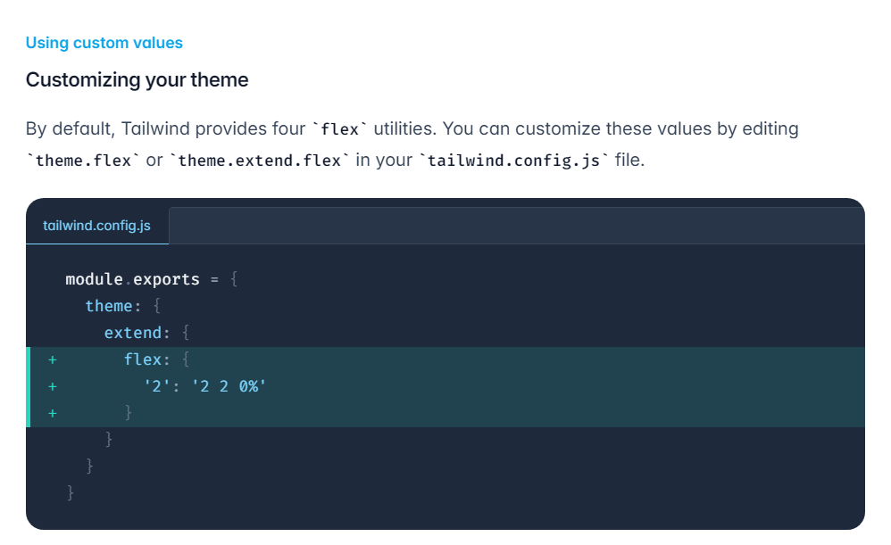

## 客製化樣式

在 tailwind.config.js 檔的可以設定客製化樣式，共有兩種方式

1. 寫在 theme 裡，會蓋掉原有 tailwind 的樣式，如下圖 tailwind 原有的 color 樣式會消失。



2. 寫在 extend 裡，tailwind 原有的樣式會保留，並擴充新增的樣式



除了單獨字串寫法，也支援物件形式

```js
theme: {
  colors: {
    transparent: 'transparent',
    current: 'currentColor',
    'white': '#ffffff',
    'tahiti': {
      100: '#cffafe',
      200: '#a5f3fc',
      300: '#67e8f9',
    },
    'maroon': {
      'light': '#FBF2F2',
      DEFAULT: '#AA0601',
      'dark': '#650300'
    }
    // ...
  },
},
```

所以當我們在 HTML 中使用時就會變成以下範例
文字顏色：

```html
<p class="text-maroon">文字 - 紅色</p>
<p class="text-maroon-light">文字 - 紅淺色</p>
<p class="text-maroon-dark">文字 - 紅深色</p>
```

背景色：

```html
<p class="bg-maroon">背景 - 紅色</p>
<p class="bg-maroon-light">背景 - 紅淺色</p>
<p class="bg-maroon-dark">背景 - 紅深色</p>
```

每個屬性在 theme 裡的名稱，可以在[文件中](https://github.com/tailwindlabs/tailwindcss/blob/master/stubs/config.full.js#L7)查詢



## 全站樣式設定

tailwind 本身就有寫自己的 base 全站設定，是參考 css normalize 調整的。若要擴充專案的 base 全站樣式設定，可以使用 @layer base。

```css
// input.css
@tailwind base;
@tailwind components;
@tailwind utilities;

@layer base {
  body {
    line-height: 500;
    color: #000;
    font-size: 1rem;
  }
}
```

以上編譯順序為: base => 自己的 base => components => utilities

如果想帶入 tailwind 的變數時，可以使用 @apply

```CSS
// input.css
@tailwind base;
@tailwind components;
@tailwind utilities;

@layer base {
  body {
    @apply font-medium;
  }
}
```

## 擴充 utilities

如果想新增 tailwind 沒有的 utilities class ，可以用 @layer utilities 設定

```css
// input.css
@tailwind base;
@tailwind components;
@tailwind utilities;

@layer utilities {
  .filter-none {
    filter: none;
  }
}
```

## 自訂元件

若要自定義元件，可以用 @apply components，但作者不建議過度使用 component，因為違反了 tailwind utilities 的概念，只建議用在 btn 按鈕跟表單上。

```css
// input.css
@tailwind base;
@tailwind components;
@tailwind utilities;

@layer components {
  .btn {
    background-color: blue;
    padding: 6px 12px;
    color: #fff;
  }
}
```

也可用在定義外部套件樣式時

```css
@layer components {
  .select2-dropdown {
    @apply rounded-b-lg shadow-md;
  }
  .select2-search {
    @apply border border-gray-300 rounded;
  }
  .select2-results__group {
    @apply text-lg font-bold text-gray-900;
  }
  /* ... */
}
```
