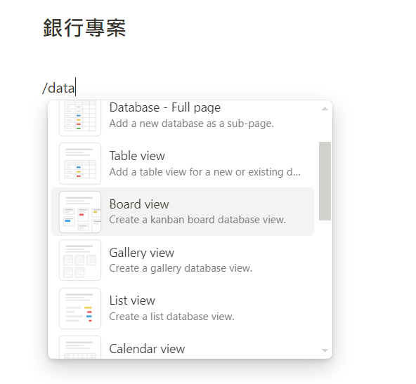
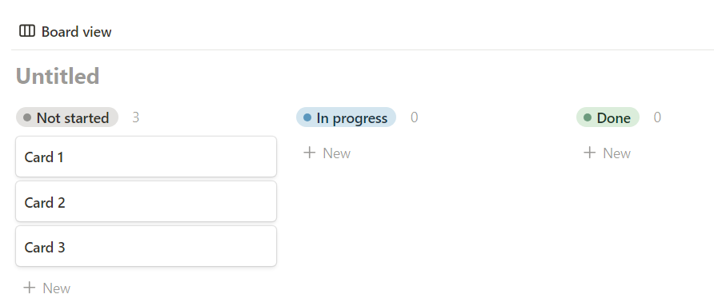
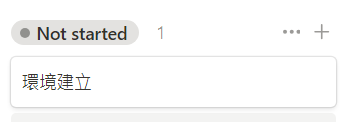
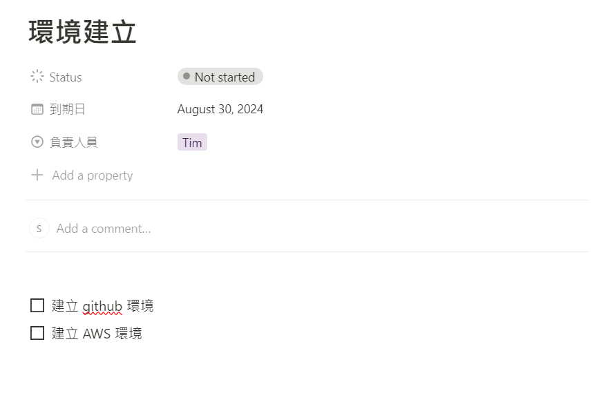
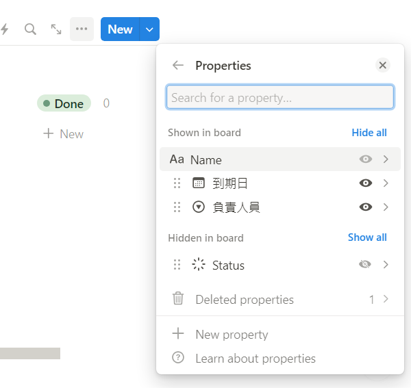
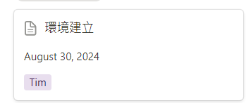
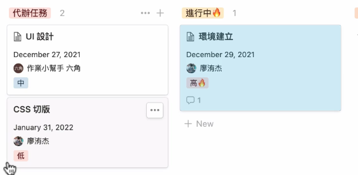

## 建立 board database

在 notion 中輸入 / 選擇 board database

會出現還未開始、進行中、完成 三種狀態

在狀態下可以新增 任務卡片

卡片內可以設定任務負責人，完成時間等狀態

在 table 右上角的三個點，可以設定每張卡片預設顯示狀態

這邊我設定預設顯示 日期、負責人員

## 設定任務優先順序

可以幫不同任務卡片加上優先順序 低、中、高，才知道哪個任務要先進行

