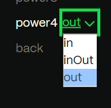

## 建立專案環境

先建立 index.html、all.js、all.css

```
- index.html
- all.js
- all.css
```

在 index.html 中引入 gasp cdn

```html
<!DOCTYPE html>
<html lang="zh-Hant-TW">
  <head>
    <meta charset="UTF-8" />
    <meta name="viewport" content="width=device-width, initial-scale=1.0" />
    <title>Document</title>
    <link rel="stylesheet" href="all.css" />
  </head>
  <body>
    <div class="blueBox"></div>
    <script src="https://cdn.jsdelivr.net/npm/gsap@3.12.5/dist/gsap.min.js"></script>
    <script src="all.js"></script>
  </body>
</html>
```

在 all.js 即可寫入 gasp 基本語法

```js
const blueBox = document.querySelector(".blueBox");

gsap.to(blueBox, {
  x: 500,
  duration: 3,
  rotation: 180,
  backgroundColor: "red",
  ease: "bounce.in",
});
```

## to、from、fromTo 語法

- to: 預設位置 => 指定位置
- from: 指定位置 => 預設位置
- fromTo: 同時設定起點和終點

```js
const blueBox = document.querySelector(".blueBox");
// to
// 元素從原本位置向右移動500
gsap.to(blueBox, {
  x: 500,
  duration: 3,
  rotation: 180,
  backgroundColor: "red",
  ease: "bounce.in",
});

// from
// 元素從 x 500位置回到原本位置
gsap.from(blueBox, {
  x: 500,
  duration: 3,
  rotation: 180,
  backgroundColor: "red",
  ease: "bounce.in",
});

// fromTo
gsap.fromTo(
  blueBox,
  {
    opacity: 0,
    duration: 2,
    rotation: 180,
    backgroundColor: "red",
  },
  {
    opacity: 300,
    duration: 2,
    rotation: 180,
    backgroundColor: "pink",
  }
);
```

## delay

若希望動畫能在指定時間後再撥放，可用 delay 語法

```js
// 等待五秒後在動畫
gsap.to(greenBox, {
  x: 500,
  duration: 5,
  backgroundColor: "blue",
  delay: 1.5,
});
```

## repeat

可使用 repeat 指定動畫重複次數

```js
// 使用 repeat 執行 2次動畫
gsap.to(greenBox, {
  x: 500,
  duration: 5,
  backgroundColor: "blue",
  delay: 1.5,
  repeat: 2,
});
```

repeat 設定 -1 可以不斷執行動畫

```js
// 使用 repeat 執行 2次動畫
gsap.to(greenBox, {
  x: 500,
  duration: 5,
  backgroundColor: "blue",
  repeat: -1,
});
```

## stager

若希望選取的元素們能依序呈現動畫，可以設定 stager

```js
// 每個連結間隔 .5 秒依序淡入顯示
gsap.from(".link", {
  duration: 2,
  opacity: 0,
  delay: 1,
  stagger: 0.5,
});
```

## 動畫速率設定

動畫速率可以參考 [官網](https://gsap.com/docs/v3/Eases/) 來設定。

```js
// 設定 ease 參數設定速率
gsap.to(target, {
  duration: 2.5,
  ease: "power4.out",
  y: -250,
});
```



每種速率都可選擇 out in 等模式，可以在官網查看效果。

## timeline 時間軸群組化

[範例](https://codepen.io/jskrtivy-the-animator/pen/YzoYgKE)

如果有多個物件要設定彼此動畫先後順序，可以用 timeline 群組化，就不用每一個用 delay 自己算延遲時間。

```js
const blueBox = document.querySelector(".blueBox");
const greenBox = document.querySelector(".greenBox");

const timeline = gsap.timeline();

// 第一個動畫跑完自動跑第二個動畫
timeline.to(blueBox, {
  x: 300,
  duration: 2,
  backgroundColor: "red",
});

timeline.to(greenBox, {
  x: 500,
  duration: 5,
  backgroundColor: "blue",
});
```

也可以設定預設值，例如 duration 預設為 1

```js
const timeline = gsap.timeline({
  default: {
    duration: 1,
  },
});

// 自動套用 duration 為1秒
timeline
  .to(blueBox, {
    x: 300,
    backgroundColor: "red",
  })
  .to(greenBox, {
    x: 500,
    backgroundColor: "blue",
  });
```

## position 參數

GSAP 的 timeline 物件中的 position 參數提供了一種靈活的方式來控制每個動畫的開始時間。這個參數可以接受多種不同的格式，用來指定動畫在時間軸上的位置。

### 絕對時間

你可以使用數字來指定動畫在時間軸上絕對的開始時間（以秒為單位）。這意味著動畫會在 timeline 的該時間點開始

```js
const tl = = gsap.timeline();
tl.to(".element1", { x: 100, duration: 1 }, 0) // 在 0 秒開始
  .to(".element2", { y: 100, duration: 1 }, 2) // 在 2 秒開始
  .to(".element3", { rotation: 360, duration: 2 }, 4); // 在 4 秒開始
```

### 相對時間

你可以使用 "+=" 或 "-=" 來指定相對於當前 timeline 的時間點。例如 "+=0.5" 代表在前一個動畫結束後的 0.5 秒開始。

```js
tl.to(".element1", { x: 100, duration: 1 }) // 在 0 秒開始
  .to(".element2", { y: 100, duration: 1 }, "+=0.5") // 在 .element1 結束後的 0.5 秒開始
  .to(".element3", { rotation: 360, duration: 2 }, "+=1"); // 在 .element2 結束後的 1 秒開始
```

### Label (標籤)

你可以為 timeline 的特定位置設置標籤，然後使用這些標籤作為 position 的參考點。這對於組織複雜的動畫很有幫助。

```js
tl.add("startLabel") // 在這裡設置一個標籤
  .to(".element1", { x: 100, duration: 1 }, "startLabel") // 在 startLabel 開始
  .to(".element2", { y: 100, duration: 1 }, "startLabel+=0.5") // 在 startLabel 之後 0.5 秒開始
  .to(".element3", { rotation: 360, duration: 2 }, "startLabel+=1"); // 在 startLabel 之後 1 秒開始
```

### timeline 範例

如果有兩個物件想等第一個物件動畫完後再一起跑時，可以設定 -= 語法。

blueBox、 greenBox 會在 pinkBox 跑到第二秒時一起跑。

```js
const timeline = gsap.timeline();

timeline.to(pinkBox, {
  x: 500,
  duration: 5,
  backgroundColor: "blue",
});

timeline.to(
  blueBox,
  {
    x: 500,
    duration: 3,
    backgroundColor: "red",
  },
  "-=3"
);

timeline.to(
  greenBox,
  {
    x: 500,
    duration: 3,
    backgroundColor: "blue",
  },
  "-=3"
);
```
