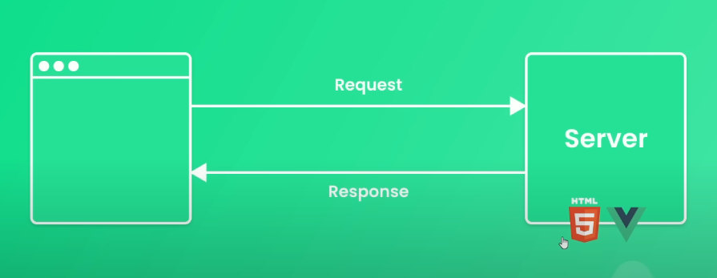
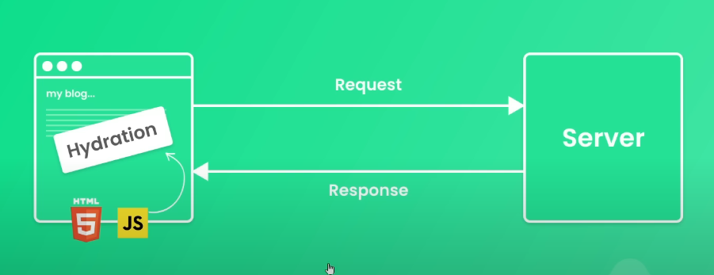

## Nuxt 是什麼

Nuxt.js 是一個基於 Vue.js 的開源框架，用於構建現代化的、伺服器端渲染（SSR）或靜態網站生成的應用程式。



當伺服器接收到前端傳來的請求時，會在伺服器端用 vue 將頁面渲染好


前端接收到的是已經渲染好的 html 檔



另外也會回傳一個 js 檔，將 vue 的功能和互動加載到頁面，頁面的切換都由前端的 vue router 進行。所以 nuxt 是綜合了 ssr 和 csr ，當一開始頁面載入時是使用 ssr (server side rendering)，之後頁面的切換則是 csr 在前端渲染。

## Nuxt 安裝

依照[官網](https://nuxt.com/docs/getting-started/installation)步驟安裝

1. 開啟新專案，輸入

```
npx nuxi@latest init <project-name>
```

2. 移動到新增專案資料夾

```
code <project-name>
```

3. 開啟開發伺服器

```
npm run dev
```
