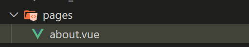
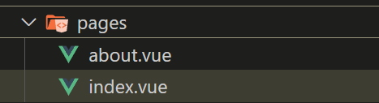
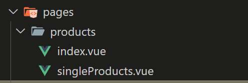
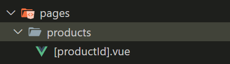

## 新增其他頁面

在專案根目錄新增 page 資料夾，並新增一個 about 頁面元件



about 元件會對應到 /about 路由。



要新增首頁的話，只要在 page 資料夾內新增 index.vue 檔，會對應到路由 / 。

另外要刪除根目錄上的 app.vue ，這樣 page 內的 index.vue 才能正確以首頁呈現。

## 建立子路由

要建立子路由只要在 page 資料夾內在新增子資料夾



上面檔案分別對應以下路由

- singleProducts.vue: /products/singleProducts
- index.vue: /products/

## 動態路由

當我們想用同一個元件依照不同路由資訊呈現不同資訊時，可使用 動態路由。



[productId].vue 括號內代表動態路由參數

上圖會對應到路由 /products/123， 其中 123 是動態更改的路由參數

在 [productId].vue 可如以下方式取得路由參數

```vue
<template>
  <div>
    <p>Product for {{ productId }}</p>
  </div>
</template>

<script setup>
const { productId } = useRoute().params;
</script>
```
