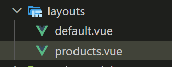

## 新增連結

在 nuxt 裡可以新增 `<NuxtLink to="/"></NuxtLink>`，連結來連到其他元件頁面，to 用來指向頁面的路由。

```html
<template>
  <header>
    <nav>
      <NuxtLink to="/">Nuxt Dojo</NuxtLink>
      <ul>
        <li><NuxtLink to="/">Home</NuxtLink></li>
        <li><NuxtLink to="/about">About</NuxtLink></li>
        <li><NuxtLink to="/products">Products</NuxtLink></li>
      </ul>
    </nav>
  </header>
</template>
```

使用 NuxtLink 的好處有

- 不會像一般 a tag 一樣重新整理頁面。
- 目前頁面的 NuxtLink 會套用 router-link-active 的 class 方便我們加上樣式。

## 新增 layout

### 通用 layout

像是 header、footer 這種每一頁都會出現的元件，可以做成 layout 管理。方法是在根目錄開一個 layout 資料夾，
並新增 default.vue 檔案。這個 layout 檔會套用到每個頁面，每頁各自內容則會在 slot 內。

```html
<template>
  <header>
    <nav>
      <NuxtLink to="/">Nuxt Dojo</NuxtLink>
      <ul>
        <li><nuxt-link to="/">Home</nuxt-link></li>
        <li><nuxt-link to="/about">About</nuxt-link></li>
        <li><nuxt-link to="/products">Products</nuxt-link></li>
      </ul>
    </nav>
  </header>
  <!-- output the page content -->
  <div>
    <slot />
  </div>
</template>
```

### 特定頁面 layout

若有特定頁面想套用不同 layout，可以在 layout 資料夾內新增新的 layout 檔

這裡我新增 products.vue，檔名可以自訂。



接著再要引入 layout 的檔案用 definePageMeta 註冊 layout

```js
<script setup>
definePageMeta({
  layout: 'products',
})
</script>
```
