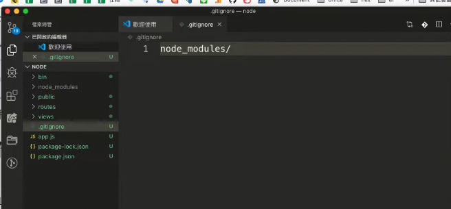
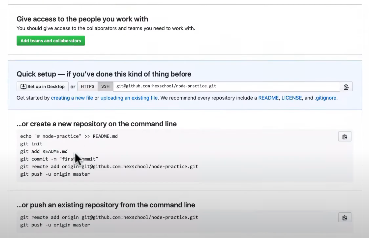
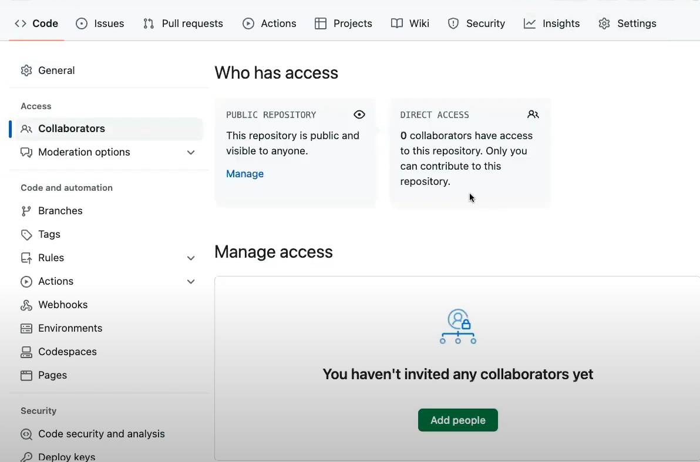
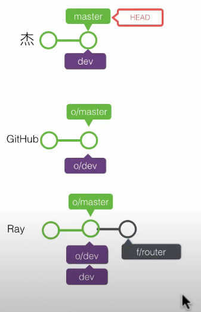
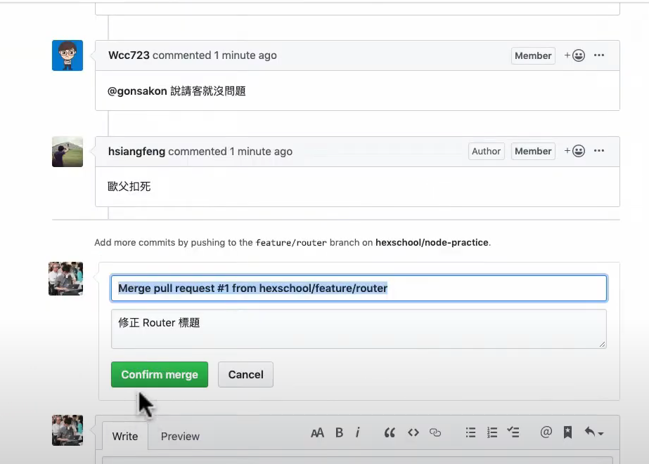
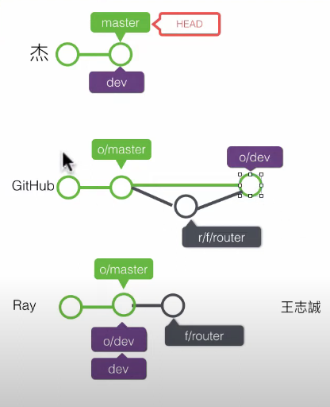

## Github flow 介紹

GitHub Flow 是一種輕量的、基於分支的開發工作流程，主要適合持續交付和快速部署的專案。這個流程非常簡單，旨在提高軟體開發的敏捷性和協作性。以下是 GitHub Flow 的基本步驟介紹：

1. 開發者 A 在本地建立專案， Git 環境，增加 (.gitignore)



2. commit 第一個版本

```
git add .
git commit -m "first commit"
```

3. 新增 dev 分支

```
git branch dev
```

4. 在 github 新增 repository



5. 推送到遠端

```
git remote add <git repository name>
git push origin main  // 推送主分支
git push origin dev   // 推送 dev 分支
```

將同事加入 repository 權限， settings => collabrator => add people



6. 開發者 B 下載專案

開發者 B 使用 git pull 將專案拉到本地端

7. 開發者 B 新增 feature 分支開發

開發者 B 新增 feature 分支開發，並 commit 一次



8. 開發者 B 推送到遠端，

開發者 B 將開發的 feature 分支推送到遠端，並發 PR 申請合併

```
git push origin feature/router
```

9. 開發者 A 合併 pr 申請



合併後遠端會多一個 commit 點


