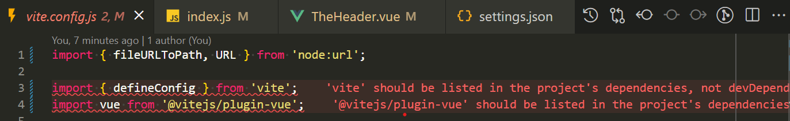

## 環境建立

安裝 vue3 開發環境

```js
npm init vue@3
```

安裝選項參考

```
✔ Project name: … vue3-eslint-airbnb
✔ Add TypeScript? … No(✅) / Yes
✔ Add JSX Support? … No(✅) / Yes
✔ Add Vue Router for Single Page Application development? … No / Yes(✅)
✔ Add Pinia for state management? … No / Yes(✅)
✔ Add Vitest for Unit Testing? … No(✅) / Yes
✔ Add Cypress for both Unit and End-to-End testing? … No(✅) / Yes
✔ Add ESLint for code quality? … No / Yes(✅)
✔ Add Prettier for code formatting? … No(✅) / Yes
```

這邊因為已安裝 eslint 格式化工具，就不安裝 pritter 了。

打開 package.json 檔案，可以看到目前專案已經有安裝 ESLint 了

```json
// package.json
  "devDependencies": {
    "@rushstack/eslint-patch": "^1.8.0",
    "@vitejs/plugin-vue": "^5.0.4",
    "@vue/eslint-config-prettier": "^9.0.0",
    "eslint": "^8.57.0",
    "eslint-plugin-vue": "^9.23.0",
    "sass": "^1.77.4",
    "vite": "^5.2.8"
  }
```

並且目錄也有一個 .eslintrc.cjs 的檔案

```cjs
/* eslint-env node */
require("@rushstack/eslint-patch/modern-module-resolution");

module.exports = {
  root: true,
  extends: [
    "plugin:vue/vue3-essential",
    "eslint:recommended",
    "@vue/eslint-config-prettier/skip-formatting",
  ],
  parserOptions: {
    ecmaVersion: "latest",
  },
};
```

當前這個 ES-Lint 專案預設是採用 Vue3 本身的規範，請注意目前僅僅只有基本的 Vue3 規範，因此還沒有加入 Airbnb 的規範。

## 加入 Air-bnb 規範

準備安裝 Airbnb 的規範，首先我們先安裝 Airbnb 的相關套件

```
npm install --save-dev eslint-config-airbnb-base
```

上面是安裝 airbnb 規範，若你是想安裝 Standard 規範 可以改輸入

```
npm install --save-dev eslint-config-standard
```

## 修改 .eslintrc.cjs

接著我們來修改 .eslintrc.cjs 檔案，目前預設設定檔案如下

```cjs
/* eslint-env node */
require("@rushstack/eslint-patch/modern-module-resolution");

module.exports = {
  root: true,
  extends: ["plugin:vue/vue3-essential", "eslint:recommended"],
  parserOptions: {
    ecmaVersion: "latest",
  },
};
```

要加入 air-bnb 只要修改如下:

```cjs
/* eslint-env node */
require("@rushstack/eslint-patch/modern-module-resolution");

module.exports = {
  root: true,
  extends: ["plugin:vue/vue3-essential", "eslint:recommended", "airbnb-base"],
  parserOptions: {
    ecmaVersion: "latest",
  },
};
```

這邊要注意 extends 的順序，因為 ESLint 會依照順序去檢查規範，所以我們需要把 airbnb-base 放在最後面，這樣才能確保 ESLint 會先檢查 Vue3 的規範，再來才是 Airbnb 的規範。

到目前為止，我們已經把 ESLint 設定好了，接下來我們就來測試一下看看 ESLint 是否有正常運作，讓我們打開 main.js 檔案，你應該會看到一大推的紅字都是關於「Missing semicolon.eslint」，在手動除錯即可。


## 安裝 eslint-import-resolver-alias

接著由於 Airbnb 較嚴格的關係，所以我們要安裝 eslint-import-resolver-alias 這個套件，而這個套件主要用途在於讓 ESLint 可以正常解析 @ 的路徑，因為我們在 vite.config.js 裡面有設定 @ 的路徑

``` js
export default defineConfig({
  plugins: [
    vue(),
  ],
  resolve: {
    alias: {
      '@': fileURLToPath(new URL('./src', import.meta.url)),
    },
  },
});
```

安裝 eslint-import-resolver-alias

```
npm install --save-dev eslint-import-resolver-alias
```

接著打開 .eslintrc.cjs，並且在 extends 的下面新增 settings

``` cjs
settings: {
  'import/resolver': {
    alias: {
      map: [['@', './src']],
      extensions: ['.js', '.vue'],
    },
  },
},
```

## 安裝 eslint-plugin-import

eslint-plugin-import 是一個專門給 ESLint 的套件，因為我這邊所使用的規範是 Airbnb，所以這個套件是必須要安裝的，而這個套件主要是用來檢查 import 的相關規範，例如：import 的順序、import 的檔案是否存在等等

``` 
npm install --save-dev eslint-plugin-import
```

## 解決 vite.config.js 錯誤

接下來你打開 vite.config.js 會出現一段錯誤，而這個錯誤非常的奇怪，因為官方所提供的 Vite 預設環境下這兩個套件就是安裝在 devDependencies 裡面，因此我們要做的事情就是告訴 ESLint 這兩個套件是可以安裝在 devDependencies 裡面的。



接著打開 .eslintrc.cjs，並且在 settings 裡面新增 import/core-modules，並且在 import/core-modules 裡面新增 vite 跟 @vitejs/plugin-vue，如下所示

``` cjs
require('@rushstack/eslint-patch/modern-module-resolution');

module.exports = {
  root: true,
  extends: ['plugin:vue/vue3-essential', 'eslint:recommended', 'airbnb-base'],
  parserOptions: {
    ecmaVersion: 'latest',
  },
  settings: {
    'import/resolver': {
      alias: {
        map: [['@', './src']],
        extensions: ['.js', '.vue'],
      },
    },
    'import/core-modules': [
      'vite',
      '@vitejs/plugin-vue',
    ],
  },
};
```


