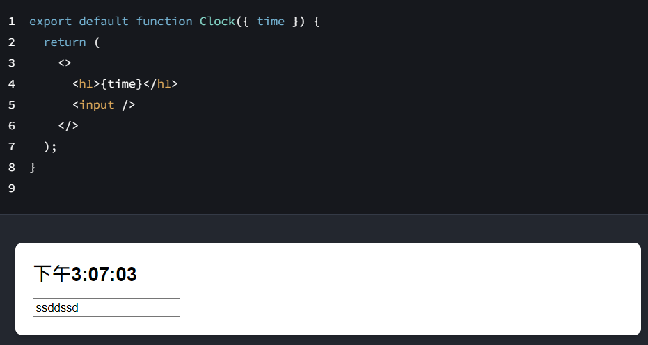

## useState 介紹

是 React 中最常用的 Hook 之一，用來在函數型元件中引入狀態管理。它允許你在元件中聲明一個狀態變數，並且可以更新這個變數，從而使元件能夠在不同的渲染周期中保持狀態。

### 基本語法

```js
const [state, setState] = useState(initialState);
```

- state: 這是當前的狀態值，可以是任何 JavaScript 類型（如數字、字串、物件、陣列等）。
- setState: 這是一個函數，當你想要更新狀態時調用它。調用這個函數後，React 會重新渲染元件，並使用更新後的狀態。
- initialState: 這是狀態的初始值，可以是靜態值，也可以是從函數計算得來的值。

```js
// #1 取出 useState 的方法
const { useState } = React;

const App = () => {
  // #2 定義狀態
  // 前者是變數，後者是方法，
  const [num, setNum] = useState(0);

  return (
    <div>
      {num}
      <button
        type="button"
        onClick={() => {
          setNum(num + 1);
        }}
      >
        {num}
      </button>
    </div>
  );
};
```

上面是一個計數器簡單範例，當點擊 button 會讓 num + 1 並渲染到畫面上。

## useState 原理

```js
function useCustom(params) {
  // react 處理
  // 純值, 方法(通知元件，值已經更新了)
  return [params, function () {}];
}

const [text, setText] = useState("這是一段文字");
```

useState 函式會回傳一個陣列，陣列第一筆純值，第二筆是方法，用來通知元件值已更新。所以 useState 僅能在元件內使用。

## 重新渲染範圍

每次用 setState 更新 state 並重新渲染畫面時，react 只會更新 state 有更新的區塊



如上圖 time 的資料變動時，只會重新渲染 h1 的部分，input 則維持原本的資料狀態。

## 非同步事件問題

```js
let num = 0;
const App = () => {
  console.log("函式更新", num++);
  const [arr, setArr] = useState([1, 2, 3]);

  function addArrData() {
    console.log("新增資料");
    setArr([...arr, arr.length + 1]);
  }

  return (
    <div>
      {console.log("畫面渲染")}
      <ul>
        {arr.map((i) => (
          <li key={i}>{i}</li>
        ))}
      </ul>
      <button type="button" onClick={addArrData}>
        新增陣列資料
      </button>
      <hr />
    </div>
  );
};
```

每當使用 set 方法來更新值時，整個元件會刷新一次，如上依序執行 `新增資料 => 函式更新 => 畫面渲染`;
所以當元件內有非同步事件會被重複註冊，非同步事件要避免直接放在元件最外層

```js
// 錯誤示範，setInterval 放在第一層
const App = () => {
  const [arr, setArr] = useState([1, 2, 3]);

  setInterval(() => {
    console.log("123");
  }, 1000);

  return (
    <div>
      <ul>
        {arr.map((i) => (
          <li key={i}>{i}</li>
        ))}
      </ul>
      <button type="button" onClick={addArrData}>
        新增陣列資料
      </button>
      <hr />
    </div>
  );
};
```

## state 是 readOnly

使用 useState 時，第一筆 state 值是 readonly 無法直接修改，下面我試圖直接修改值會報錯。

```js
const App = () => {
  // #3-2 這影響了許多會操作原始值的方法
  const [num, setNum] = useState(1);
  return (
    <div>
      <button type="button" onClick={() => num++}>
        {num}
      </button>
    </div>
  );
};
```

正確作法是使用 set 方法來通知元件值已修改

```js
const App = () => {
  const [num, setNum] = useState(1);
  return (
    <div>
      <button type="button" onClick={() => setNum(num + 1)}>
        {num}
      </button>
    </div>
  );
};
```

## useState 與陣列

當使用 useState 操作陣列資料時，因為 state 本身是 readonly，無法直接操作 ，要將更新後的陣列用 set 方法寫入原本的值。

```js
const App = () => {
  // #3-2 這影響了許多會操作原始值的方法
  const [arr, setArr] = useState([1, 2, 3]);

  // 刪除一筆陣列資料寫法
  function removeArr() {
    // 將更新後的值，用 setSrr 寫入
    setArr(arr.filter((item) => item !== arr.length));
  }

  // 新增一筆陣列資料寫法
  function addArr() {
    // 新增資料在最後
    const ary = [...arr, arr.length + 1];
    setArr(ary);
  }

  // 修改陣列其中一筆資料時，用 map 回傳修改後新陣列 
   function handleIncrementClick(index) {
    const nextCounters = counters.map((c, i) => {
      if (i === index) {
        // Increment the clicked counter
        return c + 1;
      } else {
        // The rest haven't changed
        return c;
      }
    });
    setCounters(nextCounters);
  }

  // 將新資料插入陣列指定位置
  function handleClick() {
    const insertAt = 1; // Could be any index
    const nextArtists = [
      // Items before the insertion point:
      ...artists.slice(0, insertAt),
      // New item:
      { id: nextId++, name: name },
      // Items after the insertion point:
      ...artists.slice(insertAt)
    ];
    setArtists(nextArtists);
    setName('');
  }

  // 排序陣列時，要先複製原本陣列在排序
  function handleClick() {
    const nextList = [...list];
    nextList.reverse();
    setList(nextList);
  }
};
```

## useState 與物件

更新物件資料時，必須將物件上一次狀態解構 pre 帶入，再加上此次更新的值。

```js
const App = () => {
  const [state, setState] = useState({ count: 4, theme: "blue" });

  // 新增一筆陣列資料寫法
  function addObj() {
    // 新增資料在最後
    setState((pre) => {
      return { ...pre, count: pre.count - 1 }
    })
};
```

### 使用同個函式綁定多個 input

``` jsx
export default function Form() {
  const [person, setPerson] = useState({
    firstName: 'Barbara',
    lastName: 'Hepworth',
    email: 'bhepworth@sculpture.com'
  });

  function handleChange(e) {
    setPerson({
      ...person,
      [e.target.name]: e.target.value
    });
  }
```

上面範例中使用 useState 定義一個物件，在多個 input 欄位中可以綁定同一個 handleChange 函式，當使用者更新 input 的值，`[e.target.name] `會更新物件對應屬性的值。

### 更新巢狀物件

``` jsx
const [person, setPerson] = useState({
  name: 'Niki de Saint Phalle',
  artwork: {
    title: 'Blue Nana',
    city: 'Hamburg',
    image: 'https://i.imgur.com/Sd1AgUOm.jpg',
  }
});
```

當 state 的物件資料有兩層以上時(巢狀)，可以使用雙重 ... 方式更新資料

``` jsx
setPerson({
  ...person, // Copy other fields
  artwork: { // but replace the artwork
    ...person.artwork, // with the same one
    city: 'New Delhi' // but in New Delhi!
  }
});
```

## useState 與 input

useState 與 input 綁定時，會在 input 上使用 onChange 事件，每當使用者修改 input 值就會觸發函式，再透過 set 函式將值寫入變數。

```js
const { useState } = React;

const App = () => {
  const [text, setText] = useState("這是一段文字");
  return (
    <div>
      {text}
      <input
        type="text"
        value={text}
        onChange={(e) => {
          setText(e.target.value);
        }}
      />
    </div>
  );
};
```

## useState 放在元件最外層

當使用 useState 定義資料時，請放在元件最外層，放在 if 或是 函式內會讀取不到。

```js
// 放在內層 讀取不到
if (1 > 0) {
  const [text, setText] = useState("我是文字");
}
```

## 避免值被重複計算

當用 setState 更新值時，整個元件都會刷新，包括 useState 的值，避免 useState 重複刷新，可改用函式 return 值

```js
function App() {
  // 元件第一次載入時才計算
  [count, setCount] = useState(() => {
    return 4;
  });
}
```

## 減少不必要的 state

```js
function Form() {
  const [firstName, setFirstName] = useState('Taylor');
  const [lastName, setLastName] = useState('Swift');
  // ✅ Good: calculated during rendering
  const fullName = firstName + ' ' + lastName;
  // ...
}
```

當一個值可以從其他state計算出來，就不用將值用state宣告。如上，fullName 的值可以從 firstName 和 lastName計算出來，直接在渲染過程計算即可。

```js
// 不需要使用 useState
const [email, setEmail] = useState('');

const emailRef = useRef();

function onSubmit() {
  axios.post('/api', { data: emailRef.current.value })
}
```

當輸入值的改變不需要觸發 UI 的更新時，useRef 是更高效的選擇。例如，單純收集表單資料而不需要即時更新顯示。


## 前一個狀態

在 React 中使用 useState 時，如果你需要根據前一個狀態來更新當前狀態，就可以使用 useState 提供的回調函式（callback function）形式。

```js
const [arr, setArr] = useState([]);

function mergeAryData() {
  const newAry = [{ num: 1 }, { num: 2 }, { num: 3 }];
  setArr((pre) => [...pre, ...newAry]);
}

useEffect(() => {
  setInterval(() => {
    mergeAryData();
  }, 1000);
}, []);
```

如上，在 setInterval 內每一秒都會執行一次 `mergeAryData()`，我希望每次 setArr 時，都會依據前一次 arr 的狀態再新增三筆資料進去，此時可以用 setArr 的 callback funtion 將 前一筆狀態 pre 帶出在合併。

- 另一個例子

```js
const [count, setCount] = useState(4);

function mergeAryData() {
  setCount(count - 1); // 3
  setCount(count - 1); // 3
}
```

上面 setCount 兩次結果還是 3 而不是 2， 因為 count 取得的值永遠都是 useState 定義的 4， 4 - 1 永遠會得到 3。

如果要根據前一次計算後的結果再減一，要 callback function 形式。

```js
const [count, setCount] = useState(4);

function mergeAryData() {
  setCount((preCount) => preCount - 1); // 3
  setCount((preCount) => preCount - 1); // 2
}
```

## 狀態更新是非同步的

React 中的狀態更新並不是立即執行的，它會被放入一個隊列，並在之後的渲染周期中處理。因此，即使我們連續調用多次 setState，React 也不會立即更新畫面，而是會等待所有的狀態更新操作完成後再進行一次重新渲染。

``` jsx
function Counter() {
  const [count, setCount] = React.useState(0);

  const handleClick = () => {
    setCount(count + 1);
    setCount(count + 1);
    console.log(count);  // 依然顯示舊的 count 值
  };

  return <button onClick={handleClick}>Click me: {count}</button>;
}
```

## 元件間共享 state

當兩個或多個組件需要使用相同的狀態，單獨管理每個組件的狀態可能會導致不一致的數據和邏輯錯誤。
- 解決方法：將狀態提升到共同的父組件，並通過 props 將狀態和更新函式傳遞給子組件。

假設有兩個輸入框，輸入的值需要在另一個地方顯示。

```js
function ParentComponent() {
    const [value, setValue] = React.useState("");
    return (
        <div>
            <InputComponent value={value} onChange={setValue} />
            <DisplayComponent value={value} />
        </div>
    );
}
function InputComponent({ value, onChange }) {
    return (
        <input
            type="text"
            value={value}
            onChange={(e) => onChange(e.target.value)}
        />
    );
}
function DisplayComponent({ value }) {
    return <p>輸入值為: {value}</p>;
}
```

- ParentComponent 提升了狀態，通過 props 傳遞給 InputComponent 和 DisplayComponent。
- 這種設計確保了兩個子組件使用的是同一份狀態。


