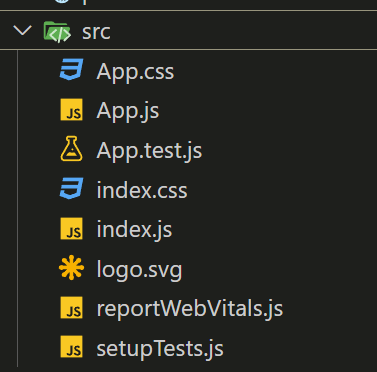
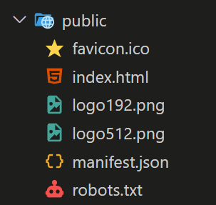
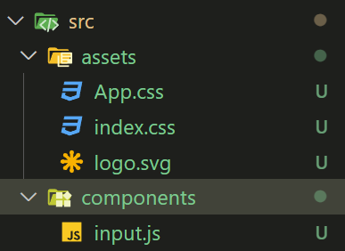
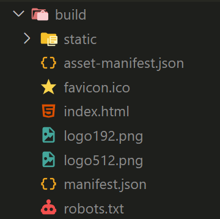

## Create React App 是什麼

Create React App (CRA) 是一個由 Facebook 開發和維護的開源工具，旨在幫助開發者快速建立和配置 React 專案。它提供了一個預設的 React 開發環境，使得開發者可以在不需要進行複雜配置的情況下，立即開始使用 React 進行開發。

主要特點：

- 快速啟動專案：CRA 透過簡單的一條命令 ，可以快速生成一個預配置好的 React 專案，適合快速上手和開發。

- 零配置：CRA 內建了所有必要的工具和配置，如 Webpack、Babel、ESLint 等，讓開發者專注於撰寫程式碼，而無需花費時間在工具的設定上。

- 現代開發工具：CRA 預設支援 JSX、ES6+、CSS Modules、熱重載 (Hot Reloading) 等現代前端開發功能，讓開發者能夠使用最新的技術和最佳實踐。

- 最佳化生產環境：CRA 在生產環境構建時，自動進行代碼壓縮、優化、去除未使用的程式碼等，使得最終的應用程式效能更高。

## 安裝 CRA

1. 來到[官網](https://create-react-app.dev/docs/getting-started)

2. 在電腦上開啟一個新的專案資料夾

3. 用 vscode 開啟資料夾後，在終端機輸入安專指令

``` 
npx create-react-app my-app  
```

4. 移動到建立好的專案

```
cd my-app
```

5. 運行專案

```
npm start
```

## 專案資料夾介紹

### src 資料夾



- index.js: 所有檔案的進入點，跟這隻檔案有關聯的檔案都會被編譯
- App.css: 專案的 css 會被 import 進 index.js
- App.js: 專案的根元件
- App.test.js: 測試用檔案
- setupTests.js: 測試用檔案

### public 資料夾

public 資料夾內的檔案都不會被編譯



## 資料夾檔案規劃

src 資料夾內可以新增不同資料夾來區分檔案



- assets: 放 css 、img 等靜態檔案
- components: 放元件

## 編譯檔案

使用指令 npm run build 將程式碼打包編譯

編譯後會出現 build 資料夾，裏頭檔案是可以直接放到網路上運行的




