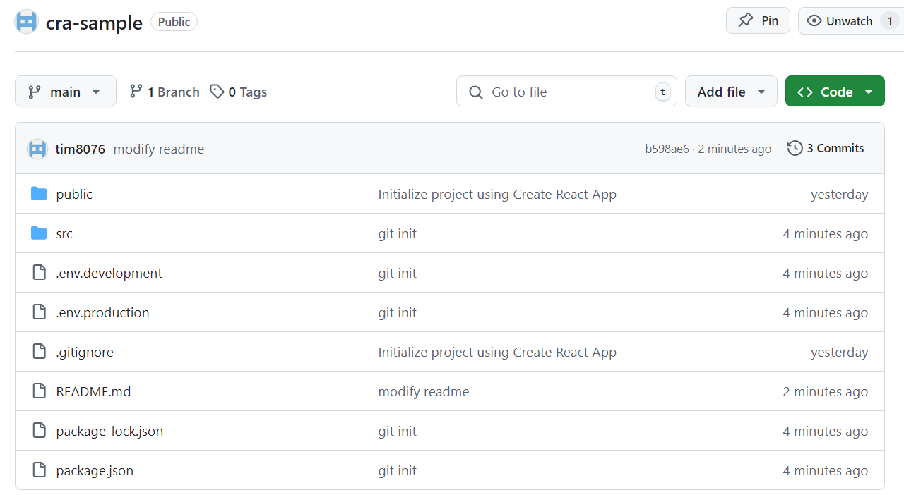
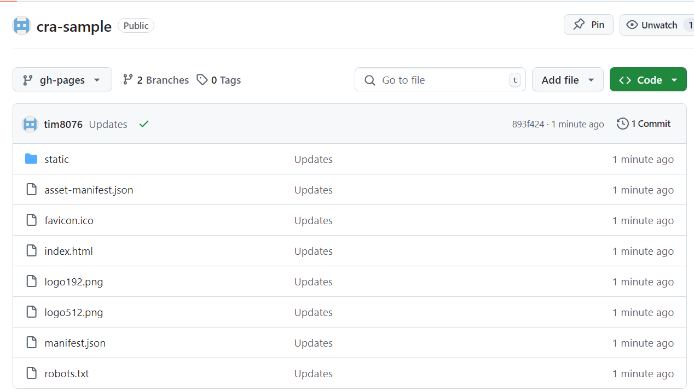
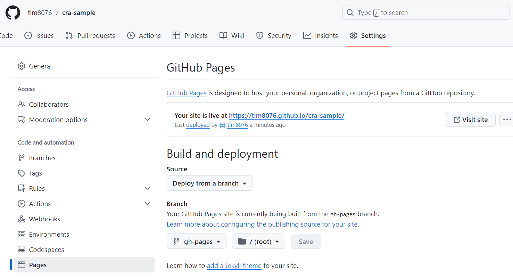

## 建立遠端儲存庫

可以先在 github 上建立新的 repository遠端儲存庫，並將專案推送上來




## 推送到 gh-pages

可以先來到 [cra 官網](https://create-react-app.dev/docs/deployment/#step-2-install-gh-pages-and-add-deploy-to-scripts-in-packagejson)，照官網步驟做:

1. 打開 package.json ，並加上 github page 路徑

```
// 官網範例
"homepage": "https://myusername.github.io/my-app"
             帳號名稱.github.io/儲存庫名稱

// 實際對應到自己的 github page
"homepage": "https://tim8076.github.io/cra-sample"
```

2. 安裝 gh-pages 套件

```
npm install --save gh-pages
```

3. 在 package.json 中的 scripts 新增這兩行指令

```
"predeploy": "npm run build",
"deploy": "gh-pages -d build"
```

4. 編譯檔案

輸入指令 `npm run deploy` 來編譯並推送到 github pages



點選 settings 即可看到部屬好的網址

