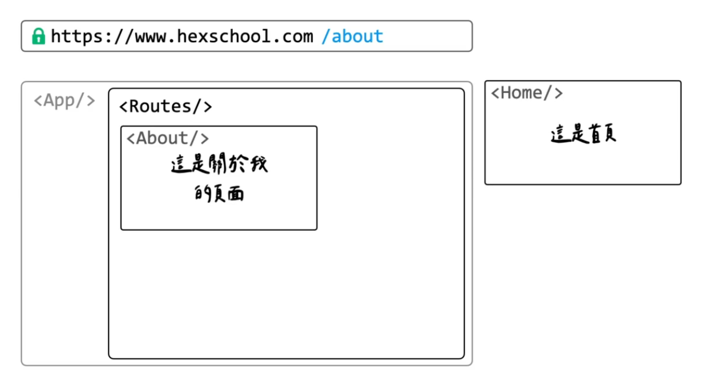
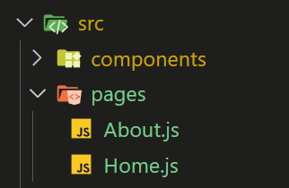
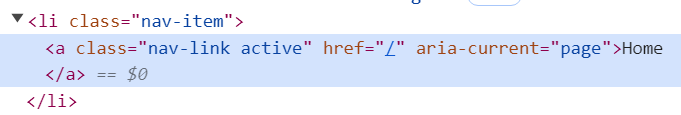

## 基礎介紹

React Router 是 React 應用程式中的路由管理工具，允許你在不重新載入整個頁面的情況下，為應用程式設定不同的路徑和相應的元件。這使得 React 應用程式能夠更具互動性，並提供單頁應用程式 (Single Page Application, SPA) 的特性。



## 安裝 router

首先在 cra 專案中安裝 react router

```
npm install react-router-dom --save
```

1. 加入 BrowserRouter 元件，每個專案只需加入一次。

BrowserRouter 元件引入後會包在 App 元件外層。

```js
// index.js
import { BrowserRouter } from "react-router-dom";

const root = ReactDOM.createRoot(document.getElementById("root"));
root.render(
  <React.StrictMode>
    <BrowserRouter>
      <App />
    </BrowserRouter>
  </React.StrictMode>
);
```

2. 準備元件



在 src 下新增 pages 資料夾，裡面放不同頁面的元件。

3. 建立 router

```js
import { Routes, Route } from "react-router-dom";
import Navbar from "./components/Navbar";
import Home from "./pages/Home";

function App() {
  return (
    <div className="App">
      <Navbar />
      <div className="container mt-3">
        <Routes>
          <Route path="/" element={<Home />}></Route>
        </Routes>
      </div>
    </div>
  );
}
```

在 App 元件內引入 Routes, Route 兩個元件，並用 Route 元件分別帶入要呈現的頁面元件。

- path: 頁面路由
- element: 要渲染的元件

3. 建立 link

我們可以在頁面中加入 link 來切換不同頁面

- 引入 link 元件

```js
import { Link } from "react-router-dom";
```

- 使用 link 元件

link 元件的 to 屬性可以指定要前往的路由

```js
export default function Navbar() {
  return (
    <nav className="navbar navbar-expand-lg bg-body-tertiary">
      <div className="container-fluid">
        <a className="navbar-brand" href="#">
          Navbar
        </a>
        <div className="collapse navbar-collapse" id="navbarSupportedContent">
          <ul className="navbar-nav me-auto mb-2 mb-lg-0">
            <li className="nav-item">
              <Link className="nav-link" to="/">
                Home
              </Link>
            </li>
            <li className="nav-item">
              <Link className="nav-link" to="/about">
                About
              </Link>
            </li>
          </ul>
        </div>
      </div>
    </nav>
  );
}
```

- Active link

```js
import { NavLink } from "react-router-dom";
```

如果希望當前點選的 link 能帶有 active class ， 可以改用 NavLink 元件


