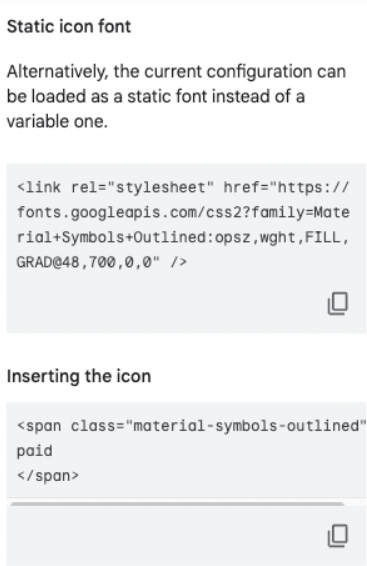
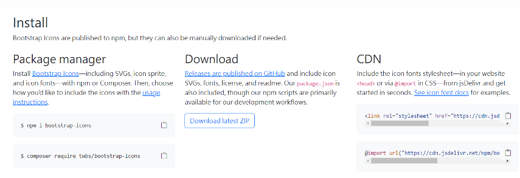
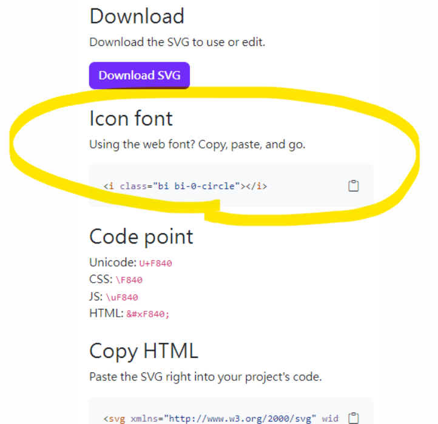

## 線上 icon 載入

[Material Symbols](https://fonts.google.com/icons?hl=zh-tw&icon.set=Material+Symbols)

選擇想要使用的 Icon， 點選 icon，出現右側欄



將 Static icon font 區塊中 <link> 程式碼貼至 <head> 內

```html
<!-- 可載入以下 CDN (此 CDN 為樣式 outline ，欲載入其他樣式需至該 icon 取得 CDN ) -->
<link
  rel="stylesheet"
  href="https://fonts.googleapis.com/css2?family=Material+Symbols+Outlined:opsz,wght,FILL,GRAD@48,400,0,0"
/>
```

將 Inserting the icon 區塊中程式碼貼至 HTML 區塊內

```html
<span class="material-symbols-outlined font-size-84"> paid </span>
```

若需對於不同區塊的 Icon 做調整，可參考此官方提供的 [CodePen](https://codepen.io/tomasdev/pen/VwyMzbZ/daacd5f6bfaecba5aa4209afc1a8a4e3)，使用 div 進行設定並包裹所需的元素。

## Bootstrap Icons

1. 需先 Bootstrap Icons 中找到該 icon 的 CDN

```html
<link
  rel="stylesheet"
  href="https://cdn.jsdelivr.net/npm/bootstrap-icons@1.11.3/font/bootstrap-icons.min.css"
/>
```



2. 點擊想要載入的 icon 即可從右欄找到載入方式，目前我們使用的是 Icon font 的載入方式



### npm 載入方法

```
npm i bootstrap-icons
```

載入樣式

```js
import "bootstrap-icons/font/bootstrap-icons.css";
```
