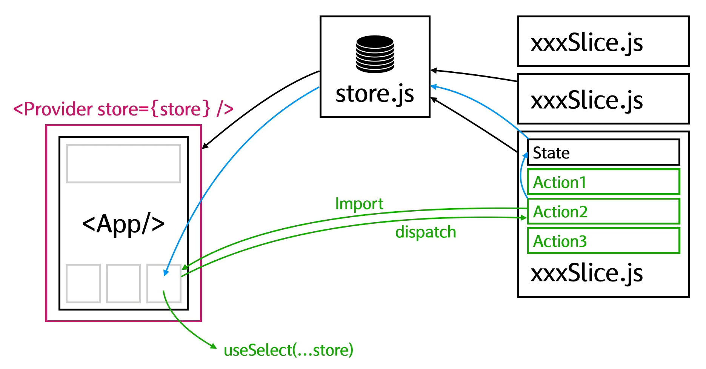

## Redux 運作原理

當有資料狀態在很多元件都會用到時，可以交由 redux 管理

以下是每個部分的說明：

1. Provider:

`<Provider store={store} />` 是一個 React 組件，負責將 Redux 的 store 提供給應用程式的其他組件。這樣應用程式中的任何地方都可以訪問到 Redux store 中的狀態。
Store:

2. store.js
   是 Redux 的 store，用來存儲應用程式的狀態。在這裡，應用程式的狀態由 store 管理，並且可以通過動作 (actions) 來改變。

3. Slices:

每個 xxxSlice.js 代表應用中的一個狀態切片 (slice)，定義了狀態結構和更新狀態的 reducers。每個 slice 都包含該部分狀態的初始值和相關的 actions (例如 Action1, Action2, Action3)，這些動作定義了如何根據用戶的行為來更新狀態。

4. App:
   App 是 React 應用程式的主要組件。
   它從 store.js 取得狀態，並使用 useSelect 來選取需要的狀態。它還可以通過 dispatch 來觸發 actions 改變 store 中的狀態。

5. Actions 和 Dispatch:

綠色的箭頭表示 dispatch。dispatch 用來傳送 actions (例如 Action1, Action2, Action3) 到 Redux store 中。當 action 被 dispatch 時，Redux 根據 action 的類型，使用對應的 reducer 來更新 store 中的狀態。

6. useSelect:

useSelect 是 React-Redux 提供的 hook，用來從 Redux store 中取得應用程式所需的狀態。
