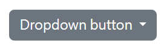
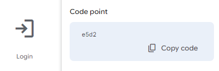

## Dropdowns 基礎用法

```html
<div class="dropdown">
  <button
    class="btn btn-secondary dropdown-toggle"
    type="button"
    data-bs-toggle="dropdown"
    aria-expanded="false"
  >
    Dropdown button
  </button>
  <ul class="dropdown-menu">
    <li><a class="dropdown-item" href="#">Action</a></li>
    <li><a class="dropdown-item" href="#">Another action</a></li>
    <li><a class="dropdown-item" href="#">Something else here</a></li>
  </ul>
</div>
```

## 客製化 dropdown 按鈕箭頭

預設 dropdown 按鈕箭頭是這樣，是寫在 `dropdown-toggle` 的 ::after 裡。



要做客製化修改，可以搭配 [meterial icon](https://fonts.google.com/icons)

點擊 icon 後可以看到 Code point



將 Code point 複製到自己的專案，font-family 使用 Material Symbols Outlined

```scss
.dropdown-toggle {
  &::after {
    content: "\e313";
    font-family: "Material Symbols Outlined";
    border: 0;
  }
}
```

## 多層次選單做法

在每個 `dropdown-menu`，裡面的 li 再放入一組要展開的 `dropdown-menu`

[範例](https://codepen.io/jskrtivy-the-animator/pen/abgexJb)
