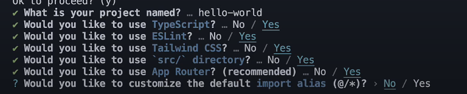
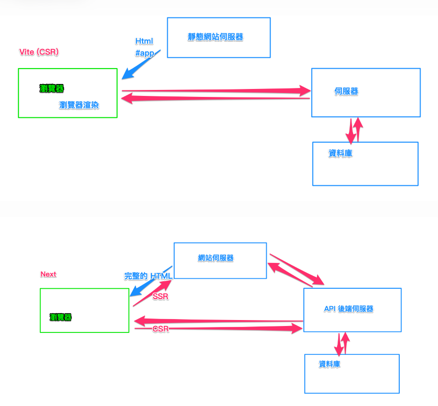
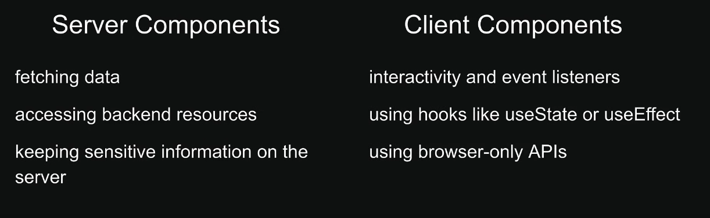

## 基礎介紹

Next.js 是由 Vercel 開發的一個開源的 React 框架，專門用來構建快速、可擴展、且對 SEO 友好的網頁應用。它讓開發者能夠更輕鬆地構建全端的 React 應用，並且提供了許多強大的功能，以下是其主要特點：

- 伺服器端渲染 (SSR)：Next.js 支援伺服器端渲染，這有助於提升 SEO 效果，並且能夠加快首屏渲染速度，對使用者體驗有極大幫助。

- 靜態生成 (Static Generation)：它允許開發者在編譯時生成靜態頁面，使得應用程式加載更快。這在部落格、產品頁面等情境中特別有用。

- API 路由：Next.js 支援構建 API，這意味著開發者可以在同一個項目中同時處理前端與後端邏輯，而不需要額外的後端框架。

- 自動路由：Next.js 基於檔案系統的自動路由，開發者只需在 pages 資料夾中新增檔案，就能自動生成對應的路由。

- 圖片優化：它內建圖片優化功能，能自動生成適合裝置的圖片格式，進而提升網站性能。

- TypeScript 支援：Next.js 原生支援 TypeScript，讓開發者能夠更好地進行類型檢查和錯誤捕捉。

- CSS-in-JS 和全域 CSS：Next.js 支援各種 CSS 解決方案，包括 CSS-in-JS、全域 CSS 以及 Sass。

## 安裝

使用 npx 安裝 nextjs

```
npx create-next-app@latest
```



執行 next app

```
cd <專案名稱>
npm install
npm run dev
```

## 專案結構

頂層資料夾
- .next：編譯後的程式碼、快取、靜態資源、SSR 頁面輸出
- node_modules
- public：靜態資源
- src：原始碼資料夾

頂層設定檔
- next.config.js：Next.js 的設定檔
- package.json：
- .env：環境變數
- .env.local：本機環境變數
- .eslintrc.json：ESLint 的設定檔案
- .gitignore：Git 忽略的 Git 檔案和資料夾
- jsconfig.json：JavaScript 的設定檔

常見專案結構範例
```
my-next-project/          # Next.js 自定義專案根目錄
│── .next/                # Next.js 編譯輸出與快取 (應該被 gitignore)
│── node_modules/         # 安裝的 npm 套件
│── public/               # 靜態資源 (不經 Webpack 處理，直接被提供)
│   ├── favicon.ico       # 網站圖示
│   ├── images/           # 靜態圖片
│   ├── fonts/            # 字體檔案
│   └── robots.txt        # SEO 設定
│── src/                  # 主要程式碼 (推薦)
│   ├── app/              # Next.js App Router
│   │   ├── layout.js     # 全域佈局
│   │   ├── page.js       # 根頁面 ("/")
│   │   ├── loading.js    # 內建 loading 狀態 (可選)
│   │   ├── error.js      # 錯誤處理頁面 (可選)
│   │   ├── about/        # `/about` 頁面
│   │   │   ├── page.js   # `/about` 頁面
│   │   ├── dashboard/    # `/dashboard` 頁面
│   │   │   ├── layout.js # 子佈局 (僅作用於 dashboard 內頁)
│   │   │   ├── page.js   # `/dashboard`
│   │   │   ├── settings/ # `/dashboard/settings`
│   │   │   │   ├── page.js
│   ├── components/       # 共用元件
│   ├── hooks/            # React hooks
│   ├── lib/              # 共用函式庫（API 請求、環境變數處理等）
│   ├── styles/           # CSS / Tailwind / SCSS
│   ├── utils/            # 工具函式
│── .env                  # 環境變數
│── .gitignore            # Git 忽略清單
│── next.config.js        # Next.js 設定檔
│── package.json          # 專案依賴與腳本
```

## 元件類型介紹

Next.js 裡元件可以分為兩種類型， server component 和 client component





### server component

✅ 可以做的事: 

- 取得伺服器資料（如環境變數、存取資料庫等）
- 可以包 Client Component（Client Component 不能包 Server Component）
- 在瀏覽器中，可以檢視其 HTML 原始碼
- 取得遠端資料，並且由伺服器渲染（重要）

🚫 不能做的事：
- 不能使用 React Hook（useState, useEffect…）
- 不能使用 onClick 等事件方法
- 不能使用 window 等方式存取用戶瀏覽器資料

### client component

可以在元件加入 'user client' 來建立 Client Component

✅ 可以做的事：
- 使用 React hooks、處理使用者事件
- 當使用 console 時，數值會顯示在 Browser Console
- 環境變數必須搭配 NEXT_PUBLIC_
- 使用 瀏覽器 API
- 再次更新畫面（AJAX）

🚫 不能做的事：
- 不能存取伺服器資源（例如 fs）
- 不能包 Server Component