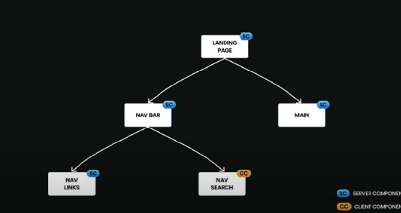

## 基礎介紹

Next.js 是由 Vercel 開發的一個開源的 React 框架，專門用來構建快速、可擴展、且對 SEO 友好的網頁應用。它讓開發者能夠更輕鬆地構建全端的 React 應用，並且提供了許多強大的功能，以下是其主要特點：

- 伺服器端渲染 (SSR)：Next.js 支援伺服器端渲染，這有助於提升 SEO 效果，並且能夠加快首屏渲染速度，對使用者體驗有極大幫助。

- 靜態生成 (Static Generation)：它允許開發者在編譯時生成靜態頁面，使得應用程式加載更快。這在部落格、產品頁面等情境中特別有用。

- API 路由：Next.js 支援構建 API，這意味著開發者可以在同一個項目中同時處理前端與後端邏輯，而不需要額外的後端框架。

- 自動路由：Next.js 基於檔案系統的自動路由，開發者只需在 pages 資料夾中新增檔案，就能自動生成對應的路由。

- 圖片優化：它內建圖片優化功能，能自動生成適合裝置的圖片格式，進而提升網站性能。

- TypeScript 支援：Next.js 原生支援 TypeScript，讓開發者能夠更好地進行類型檢查和錯誤捕捉。

- CSS-in-JS 和全域 CSS：Next.js 支援各種 CSS 解決方案，包括 CSS-in-JS、全域 CSS 以及 Sass。

## 安裝

使用 npx 安裝 nextjs

```
npx create-next-app@latest
```


執行 next app

```
cd <專案名稱>
npm install
npm run dev
```

## 專案結構

頂層資料夾
- .next：編譯後的程式碼、快取、靜態資源、SSR 頁面輸出
- node_modules
- public：靜態資源
- src：原始碼資料夾

頂層設定檔
- next.config.js：Next.js 的設定檔
- package.json：
- .env：環境變數
- .env.local：本機環境變數
- .eslintrc.json：ESLint 的設定檔案
- .gitignore：Git 忽略的 Git 檔案和資料夾
- jsconfig.json：JavaScript 的設定檔

常見專案結構範例
```
my-next-project/          # Next.js 自定義專案根目錄
│── .next/                # Next.js 編譯輸出與快取 (應該被 gitignore)
│── node_modules/         # 安裝的 npm 套件
│── public/               # 靜態資源 (不經 Webpack 處理，直接被提供)
│   ├── favicon.ico       # 網站圖示
│   ├── images/           # 靜態圖片
│   ├── fonts/            # 字體檔案
│   └── robots.txt        # SEO 設定
│── src/                  # 主要程式碼 (推薦)
│   ├── app/              # Next.js App Router
│   │   ├── layout.js     # 全域佈局
│   │   ├── page.js       # 根頁面 ("/")
│   │   ├── loading.js    # 內建 loading 狀態 (可選)
│   │   ├── error.js      # 錯誤處理頁面 (可選)
│   │   ├── about/        # `/about` 頁面
│   │   │   ├── page.js   # `/about` 頁面
│   │   ├── dashboard/    # `/dashboard` 頁面
│   │   │   ├── layout.js # 子佈局 (僅作用於 dashboard 內頁)
│   │   │   ├── page.js   # `/dashboard`
│   │   │   ├── settings/ # `/dashboard/settings`
│   │   │   │   ├── page.js
│   ├── components/       # 共用元件
│   ├── hooks/            # React hooks
│   ├── lib/              # 共用函式庫（API 請求、環境變數處理等）
│   ├── styles/           # CSS / Tailwind / SCSS
│   ├── utils/            # 工具函式
│── .env                  # 環境變數
│── .gitignore            # Git 忽略清單
│── next.config.js        # Next.js 設定檔
│── package.json          # 專案依賴與腳本
```

## package.json 指令

```json
{
  "scripts": {
    "dev": "next dev",
    "build": "next build",
    "start": "next start",
    "lint": "next lint"
  }
}
```
- next dev：啟動開發伺服器。
- next build：將應用程式建置為可用於正式環境的版本。
- next start：啟動正式環境的伺服器。
- next lint：執行 ESLint 程式碼檢查工具。

## Public 資料夾

public 資料夾用來儲存靜態資源（static assets），例如圖片、字型、音訊、PDF、favicon 等。
這些資源會直接對應到網站的根目錄路徑，可以透過 URL 直接存取。
假設你在 public 資料夾中放了一張圖片：
```
public/
└── images/
    └── logo.png
```
可以在程式中這樣調用，不需要加上 public/，因為 Next.js 會自動把 public 當作網站根目錄。
```html

```

## 元件類型介紹

Next.js 裡元件可以分為兩種類型， server component 和 client component


客戶端渲染（CSR）的場景。具體流程如下：

1. 瀏覽器（使用者）首先向靜態網站伺服器發出請求，以獲取網頁的初始 HTML 檔案。

2. 靜態網站伺服器回應並將包含 #app 等掛載點的 HTML 結構傳送給瀏覽器。

3. 瀏覽器接收到 HTML 後，會載入並執行其中的 JavaScript 程式碼（由 Vite 負責打包和優化）。

4. 在瀏覽器內部，應用程式（例如由 React、Vue 等框架構建）開始進行「瀏覽器渲染」，這表示所有的 UI 元素和內容都是在客戶端（使用者的瀏覽器）動態生成和顯示的。

5. 在瀏覽器進行渲染或使用者與網頁互動時，如果需要動態資料，瀏覽器會向後端伺服器發出 API 請求（例如，獲取使用者資料、提交表單等）。

6. 資料庫處理完請求後，將結果返回給伺服器，伺服器再將處理後的資料或結果傳送回瀏覽器。


### server component

✅ 可以做的事: 

- 取得伺服器資料（如環境變數、存取資料庫等）
- 可以包 Client Component（Client Component 不能包 Server Component）
- 在瀏覽器中，可以檢視其 HTML 原始碼
- 取得遠端資料，並且由伺服器渲染(因為是在伺服器端渲染，對前端瀏覽器負擔較小)

🚫 不能做的事：
- 不能使用 React Hook（useState, useEffect…）
- 不能使用 onClick 等事件方法
- 不能使用 window 等方式存取用戶瀏覽器資料

### client component

可以在元件加入 'user client' 來建立 Client Component

✅ 可以做的事：
- 使用 React hooks、處理使用者事件
- 當使用 console 時，數值會顯示在 Browser Console
- 環境變數必須搭配 NEXT_PUBLIC_
- 使用 瀏覽器 API (localStorage, setTimeout)
- 再次更新畫面（AJAX）

🚫 不能做的事：
- 不能存取伺服器資源（例如 fs）
- 不能包 Server Component

### 範例

資料在 Server Component 取回後，傳入 LikeButton 這個 Client Component

```js
// app/[id]/page.js
import LikeButton from '@/app/ui/like-button'
import { getPost } from '@/lib/data'
 
export default async function Page({ params }) {
  const post = await getPost(params.id)
 
  return <LikeButton likes={post.likes} />
}
```

### 元件層級


如果將元件轉為 Client Component ，那元件內層的其他元件都會自動被轉為 Client Component。



所以盡量只在元件樹最底層的元件轉為 Client Component 就好，避免影響其他元件。

## 外部元件

當載入的外部元件有用到 hook 等 Client 元件的功能時，可以先將外部元件加入'use client'

```js
// app/carousel.js
'use client'
import { Carousel } from 'acme-carousel'
export default Carouse
```

再引入 Server Component

```js
import Carousel from './carousel';
export default function Page() {
  return (
    <div>
      <p>View pictures</p>
      {/*  Works, since Carousel is a Client Component */}
      <Carousel />
    </div>
  )
}
```

## 防止環境污染（避免伺服器專用程式碼被誤用於客戶端）

```js
// lib/data.js
export async function getData() {
  const res = await fetch('https://external-service.com/data', {
    headers: {
      authorization: process.env.API_KEY,
    },
  })
  return res.json()
}
```

這裡 process.env.API_KEY 是一個敏感資料（API 金鑰），理論上只能在伺服器上使用。如果你不小心在 client component 中引用這個 getData() 函數，就可能造成安全問題。

### Next.js 的安全預設行為
在 Next.js 中，只有 NEXT_PUBLIC_ 開頭的環境變數會被打包進 client bundle。
也就是說：

✅ process.env.NEXT_PUBLIC_API_URL 👉 會被送到客戶端（可公開）
❌ process.env.API_KEY 👉 不會送到 client，會變成空字串 ""

### 如何防止「不小心誤用」

為了避免 client component 不小心導入 server-only 程式碼（例如 getData()），你可以這樣寫：

```js
// lib/data.js
import 'server-only' // 👈 關鍵
export async function getData() {
  const res = await fetch('https://external-service.com/data', {
    headers: {
      authorization: process.env.API_KEY,
    },
  })
  return res.json()
}
```

import 'server-only' 是 Next.js 提供的一個特殊的 module。
這會告訴編譯器：「這個檔案只應該被 server component 引用」。
如果你嘗試在 client component 引用這檔案，Next.js 會在建置階段報錯，避免風險發生！

## client-only

是 Next.js 提供的一個特殊 module（類似 server-only），用途是：
強制讓某個 component 或模組只能在瀏覽器端（Client Components）被使用。

```js
// components/MyChart.jsx
import 'client-only'
export default function MyChart() {
  // 這裡可以安全使用瀏覽器 API，例如 window、document 等
  return <div>My Chart</div>
}
```

- 告訴 Next.js：這個檔案只能被 Client Component 引用。
- 如果不小心在 Server Component 裡去 import 它 → Next.js 在開發時就會報錯提醒。
- 避免把包含 window / document / localStorage 等瀏覽器專用 API 的程式碼，錯誤地引入到 Server Component。