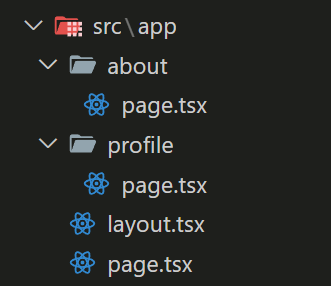

## 建立路由

在 Next.js 中，路由設定是非常直觀且基於文件結構的，在 `/src/app` 底下新增結構如下

在這個結構中：

- page.tsx: 對應到 / 路由
- about/page.tsx：對應到 /about 路由。
- profile/page.tsx：對應到 /profile 路由。

所有對應路由的元件都要用 page.js 或 page.tsx 命名。

