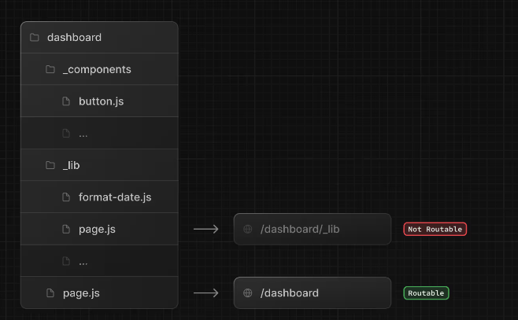

## 巢狀路由


要達成在 /blog 路由底下分別有 /blog/first、 /blog/second 兩個路由時，可在 blog 資料夾底下再開 first、/second 兩個資料夾


## 動態路由


如果路由上的參數是動態帶入的，例如 product/1 、product/2 ，這個 1 、2 是動態帶入的值，可以在使用 [] 定義資料夾名稱。


在元件中可以透過參數取得路由的 params，因為 params 是 promise 所以要 await 後取得。

```js
export default async function ProductPage({ params }) {
  const { id } = await params;
  return (
    <div>
      這是 product { id }
    </div>
  )
}
```

## 巢狀動態路由


如果動態路由底下還有其他路由，例如 /products/1/reviews/2
可以在底下再開其他資料夾設定


元件內路由參數一樣由 params 取得

```js
export default function ReviewDetails({ params }) {
  return (
    <>
      <h1>
        Review {params.reviewId} for {params.productId}
      </h1>
    </>
  );
}
```

## 私有資料夾

可以透過在資料夾名稱前加上底線（_）來建立私有資料夾，例如：_folderName。
這代表該資料夾以及它的所有子資料夾都會被排除在路由之外。



## 路由參數

在 Next.js 中使用 search parameters（網址上的查詢參數，例如 ?page=2&sort=asc）的方法。

1. 使用 useSearchParams（用於 Client Component)

```js
'use client';
import { useSearchParams } from 'next/navigation';

export default function MyComponent() {
  const searchParams = useSearchParams();
  const page = searchParams.get('page');
  const sort = searchParams.get('sort');
  return (
    <div>
      <p>Page: {page}</p>
      <p>Sort: {sort}</p>
    </div>
  );
}
```

2. 在 Server Component 中讀取 searchParams

```js
export default function Page({ searchParams }) {
  const page = searchParams.page;
  return <div>Page: {page}</div>;
}
```

## generateStaticParams

因為 Next.js 中動態路由的頁面是使用訪問時才動態產生，如果希望預先產生頁面的話，可以使用 generateStaticParams。

```js
// app/posts/[id]/page.jsx
export async function generateStaticParams() {
  // 回傳一組陣列，每一項都是一個路由參數物件
  return [
    { id: "1" },
    { id: "2" },
    { id: "3" }
  ]
}

export default function Page({ params }}) {
  return <div>Post ID: {params.id}</div>
}
```

上面會在 build 的時候自動產生以下路由的 html 頁面：

- /posts/1
- /posts/2
- /posts/3

適合使用在某幾個特別熱門的文章或產品頁面，讓 Next.js 預先產生頁面。

## dynamicParams

dynamicParams 是用來控制 動態路由（例如 [id]）在訪問時，如果該路由參數 沒有包含在 generateStaticParams() 回傳的列表中，Next.js 要不要「允許使用者動態訪問」它。

放在 動態路由資料夾的 route.js | route.ts 中：

```js
// app/posts/[id]/route.js
export const dynamicParams = true | false;
```

- dynamicParams: true（預設）: 允許使用者訪問 generateStaticParams() 沒生成過的 params，Next.js 會動態產生頁面（通常搭配 ISR 或 fallback）
- dynamicParams: false: 不允許訪問不在 generateStaticParams() 裡的動態參數 → 直接回傳 404

常見使用情境，假設今天我的部落格文章只有六篇，我不希望使用者訪問這六篇以外的頁面，可以設定 false，讓使用者訪問六篇以外的頁面時得到 404 頁面。


