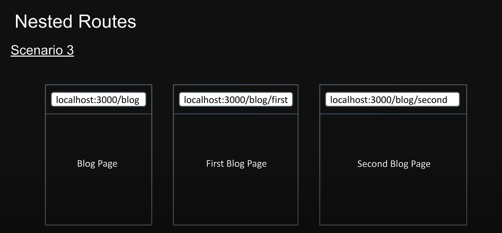
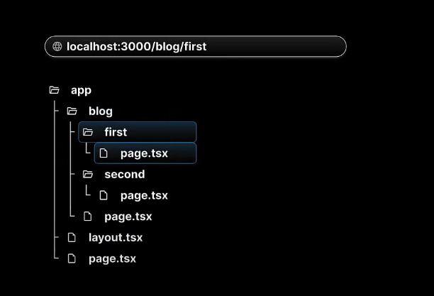
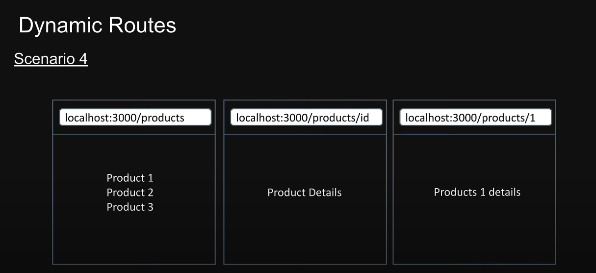
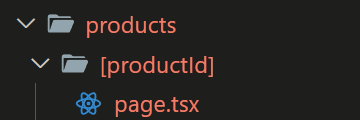
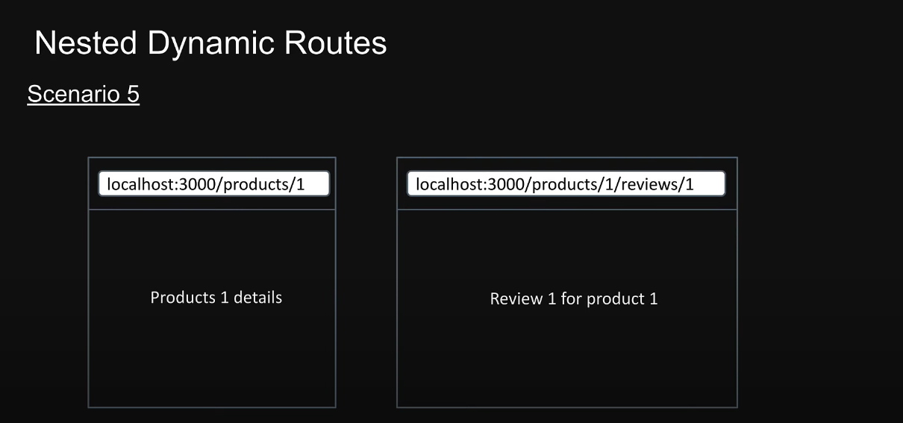
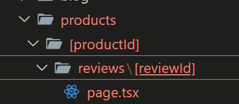

## 巢狀路由



要達成在 /blog 路由底下分別有 /blog/first、 /blog/second 兩個路由時，可在 blog 資料夾底下再開 first、/second 兩個資料夾



## 動態路由



如果路由上的參數是動態帶入的，例如 product/1 、product/2 ，這個 1 、2 是動態帶入的值，可以在使用 [] 定義資料夾名稱。



在元件中可以透過參數取得 路由的 params

```js
export default function ProductDetails({ params }) {
  return (
    <>
      <h1>Products Details {params.productId}</h1>
    </>
  );
}
```

## 巢狀動態路由



如果動態路由底下還有其他路由，例如 /products/1/reviews/2
可以在底下再開其他資料夾設定



元件內路由參數一樣由 params 取得

```js
export default function ReviewDetails({ params }) {
  return (
    <>
      <h1>
        Review {params.reviewId} for {params.productId}
      </h1>
    </>
  );
}
```
