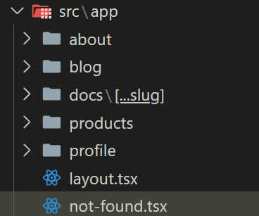
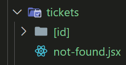
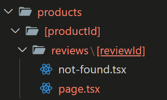
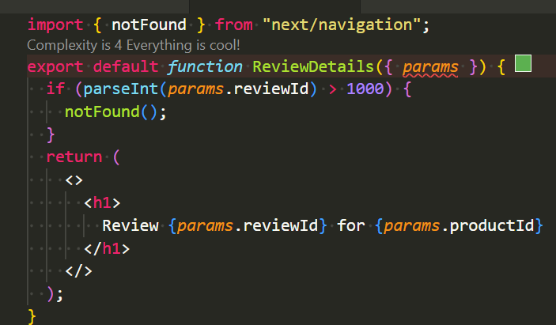

## 404 Not Found 頁面

在 next.js 中建立 404 頁面很簡單，在 app 資料夾內新增 `not-found.jsx` 即可

## 指定路由 404 頁面

如果希望在指定的路由下出錯時，能有特定的 404 頁面，可以新增 404 頁面在指定資料夾內。

## 手動轉址到 404 頁面

在 review-id 資料夾內新增一個 not-found 元件

當條件不滿足時，使用 `notFound()`，函式轉址到 404 頁面
