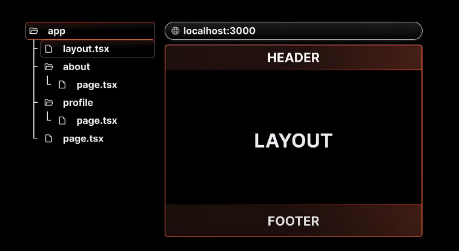
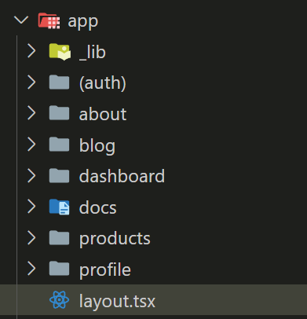
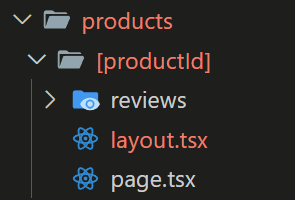
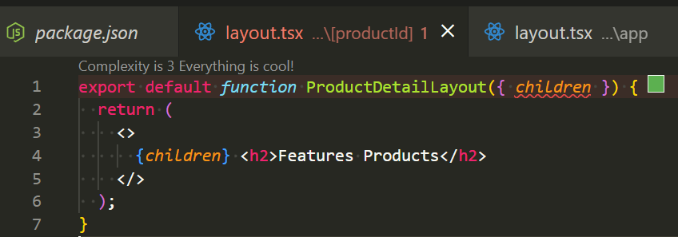

## 建立 Layout 共同模板



如果要建立 Header、Footer 這種通用版型時，next.js 預設就有提供 layout 檔案

位置在 app 資料夾內



在 layout 內，可以像這樣加入 header、footer

```js
return (
  <html lang="en">
    <body>
      <header>
        <p>header</p>
      </header>
      {children}
      <footer>
        <p>footer</p>
      </footer>
    </body>
  </html>
);
```

6

## 指定頁面 Layout

個別頁面也能設定自己的 layout



