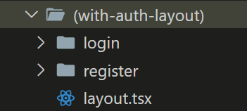

## Route Group

如果資料夾只是作為整理檔案用途，而不想成為路由的一部分，可以使用路由群組

做法是將資料夾名稱用 ()包起來

```
- (auth)
  - login
  - register
```

這樣路由就只會顯示 /login 、/register 而不是 /auth/login

## 自帶 Layout

在 route group 資料夾內也能自帶 layout


