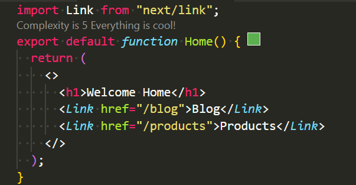
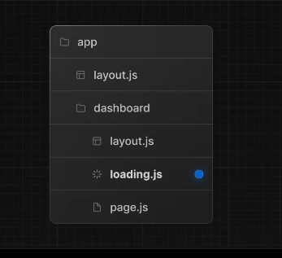

## 使用 link 元件

在 nextJs 裡，可以 import Link 元件，作為換頁的連結



可選屬性（部分）：

- replace：使用 replaceState 而非 pushState
- scroll：默認會滾動到頁首，設 false 可保留當前滾動位置
- prefetch：可關閉預取
- onNavigate：事件回調
- legacyBehavior、passHref（針對自訂子元件

在 Next.js 中都應該用 link 元件而非 a 連結，因為<Link>有預取功能。
- 預取（Prefetching）：當使用 <Link> 並且該連結出現在畫面視窗或被 hover 時，Next.js 會提前載入對應路由所需資料，以提升點擊後的響應速度

- 動態路由：對於像 /blog/[slug] 的動態路由，預設不會完整預取。如果有 loading.js，會只預取 shared layout 與 loading skeleton，以支援部分預取與串流加速。




## 動態路徑

Link 元件的 href 也可以帶入變數

```js
<Link href={`products/${productId}`}>Product {productId}</Link>
```

## replace

replace 是一個可選屬性，當你設定 replace 屬性時，Next.js 會使用 replaceState 而不是 pushState 來更新歷史紀錄。
如果你想讓使用者點擊鏈接後，不將新的頁面加入到歷史紀錄中，可以使用 replace 屬性：

```js
import Link from "next/link";

<Link href="/about" replace>
  About Page
</Link>;
```

replace 屬性通常在下列情況下會比較實用：

- 當你不希望使用者按下返回鍵時回到上一個頁面，特別是在有多步驟的表單或流程時。
- 當頁面狀態變化對使用者而言是透明的，不需要新增一個歷史紀錄。

## usePathname

在 Next.js 中，usePathname 是一個內建的 React hook，用來獲取當前頁面的 URL 路徑名稱（pathname）。它是 Next.js App Router 的一部分，方便你在應用中獲取當前的路徑，並基於此進行一些邏輯操作，比如在某些頁面顯示特定內容。

- 基本用法

要使用 usePathname，你首先需要從 next/navigation 匯入它，然後在元件內調用即可。

```js
import { usePathname } from "next/navigation";

export default function MyComponent() {
  const pathname = usePathname();

  return (
    <div>
      <p>當前路徑是: {pathname}</p>
    </div>
  );
}
```

usePathname() 會返回一個字串，這個字串是當前頁面的路徑。例如：

- 如果當前頁面是 /about，則 pathname 會是 "/about"。
- 如果是 /posts/123，pathname 則會是 "/posts/123"。

實際應用場景

1. 高亮當前導航項目:

你可以使用 usePathname 來根據當前的路徑來高亮對應的導航連結：

```js
import { usePathname } from "next/navigation";
import Link from "next/link";

export default function Navbar() {
  const pathname = usePathname();
  return (
    <nav>
      <Link href="/" className={pathname === "/" ? "active" : ""}>
        Home
      </Link>
      <Link href="/about" className={pathname === "/about" ? "active" : ""}>
        About
      </Link>
    </nav>
  );
}
```

## useRouter

在 Next.js 中，useRouter 是一個非常常用的 React hook，它允許你訪問 Next.js 的路由系統，並讓你能夠程式化地導航、訪問路由參數、監聽路由變更等。這對於需要更靈活導航邏輯的情況很有用，例如條件導航、攜帶查詢參數的跳轉、或監控路由狀態變化。

- 基本用法

首先，你需要從 next/router 中引入 useRouter，然後在你的元件內使用：

```js
import { useRouter } from "next/router";

export default function MyComponent() {
  const router = useRouter();

  return (
    <div>
      <button onClick={() => router.push("/about")}>前往 About 頁面</button>
    </div>
  );
}
```

- 其他方法

  ```js
  // push: 將使用者導航到新的 URL。
  router.push("/about");

  // replace: 與 push 相似，但它會用新頁面替換當前的歷史紀錄，使用者無法返回上一頁。
  router.replace("/about");

  // back(): 導航到瀏覽器的上一頁。
  router.back();

  // forward(): 導航到瀏覽器的上一頁。
  router.forward();

  // reload(): 重新加載當前頁面。
  router.reload();

  // prefetch(url): 預加載指定頁面的資料，當使用者點擊鏈接時，頁面能夠更快加載。它在連結元件中默認開啟，但可以手動使用。
  ```
