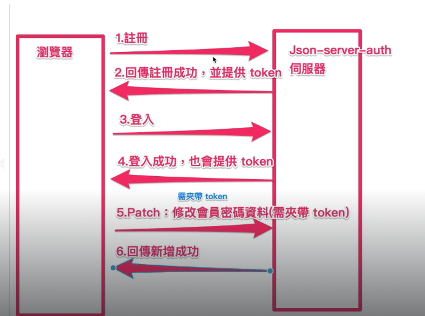
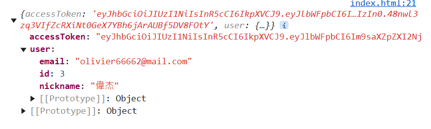
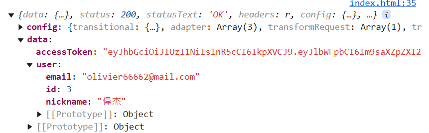
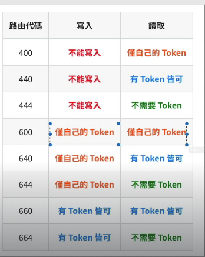

## 安裝流程

1. 安裝 json-server-auth

[json-server-auth 官網](https://www.npmjs.com/package/json-server-auth)

```
npm install -D json-server json-server-auth
```

2. 在專案中建立 db.json

```json
// 固定使用 users 格式
{
  "users": []
}
```

3. 開啟 json-server

```
json-server db.json -m ./node_modules/json-server-auth
```

## 註冊流程



- POST /register

email 和 password 為必填欄位，其他欄位可自由帶入

```json
{
  "email": "olivier@mail.com", // 必要
  "password": "bestPassw0rd", // 必要
  "firstname": "Olivier",
  "lastname": "Monge",
  "age": 32
}
```

註冊成功回傳 token (時效為一小時) 和 user資料



- 前端註冊範例程式碼:

```js
function signUp() {
  axios.post('http://localhost:3000/register', {
    "email": "olivier66662@mail.com",
    "password": "bestPassw0rd",
    "nickname": '偉杰'
  })
  .then((res) => {
    console.log(res.data);
  })
  .catch(err => {
    console.log('錯誤資訊', err.response)
  })
}
```

### 註冊身分

如果想要區分註冊者身分，可以加上身份判別的陣列。之後登入時依照身分區別。

```json
{
  "email": "olivier@mail.com", // 必要
  "password": "bestPassw0rd", // 必要
  "firstname": "Olivier",
  "lastname": "Monge",
  "age": 32,
  "role": ["user", "admin"]
}
```

## 登入功能

POST /login

登入要帶入 email 和 password 欄位

```json
{
  "email": "olivier@mail.com",
  "password": "bestPassw0rd"
}
```

登入成功回傳 token 和用戶資訊



登入範例程式碼

```js
function logIn() {
  axios.post('http://localhost:3000/login', {
    "email": "olivier66662@mail.com",
    "password": "bestPassw0rd",
  })
  .then((res) => {
    token = res.data.accessToken;
  })
  .catch(err => {
    console.log('錯誤資訊', err.response)
  })
}
```

## 修改密碼(無權限)

使用 patch ，並在路由中帶入 user 的 id 即可修改user資料。

```js
function updatePassword() {
  axios.patch('http://localhost:3000/users/1', {
    "password": "336699",
  })
  .then((res) => {
    console.log(res.data);
  })
  .catch(err => {
    console.log('錯誤資訊', err.response)
  })
}
```

## 修改密碼(有權限)

json-server-auth 提供了一個簡單的路由權限系統。權限設置基於路由模式和用戶角色，格式如下：



透過在路由中帶入權限設定的數字來控管權限。

以下範例權限為 600，代表必須登入取得token後，才能修改自己的資料。

```js
// 修改密碼
function updatePassword() {
  axios.patch('http://localhost:3000/600/users/3', {
    "password": "336698889",
  }, {
    headers: {
      "authorization": `Bearer ${token}`,
    }
  })
  .then((res) => {
    console.log(res.data);
  })
  .catch(err => {
    console.log('錯誤資訊', err.response)
  })
}
```

## 新增貼文

如果要新增貼文，路由中要設定權限為 600，只有自己能新增貼文到自己的帳號底下。

- 方法: 使用 POST 方法新增
- userId: 送出請求時要body帶入使用者 userId
- token: headers 要帶入 token 驗證。

```js
function addPost() {
  axios.post('http://localhost:3000/600/posts', {
    "content": "今天要洗臉",
    "userId": id 
  }, {
    headers: {
      "authorization": `Bearer ${token}`,
    }
  })
  .then((res) => {
    console.log(res)
  })
  .catch(err => {
    console.log('錯誤資訊', err.response)
  })
}
```

如果不想在 body 上帶上 id，可以改在路由上帶入，寫法如下:

```js
// 在指定的 user 內新增貼文
axios.post(`http://localhost:3000/600/users/${id}/posts`, {
  "content": "今天要洗臉",
}, {
  headers: {
    "authorization": `Bearer ${token}`,
  }
})
```


